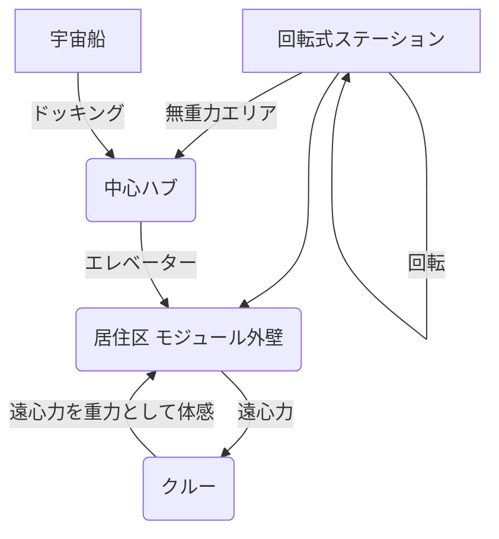

## Summary（5つの要点）

1.  **微小重力対策の本命**: 長期宇宙滞在（月・火星）による筋力低下、骨密度低下、視力障害（SANS）などの深刻な健康問題を根本的に解決する技術。
2.  **遠心力による生成**: 宇宙ステーションや居住モジュール全体を回転させ、その遠心力によって「重力」を模擬する。スタンフォード・トーラス型が有名。
3.  **回転半径と速度の課題**: 人体が不快感（コリオリ力による吐き気）を感じないようにするには、回転半径を大きく（数百m）、回転速度を遅く（毎分1〜2回転）する必要がある。
4.  **民間の積極的な動き**: 米国企業「Vast Space」が、2035年までに回転式の人工重力ステーション（クルー40人規模）を建設する具体的なロードマップを発表している。
5.  **JAXA・NASAの現状**: JAXAやNASAでは、月面・火星探査が優先されており、軌道上の大型人工重力施設は2040年以降の長期目標とされているが、基礎研究は継続中。

#### 概念図: 回転式人工重力ステーションの原理

## 技術評価表（定量的な視点）

| 項目 | 導入コスト | 技術成熟度 | 日本の競争力 | 市場性 | 品質保証の重要性 |
| :--- | :--- | :--- | :--- | :--- | :--- |
| 評価 | ★★★★★（極高） | ★☆☆☆☆（概念実証前） | ★★☆☆☆（低） | ★★★★☆（中） | ★★★★★（極高） |
| 概要 | 巨大構造物の軌道上建設・回転機構に莫大なコスト。Vast社はStarship前提で計画。 | 軌道上での実証例は皆無。すべては設計・シミュレーション段階。 | 基礎研究（JAXA、大学）レベル。構造物設計・建設技術（清水建設の宇宙ホテル構想等）はある。 | 宇宙観光、長期滞在、軌道上製造の「健康基盤」として将来的に必須となる可能性。 | 回転機構の長期信頼性、振動制御、気密性、緊急時の回転停止・避難プロセスの確立が最重要。 |

## 日本の立ち位置・強み弱みのSummary

### 強み

* **建設業界の構想力**: 清水建設が回転式人工重力施設（宇宙ホテル）の構想を発表するなど、ゼネコンが持つ大規模構造物の設計・建設ノウハウは強みとなり得る。
* **基礎医学研究**: 微小重力下での人体影響に関する医学研究（JAXA、大学病院）の蓄積は、人工重力環境の設計（必要なGレベル、回転速度）に貢献できる。

### 弱み

* **国家プロジェクトの不在**: JAXAや政府のロードマップでは優先度が低く、国家レベルでの大規模な開発プロジェクトが存在しない。
* **民間主導の遅れ**: Vast Space（米国）のような、具体的な商用ステーション計画を持つ民間企業が育っていない。
* **大型輸送手段**: 巨大な回転アームやモジュールを打ち上げる低コストな大型ロケット（Starship級）が必須であり、その手段を持たない。

## 技術ロードマップ（短期/中期/長期）

### 短期目標（～2027年）

* **地上アナログ研究**: 地上の遠心分離機（ベッドレスト研究）で、人体が許容できる回転速度（RPM）と重力レベルの最適な組み合わせを特定。
* **小型実証衛星**: CubeSatなどを利用し、軌道上で小型アームを展開・回転させ、流体や生物（メダカ等）への影響を調べる基礎実験。
* **構造シミュレーション**: 大規模回転構造物の材料力学、振動制御、展開方法に関する詳細なシミュレーション。

### 中期目標（2028年～2031年）

* **Vast社の「Haven-1」打ち上げ**: Vast社がSpaceXと提携し、非回転型の商用宇宙ステーション「Haven-1」を打ち上げ、軌道上滞在技術を確立（人工重力の前段階）。
* **無人実証モジュール**: 回転する無人モジュールを打ち上げ、長期間の構造安定性、振動特性、内部機器の動作検証を実施。

### 長期目標（2032年～2035年）

* **Vast社の人工重力ステーション建設開始**: Vast社がロードマップに基づき、Haven-2（2032年完成予定）の技術を基に、回転式の大型人工重力ステーションの軌道上建設を開始（2035年目標）。
* **月面・火星重力（1/6G, 1/3G）の模擬**: 将来の惑星移住に向け、1G（地球重力）だけでなく、低重力環境を模擬する施設の検討開始。

### 📚 参照リンク

* [Vast Space Roadmap (公式)](https://www.vastspace.com/roadmap)
* [NASA: Artificial Gravity (NTRS)](https://ntrs.nasa.gov/api/citations/20160013852/downloads/20160013852.pdf)
* [J-Stage: JSASS宇宙ビジョン2050 (PDF)](https://www.jsass.or.jp/wp-content/uploads/2019/05/JSASS_SpaceVision2050_20190313_JPN.pdf)
