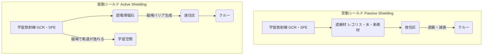

## Summary（5つの要点）

1.  **深宇宙の脅威**: 地球磁気圏外（月、火星、惑星間空間）では、高エネルギーの銀河宇宙線（GCR）や太陽フレア（SPE）に常時曝露され、被ばく線量はISSの100倍以上。
2.  **受動シールド（パッシブ）**: 水、ポリエチレン、アルミニウム、月のレゴリスなど、物質で放射線を遮蔽する従来型技術。厚く（重く）する必要があり、宇宙船の質量増大が課題。
3.  **新素材の開発**: 水素を多く含む新素材（BNNT：窒化ホウ素ナノチューブ等）が研究されており、従来のアルミより軽量で高い遮蔽効果が期待される。
4.  **能動シールド（アクティブ）**: 宇宙船の周囲に超電導磁石で強力な磁場（ミニ地球磁気圏）を発生させ、荷電粒子である宇宙放射線を逸らして防護する技術。
5.  **磁場シールドの課題**: 超電導磁石の冷却、莫大な電力消費、強力な磁場が人体や機器に与える影響など、技術的ハードルが極めて高く、実用化はまだ先の概念研究段階。

#### 概念図: 放射線防護シールドの概念比較

## 技術評価表（定量的な視点）

| 項目 | 導入コスト | 技術成熟度 | 日本の競争力 | 市場性 | 品質保証の重要性 |
| :--- | :--- | :--- | :--- | :--- | :--- |
| 評価 | ★★★★★（極高） | ★★☆☆☆（受動） ★☆☆☆☆（能動） | ★★★☆☆（中） | ★★★★☆（中） | ★★★★★（極高） |
| 概要 | 能動シールドは莫大な開発・電力コスト。受動シールドも質量増＝打上コスト増。 | 受動シールドは実用段階だが最適化が必要。能動シールドは基礎研究・概念実証段階。 | QST（量研）が放射線影響評価で先行。新素材（BNNT等）の研究も進む。超電導技術も保有。 | 深宇宙有人探査の必須技術。実現すれば独占的技術となる。 | クルーの被ばく線量管理と健康被害（特に中枢神経系）の防止が最重要ミッション。 |

## 日本の立ち位置・強み弱みのSummary

### 強み

* **放射線医学・生物学**: QST（量子科学技術研究開発機構）が宇宙放射線の生物影響評価、被ばく線量計側、防護研究で世界をリードしている。
* **超電導技術**: 高温超電導線材や強力な磁場発生技術（リニア新幹線、医療用MRI）の蓄積は、能動シールドの基礎技術として応用可能。
* **素材科学**: 軽量で遮蔽効果の高い新素材（水素リッチ材料、ナノチューブ等）の開発において、日本の素材メーカーが貢献できる可能性がある。

### 弱み

* **能動シールドの実証不足**: 能動シールドはまだ概念研究が中心であり、宇宙空間での大規模な実証プロジェクトは日米欧ともに存在しない。
* **GCR対策の困難さ**: エネルギーが極めて高い銀河宇宙線（GCR）は、受動シールドでは防ぎきれず、二次中性子を発生させる問題がある。能動シールドもGCRの防護は困難とされる。

## 技術ロードマップ（短期/中期/長期）

### 短期目標（～2027年）

* **月周回での線量計測**: 月周回ステーション「Gateway」や月面探査機で、深宇宙の正確な放射線環境データ（GCR, SPE）を蓄積・モデル化。
* **受動シールドの最適化**: 水、ポリエチレン、レゴリスを組み合わせた「多層型シールド」の最適設計。新素材（BNNT等）の遮蔽効果の地上試験。
* **薬剤防護の研究**: 放射線によるDNA損傷を修復・保護する薬剤（サプリメント含む）の基礎研究。

### 中期目標（2028年～2031年）

* **Gatewayでの実証**: Gatewayモジュールに試験的な遮蔽材を設置し、実際の防護効果を検証。
* **月面での「安全な避難場所」**: 太陽フレア（SPE）発生時に備え、月のレゴリスを厚く盛った「ストームシェルター」の月面基地内への設置。
* **能動シールドの小型実証**: CubeSat等で小型の超電導磁石を軌道上に運び、磁場生成と放射線偏向の基礎データを取得。

### 長期目標（2032年～2035年）

* **火星探査船への実装**: 火星有人探査（往復3年）に向け、水タンクや食料庫を防護壁として最適配置する受動シールド設計を確立。
* **能動シールドのプロトタイプ開発**: 火星探査船への搭載を視野に入れた、中規模の能動シールド（磁場シールド）の工学プロトタイプの地上開発。
* **月面基地での恒久防護**: 月面基地の居住区画全体をレゴリスで数メートル覆うか、地下（溶岩洞）に設置することで恒久的な放射線防護を実現。

### 📚 参照リンク

* [QST: 宇宙放射線の被ばく線量を低減する新たな宇宙船素材を発見](https://www.qst.go.jp/site/press/20210908.html)
* [MDPI: A Review of Magnetic Shielding Technology for Space Radiation](https://www.mdpi.com/2673-592X/3/1/5)
* [ChosunBiz: BNNT高密度配列で宇宙放射線遮蔽性向上](https://biz.chosun.com/jp/jp-science/2025/11/06/F4RRMJRAZ5D4LAMY3V67OR4DSA/)
