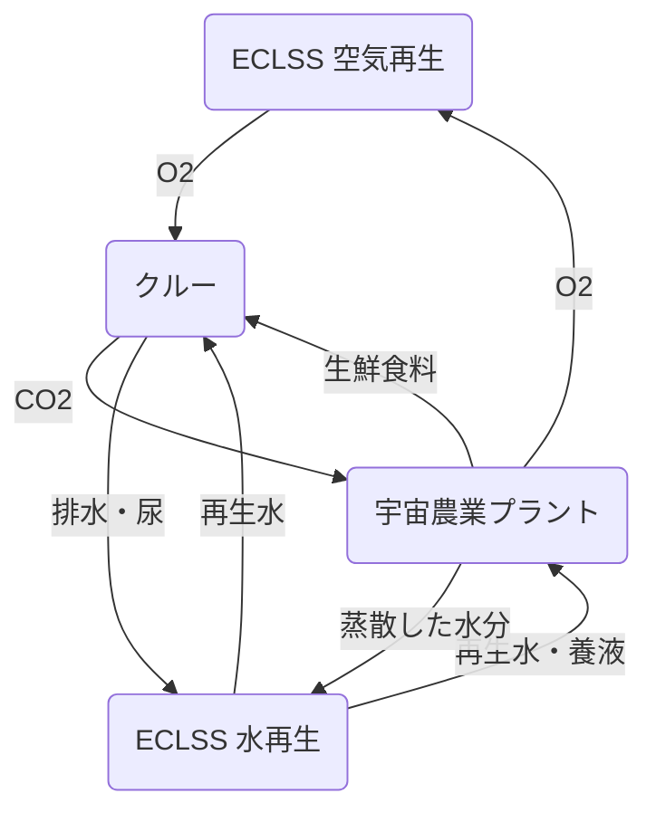

## Summary（5つの要点）

1.  **長期滞在の食料自給**: 月・火星への長期滞在（数年単位）では、地球からの食料補給（フリーズドライ）に限界があり、現地での食料（特に生鮮野菜）生産が不可欠。
2.  **ISSでの栽培実績**: NASAの「Veggie」やJAXAの「きぼう」内栽培装置で、レタス、トマト、トウガラシなどの水耕栽培（養液栽培）に成功している。
3.  **植物工場の応用**: 地上の植物工場（T17-05）技術を宇宙向けに最適化。LED照明、CO2供給、養液循環、温湿度管理を自動制御する。
4.  **ECLSSとの連携**: 植物の光合成（CO2吸収、O2放出）と蒸散（水分放出）を、生命維持装置（ECLSS）の空気・水再生システムと統合し、物質循環の効率を高める。
5.  **月面・火星での課題**: 月（1/6G）・火星（1/3G）の低重力下での生育影響、放射線耐性、レゴリス（現地の砂）を土壌として利用する研究（病原菌対策）が課題。

#### 概念図: 宇宙農業とECLSSの統合循環

## 技術評価表（定量的な視点）

| 項目 | 導入コスト | 技術成熟度 | 日本の競争力 | 市場性 | 品質保証の重要性 |
| :--- | :--- | :--- | :--- | :--- | :--- |
| 評価 | ★★★★☆（高） | ★★★☆☆（ISSで実用） | ★★★★☆（高） | ★★★☆☆（中） | ★★★★★（極高） |
| 概要 | 植物工場モジュールの打上・設置コストは高い。長期では食料補給コストを削減。 | ISSでの葉物野菜栽培は実用段階。果菜類、穀類は研究段階。月面実証はこれから。 | 日本は植物工場技術（LED、水耕栽培、環境制御）で世界をリードしており、強みを発揮できる。 | 宇宙市場に加え、地上（砂漠、寒冷地、災害時）の自立型食料生産システムとして応用可能。 | 病原菌やカビの発生防止（無菌管理）、安定した収穫量、栄養価の保証が最重要。 |

## 日本の立ち位置・強み弱みのSummary

### 強み

* **植物工場技術**: パナソニック、スプレッド、みらい等の企業が持つ、LED照明、環境制御、水耕栽培システムは世界トップレベル。
* **「きぼう」での運用実績**: JAXAはISS「きぼう」日本実験棟で、高度な細胞培養や植物栽培実験の運用ノウハウを蓄積している。
* **食文化と品質**: 高品質な作物を安定生産するノウハウや、多様な食材（大豆など）の栽培技術は、宇宙でのQOL向上に貢献できる。

### 弱み

* **大型モジュールの経験**: NASAの「Veggie」のような、大型の宇宙用栽培装置の開発・運用経験は限定的。
* **低重力下での知見**: 月や火星の低重力（1/6G, 1/3G）が植物の生育（根の張り方、水分移動）に与える長期的な影響データが不足している。

## 技術ロードマップ（短期/中期/長期）

### 短期目標（～2027年）

* **ISSでの多様な作物栽培**: レタス等の葉物野菜に加え、トマト、トウガラシ、イチゴ等の果菜類、大豆等のタンパク質源の栽培実証。
* **自動化・省力化**: 水やり、収穫、健康状態のモニタリング（AI画像認識）を自動化する技術の軌道上実証。
* **Gatewayでの基礎実験**: 月周回ステーション「Gateway」で、深宇宙放射線環境下での種子保存や発芽実験。

### 中期目標（2028年～2031年）

* **月面での初期実証**: アルテミス計画の初期ミッションで、小型の自動栽培装置を月面に設置し、低重力・放射線下での生育を実証（無人・短期）。
* **ECLSSとの部分統合**: 栽培装置のCO2吸収能力や水分蒸散量をECLSSの制御パラメータとして組み込む実証。

### 長期目標（2032年～2035年）

* **月面基地での恒久栽培**: アルテミスベースキャンプ内に、クルーの食料（生鮮野菜）の30%～50%を供給可能な恒久的な植物工場モジュールを設置・運用。
* **レゴリス土壌の利用**: 月のレゴリスから有害物質を除去し、有機物（廃棄物堆肥）を混ぜて土壌として利用する技術の確立。
* **火星ミッションへの準備**: 火星の環境（低重力、低気圧）に適応した品種改良（ゲノム編集等）と、火星レゴリスを利用した栽培技術の確立。

### 📚 参照リンク

* [NASA: Space Crop Production](https://www.nasa.gov/centers-and-facilities/kennedy/space-crop-production/)
* [JAXA: 宇宙での野菜づくり](https://humans-in-space.jaxa.jp/kibomaga/life/11559.html)
* [APLU: 2025-2035 Land-grant University Roadmap (PDF)](https://www.aplu.org/wp-content/uploads/LGU-RM-CO-B.pdf) (地上の食料生産ロードマップだが宇宙農業に応用可能)
