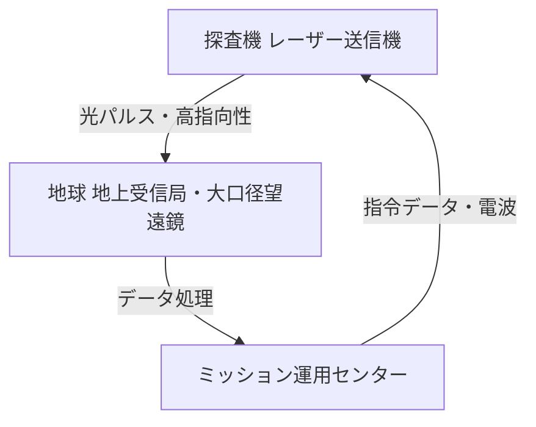

# T19-02-01 深宇宙通信技術・光通信

## Summary（5つの要点）

1.  **超高速データレート**: 従来の電波（RF）通信に比べ、10倍から100倍のデータ伝送速度を実現し、高解像度画像や科学データを短時間で送信可能。
2.  **小型・軽量・低消費電力**: 電波アンテナより大幅に小型軽量化でき、探査機搭載機器の消費電力を抑えられるため、ミッションの設計自由度が向上する。
3.  **高い秘匿性**: レーザー光は指向性が極めて高くビーム幅が狭いため、通信の傍受が非常に困難であり、安全保障上も優位性がある。
4.  **NASA LCRDによる実証**: NASAはLCRD（レーザー通信リレー実証）ミッションにより、地球周回軌道上での光通信技術を実証し、深宇宙への適用を進めている。
5.  **JAXA HICALIの挑戦**: JAXAも光通信実証機「HICALI（ひかり）」を開発し、将来の月探査や深宇宙探査での大容量通信の実現を目指している。

#### 概念図: 深宇宙光通信システム

## 技術評価表（定量的な視点）

| 項目 | 評価 (5段階) | 概要 |
| :--- | :--- | :--- |
| **導入コスト** | ⭐⭐⭐⭐☆ | 地上局に大口径望遠鏡や高精度追尾システムが必要で高コスト。 |
| **技術成熟度** | ⭐⭐⭐☆☆ | 地球周回軌道では実証済み。深宇宙（月・火星）では実証段階。 |
| **日本の競争力** | ⭐⭐⭐⭐☆ | JAXA、NICTが長年の基礎研究と実証実験で高い技術力を保持。 |
| **市場性** | ⭐⭐⭐⭐☆ | 衛星コンステレーション、深宇宙探査のデータ量増大で需要急増。 |
| **品質保証の重要性** | ⭐⭐⭐⭐⭐ | μradレベルの超高精度な指向制御、大気揺らぎ補正が必須。 |

## 日本の立ち位置・強み弱みのSummary

### 強み

* **基礎技術の蓄積**: NICT（情報通信研究機構）やJAXAが、長年にわたり衛星光通信の基礎研究と軌道上実証を続けており、要素技術で世界レベルにある。
* **高性能な光学部品**: 高出力レーザー発振器、高感度光検出器など、日本のメーカーが強みを持つ高性能な光学部品・電子部品の供給力がある。

### 弱み

* **実証実績の差**: NASAがLCRDミッションで先行し、欧州もEDRS（欧州データ中継衛星システム）を運用する中、深宇宙での大規模な実証実績で後れを取っている。
* **地上局インフラ**: 深宇宙からの微弱な光を捉えるための大口径望遠鏡など、地上インフラの整備が欧米に比べて限定的である。

## 技術ロードマップ（短期/中期/長期）

### 短期目標（～2027年）

* 地球低軌道（LEO）での光通信コンステレーション（Starlink Gen2など）が商用化。
* NASA「アルテミス計画」において、月周回軌道と地球間の大容量光通信（Orion-Artemis II Optical Comms）を実証。

### 中期目標（2028年～2031年）

* 月面基地（ゲートウェイ、月面探査車）と地球を結ぶ常時大容量通信ネットワークの基盤として光通信が本格導入される。
* JAXAがHICALI等により、深宇宙（火星圏手前）での光通信技術を実証する。

### 長期目標（2032年～2035年）

* 火星有人探査や、木星圏・土星圏探査において、高解像度映像のリアルタイム伝送が可能な標準通信方式として定着する。
* 光通信ネットワークが太陽系全体に広がり始める。

### 📚 参照リンク

* [NASA - Laser Communications Relay Demonstration (LCRD)](https://www.nasa.gov/mission/laser-communications-relay-demonstration-lcrd/)
* [JAXA - 衛星光通信](https://www.kenkai.jaxa.jp/research/optical/optical.html)
* [NICT - 衛星光通信](https://www.nict.go.jp/wireless/satcom.html)
