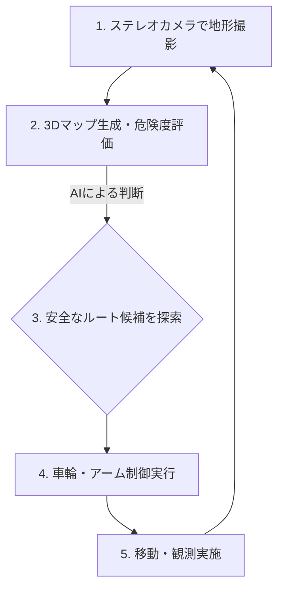

# T19-02-02 自律航行・AI搭載探査ロボット

## Summary（5つの要点）

1.  **通信遅延の克服**: 地球-火星間では通信に往復数分～数十分の遅延が発生するため、リアルタイムの遠隔操縦は不可能。ローバー自身のAIによる自律判断が必須となる。
2.  **NASA「AutoNav」技術**: NASAの火星ローバー「Perseverance」は、ステレオカメラで周囲の地形を3Dマッピングし、危険な岩や砂地をAIが認識・回避する「AutoNav」技術を搭載している。
3.  **探査効率の飛躍的向上**: AutoNavにより、Perseveranceは思考しながら走行でき、従来のローバー（Curiosity）の最大5倍の速度で移動可能となり、探査範囲が劇的に拡大した。
4.  **科学観測の自動化 (AEGIS)**: AI（AEGISシステム）がカメラ画像から科学的に興味深い岩石（特定の形状や色）を自動で識別し、レーザー分光分析（SuperCam）のターゲット選定を自律的に行う。
5.  **JAXAの月面探査**: JAXAもインド宇宙研究機関（ISRO）と共同で進める月極域探査ミッション（LUPEX）において、自律走行技術を搭載したローバーを開発中である。

#### 概念図: 探査ローバーの自律航行プロセス

## 技術評価表（定量的な視点）

| 項目 | 評価 (5段階) | 概要 |
| :--- | :--- | :--- |
| **導入コスト** | ⭐⭐⭐⭐⭐ | 開発・試験に巨額の費用。特にAIの検証コストが莫大。 |
| **技術成熟度** | ⭐⭐⭐⭐☆ | 火星表面で実証済み。ただし、より複雑な地形への対応など高度化が進行中。 |
| **日本の競争力** | ⭐⭐⭐☆☆ | NASA/JPLが圧倒的に先行。日本はLUPEXや民間探査でのキャッチアップを目指す。 |
| **市場性** | ⭐⭐⭐☆☆ | 宇宙探査特化型だが、自動運転車や地上ロボットへの技術スピンオフが期待される。 |
| **品質保証の重要性** | ⭐⭐⭐⭐⭐ | AIの判断ミスが即ミッション失敗に直結。厳格なシミュレーションと検証が不可欠。 |

## 日本の立ち位置・強み弱みのSummary

### 強み

* **ロボット工学の基礎**: 自動車産業や産業用ロボットで培った高度なロボット制御技術、画像認識技術の基礎体力がある。
* **自動運転技術の応用**: 国内で開発が進む自動車の自動運転（SLAM、センサーフュージョン）技術を宇宙分野に応用可能。

### 弱み

* **実環境での運用実績**: NASAが火星で長年にわたり蓄積してきた運用実績（データ、ノウハウ）に圧倒的な差がある。
* **耐放射線性AIチップ**: 宇宙の過酷な放射線環境で動作する高性能なAIチップ（GPU/NPU）の開発で米国に後れを取っている。

## 技術ロードマップ（短期/中期/長期）

### 短期目標（～2027年）

* 月面での自律走行実証。JAXA LUPEXローバーや、ispace等の民間ローバーによるデータ取得。
* AIによる移動中の科学観測ターゲット選定の精度向上。

### 中期目標（2028年～2031年）

* 複数のローバーが協調・連携して探査を行う「群制御AI」の軌道上実証。
* 月面の恒久的な影（永久影）など、超低温・暗闇環境下での自律航行技術の確立。

### 長期目標（2032年～2035年）

* 火星サンプルリターンミッションにおいて、サンプル採取・保管・帰還ロケットへの搭載までを完全自律で実行するロボットシステムの実現。
* 氷衛星（エウロパ、エンケラドゥス）など、さらに過酷な環境での自律探査。

### 📚 参照リンク

* [NASA Mars 2020 - Autonomous Navigation](https://mars.nasa.gov/mars2020/mission/technology/autonomy/)
* [NASA - AEGIS (Autonomous Exploration for Gathering Increased Science)](https://www.nasa.gov/general/aegis-autonomous-exploration-for-gathering-increased-science/)
* [JAXA - 月極域探査ミッション（LUPEX）](https://www.lupex.jaxa.jp/)
