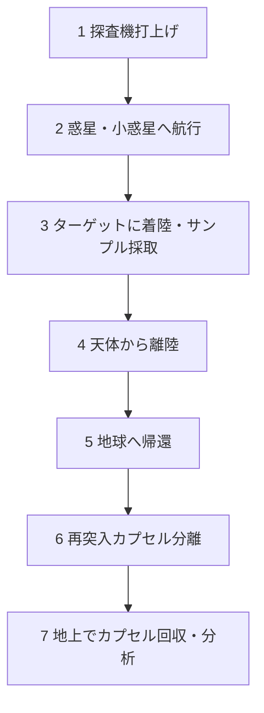

# T19-02-03 惑星サンプルリターン技術

## Summary（5つの要点）

1.  **究極の科学探査**: 惑星や小惑星のサンプルを地球に持ち帰り、地上の最先端の分析機器で詳細に分析することで、太陽系の起源や生命の材料の解明に決定的な情報をもたらす。
2.  **JAXAの世界最先端技術**: JAXAは「はやぶさ」および「はやぶさ2」ミッションで、世界で初めて小惑星からの往復とサンプルリターンを成功させ、この分野で世界をリードしている。
3.  **米国の追随と大規模化**: NASAも「OSIRIS-REx」ミッションで小惑星ベンヌから大量のサンプルリターンに成功し、日米が技術を競い合っている。
4.  **次の目標「火星」**: 現在、NASAとESA（欧州宇宙機関）は共同で、火星のサンプルを持ち帰る極めて高難度な「Mars Sample Return (MSR)」計画を推進している。
5.  **高度技術の複合体**: 目的天体への高精度着陸、サンプル採取、汚染防止（コンタミネーション・コントロール）、天体からの離陸、地球への超高速再突入・回収など、多岐にわたる高度な技術の集合体である。

#### 概念図: サンプルリターンミッションのシーケンス

## 技術評価表（定量的な視点）

| 項目 | 評価 (5段階) | 概要 |
| :--- | :--- | :--- |
| **導入コスト** | ⭐⭐⭐⭐⭐ | ミッション全体で数千億円規模。最も高コストな宇宙ミッションの一つ。 |
| **技術成熟度** | ⭐⭐⭐⭐☆ | 小惑星では日米が実証済み。火星からのリターンは未だ挑戦段階。 |
| **日本の競争力** | ⭐⭐⭐⭐⭐ | 小惑星サンプルリターンに関しては、JAXAが世界トップの技術力と実績を持つ。 |
| **市場性** | ⭐⭐☆☆☆ | 国家主導の科学探査がメイン。将来的な宇宙資源探査への布石。 |
| **品質保証の重要性** | ⭐⭐⭐⭐⭐ | サンプルの汚染防止、惑星検疫、再突入カプセルの耐熱・回収信頼性。 |

## 日本の立ち位置・強み弱みのSummary

### 強み

* **ピンポイント着陸・採取技術**: 「はやぶさ2」で実証した、数cm単位でのピンポイント・タッチダウン技術とプロジェクタイル（弾丸）によるサンプル採取技術。
* **イオンエンジン**: 長距離航行を可能にする高効率イオンエンジン（μ10）の長期運用実績。
* **再突入・回収技術**: 豪州の砂漠でカプセルを完璧に回収した技術と、地球のサンプルで汚染させない高度なキュレーション（試料管理）技術。

### 弱み

* **重力天体からの離陸**: 火星のような重力を持つ天体から離陸する小型ロケット技術は未実証（MMXで挑戦中）。
* **ミッション規模**: 火星サンプルリターンのような超大型ミッションを主導する予算規模や国際的な枠組み構築力で米国・欧州に劣る。

## 技術ロードマップ（短期/中期/長期）

### 短期目標（～2027年）

* 「はやぶさ2」および「OSIRIS-REx」の回収サンプルの詳細分析が進み、太陽系初期に関する科学的成果が続々と発表される。
* NASA/ESAが火星サンプルリターン（MSR）計画の地上試験を完了。

### 中期目標（2028年～2031年）

* JAXAの火星衛星探査計画（MMX）が、火星の衛星「フォボス」からサンプルリターンを実行（2029年地球帰還予定）。
* MSR計画の帰還機（ERO）と着陸機（SRL）が打ち上げられる。

### 長期目標（2032年～2035年）

* 人類史上初となる火星のサンプルが地球に帰還（MSR計画）。生命の痕跡の有無に関する分析が開始される。
* 彗星核や木星トロヤ群小惑星など、さらに遠方の天体からのサンプルリターン計画が始動する。

### 📚 参照リンク

* [JAXA - はやぶさ2プロジェクト](https://www.hayabusa2.jaxa.jp/)
* [NASA - Mars Sample Return Mission](https://mars.nasa.gov/msr/)
* [JAXA - 火星衛星探査計画（MMX）](https://www.mmx.jaxa.jp/)
* [NASA - OSIRIS-REx Mission](https://science.nasa.gov/mission/osiris-rex/)
