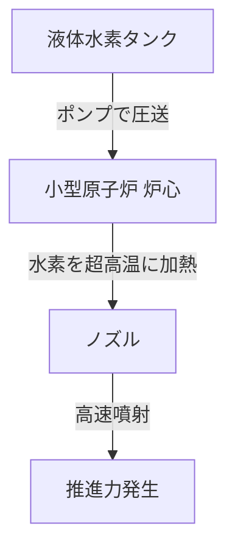

# T19-02-04 原子力推進システム（イオンエンジン・核熱推進）

## Summary（5つの要点）

1.  **高効率（イオンエンジン）**: JAXA「はやぶさ」のμ10エンジンが実証。推進剤（キセノン等）を電気でイオン化して加速。推力は小さいが燃費（比推力）が極めて良く、少ない燃料で長期間加速でき、深宇宙探査の航行期間短縮に貢献する。
2.  **高推力（核熱推進 NTP）**: 小型原子炉で液体水素を数千度の高温ガスにして噴射。従来の化学ロケット（液体酸素/水素）の2倍以上の燃費効率と、化学ロケット並みの高推力を両立する。
3.  **火星有人探査の鍵**: NTPは、火星への航行期間を従来の8～9ヶ月から3～4ヶ月に劇的に短縮できる。これにより、宇宙飛行士の宇宙線被ばく量を許容範囲内に抑えるための最重要技術とされている。
4.  **NASA/DARPA「DRACO」**: NASAとDARPAは、核熱推進（NTP）を軌道上で実証する「DRACO」計画を推進しており、2027年にも実証機を打ち上げる予定。
5.  **原子力電池 (RPS)**: 推進用ではないが、プルトニウムの崩壊熱で発電する原子力電池（RTG）は、太陽光が極めて弱い木星以遠の外惑星探査（ボイジャー、カッシーニ等）に必須の電源技術である。

#### 概念図: 核熱推進 (NTP) の基本原理

## 技術評価表（定量的な視点）

| 項目 | 評価 (5段階) | 概要 |
| :--- | :--- | :--- |
| **導入コスト** | ⭐⭐⭐⭐⭐ | 原子炉の開発、試験、安全対策に莫大なコスト。 |
| **技術成熟度** | ⭐⭐☆☆☆ | NTPは1970年代に地上試験実績あるも、宇宙実証はこれから。イオンエンジンは実用化済み。 |
| **日本の競争力** | ⭐⭐⭐⭐☆ | イオンエンジン技術（はやぶさ）は世界トップクラス。NTPは基礎研究段階。 |
| **市場性** | ⭐⭐☆☆☆ | 深宇宙探査、および軍事衛星（軌道変更）など、国家主導のミッションに限定される。 |
| **品質保証の重要性** | ⭐⭐⭐⭐⭐ | 放射性物質の厳格な管理と、打ち上げ失敗時・再突入時の安全確保が最優先課題。 |

## 日本の立ち位置・強み弱みのSummary

### 強み

* **イオンエンジンの実績**: 「はやぶさ」初号機・2号機で培ったイオンエンジンの長期運用実績と信頼性は世界最高レベルであり、MMXにも搭載されている。
* **原子炉の基礎技術**: 高温ガス炉（HTTR）など、高温原子炉に関する基礎技術の蓄積がある。

### 弱み

* **NTP開発の遅れ**: NTP（核熱推進）に関する具体的な開発プロジェクトは米国（NASA/DARPA）が大きく先行しており、日本は研究段階に留まる。
* **社会的・政治的ハードル**: 原子力の宇宙利用（特に原子炉）に対する国内の社会的・政治的ハードルが米国やロシアに比べて高く、開発が進めにくい。

## 技術ロードマップ（短期/中期/長期）

### 短期目標（～2027年）

* NASA/DARPAがNTP実証機「DRACO」を打ち上げ、軌道上での原子炉起動と推進実証を行う。
* 高性能イオンエンジンのさらなる長寿命化・大推力化が進む。

### 中期目標（2028年～2031年）

* 「DRACO」の実証結果に基づき、NTP技術の高度化と、将来の火星ミッションに向けた実用エンジンの設計が確定する。
* 原子力電池（RPS）の次世代型（高効率）の開発が進む。

### 長期目標（2032年～2035年）

* 2030年代後半から2040年代に計画される火星有人探査ミッションの推進システムとして、NTPエンジンが実用化される。
* 外惑星（木星・土星圏）への高速無人探査にもNTPが適用され始める。

### 📚 参照リンク

* [NASA - Nuclear Thermal Propulsion (NTP)](https://www.nasa.gov/general/nuclear-thermal-propulsion/)
* [DARPA - DRACO Program](https://www.darpa.mil/program/demonstration-rocket-for-agile-cislunar-operations)
* [JAXA - イオンエンジン](https://www.isas.jaxa.jp/technology/mechanics/ion_engine.html)
