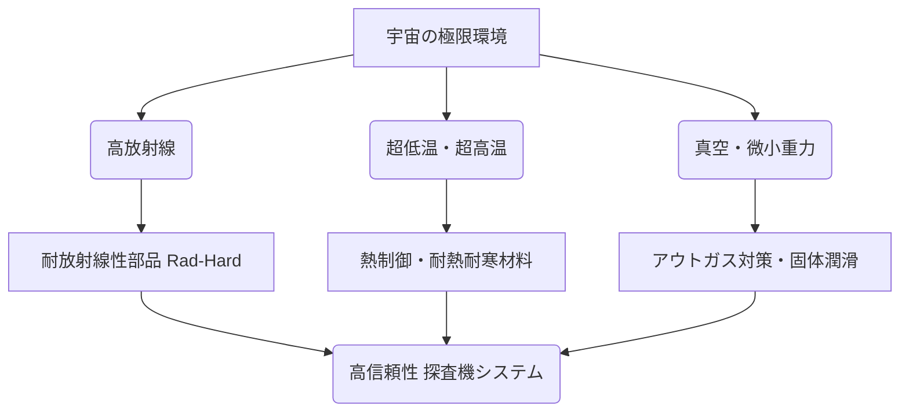

# T19-02-05 極限環境耐性技術（超低温・高放射線・真空）

## Summary（5つの要点）

1.  **ミッション成功の基盤**: 探査機が宇宙空間や惑星表面の過酷な環境で10年以上にわたり正常に動作するための、最も地味だが最重要な基盤技術。
2.  **耐放射線性 (Rad-Hard)**: 宇宙線（特に銀河宇宙線や太陽フレア）による電子部品（CPU、メモリ）の誤動作（シングルイベント）や劣化を防ぐ技術。シールド（遮蔽）や専用の回路設計で対応する。
3.  **耐低温・耐高温**: 月の夜（-170℃）や木星圏（-145℃）での超低温、逆に金星表面（+460℃）での超高温に耐えるバッテリー、電子機器、モーター、潤滑剤（固体潤滑）の開発が必須。
4.  **真空対策**: 真空中では材料からガス（アウトガス）が発生し、カメラのレンズを曇らせるため、低アウトガス材料の使用やベーキング処理が不可欠。
5.  **究極の品質保証**: 地上での修理が不可能なため、部品選定から製造プロセス、地上での過酷な環境試験（熱真空試験、振動試験、放射線照射試験）まで、極めて高度な品質保証が要求される。

#### 概念図: 極限環境への対策技術

## 技術評価表（定量的な視点）

| 項目 | 評価 (5段階) | 概要 |
| :--- | :--- | :--- |
| **導入コスト** | ⭐⭐⭐⭐☆ | 特殊な材料、専用の試験設備、厳格なスクリーニングが必要で高コスト。 |
| **技術成熟度** | ⭐⭐⭐⭐☆ | 多くの探査機で長年の実績があるが、金星表面など未踏の環境も多い。 |
| **日本の競争力** | ⭐⭐⭐⭐☆ | JAXA認定部品制度など、民生品をベースにした高品質な部品供給力に強み。 |
| **市場性** | ⭐⭐⭐☆☆ | 宇宙・防衛・原子力・航空機など、高信頼性が求められるニッチ市場が中心。 |
| **品質保証の重要性** | ⭐⭐⭐⭐⭐ | 最重要。環境試験、信頼性評価、故障モード解析（FMEA）がミッションの成否を分ける。 |

## 日本の立ち位置・強み弱みのSummary

### 強み

* **高品質な電子部品**: 日本のメーカーは高品質な民生用電子部品（コンデンサ、半導体メモリ等）に強みを持ち、これを宇宙用にスクリーニングする「JAXA認定部品」制度が確立されている。
* **材料科学**: 耐熱性や耐放射線性に優れた新材料（セラミックス、複合材料）の研究開発で高い基礎技術力を持つ。

### 弱み

* **専用部品メーカーの不在**: BAE Systems（米）やHoneywell（米）のように、耐放射線性CPU（Rad-Hard CPU）を専門に開発・販売するメーカーが国内に少なく、高性能品は輸入に依存しがち。
* **極限環境試験設備の不足**: 金星表面や木星の高放射線環境を地上で完全に再現する大規模な試験設備が限られている。

## 技術ロードマップ（短期/中期/長期）

### 短期目標（～2027年）

* 月面探査（アルテミス計画、LUPEX）に向け、月の夜の超低温（-170℃）環境下で長期動作可能なバッテリー、電子機器、ローバー機構部品の実用化。
* 民生品（COTS）の宇宙利用を促進するための、効率的な放射線試験・評価手法の確立。

### 中期目標（2028年～2031年）

* 木星の衛星エウロパなど、高放射線環境下での探査ミッション（NASAエウロパ・クリッパー等）に向けた、超耐放射線性電子部品の開発。
* 月面での長期滞在（有人基地）に向けた、放射線防護技術の確立。

### 長期目標（2032年～2035年）

* 金星表面（+460℃、90気圧）という究極の高温・高圧環境で長時間動作可能な探査機（シリコンカーバイド半導体など）の研究開発が進展。
* 極低温環境（例：タイタンのメタンの海）で動作する探査ロボットの実用化。

### 📚 参照リンク

* [NASA - Radiation Effects and Analysis](https://www.nasa.gov/general/radiation-effects-and-analysis/)
* [JAXA - JAXA認定部品](https://stage.tksc.jaxa.jp/jedi/jp/supply/parts.html)
* [NASA - Extreme Environment Technologies](https://www.nasa.gov/general/extreme-environment-technologies/)
