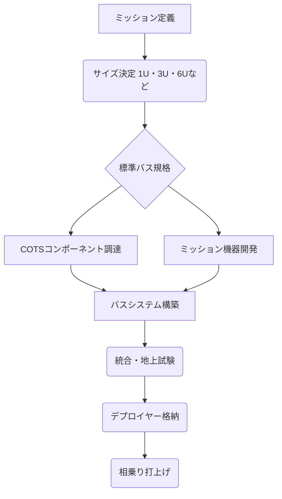

## Summary（5つの要点）

1.  **標準化による革命**: 1U（10cm立方、約1.33kg）を基本単位とする国際標準規格（CubeSat Standard）により、開発と打上げのハードルが劇的に低下。
2.  **COTS部品の活用**: 民生品・汎用品（Components-Off-The-Shelf）を積極的に利用し、開発コストと期間を従来の1/10～1/100に短縮。
3.  **開発の民主化**: 大学の研究室やスタートアップ企業が宇宙開発に参入する道を開き、イノベーションを加速。
4.  **高いスケーラビリティ**: 1U、3U、6U、12U、16Uとサイズが拡張され、より高度なミッション（深宇宙探査、高分解能観測）にも対応可能に。
5.  **コンステレーションの基盤**: 数十～数百機のCubeSatを連携させるコンステレーション構築の基盤技術となっている。

#### 概念図: CubeSat開発と標準化のプロセス

## 技術評価表（定量的な視点）

| 項目 | 評価（5段階） | 概要 |
| :--- | :--- | :--- |
| **導入コスト** | ⭐⭐⭐⭐⭐ (低) | 従来の衛星と比べ桁違いに低い。数千万円から開発可能。 |
| **技術成熟度** | ⭐⭐⭐⭐⭐ (高) | 2000年代初頭から始まり、既に数千機が軌道投入済み。 |
| **日本の競争力** | ⭐⭐⭐☆☆ (中) | 大学発の技術で先行したが、現在は欧米ベンチャーが市場を席巻。 |
| **市場性** | ⭐⭐⭐⭐⭐ (高) | 教育、研究、ビジネス（観測、通信）の全分野で需要が拡大。 |
| **品質保証の重要性** | ⭐⭐⭐⭐☆ (高) | 低コスト優先だが、デブリ化防止や放出機構の信頼性確保が必須。 |

## 日本の立ち位置・強み弱みのSummary

### 強み

1.  **早期の技術蓄積**: 東京大学、東京工業大学などが2000年代初頭に世界初のCubeSatを打ち上げ、技術をリードした実績がある。
2.  **有力ベンチャーの存在**: アクセルスペースなど、CubeSatを活用したビジネス（コンステレーション）を展開する有力ベンチャーが育っている。
3.  **高品質な部品製造**: 日本の得意とする高品質な電子部品や素材が、信頼性の高いコンポーネント供給に貢献している。

### 弱み

1.  **コンポーネントの海外依存**: バス用の主要コンポーネント（電源、通信機、姿勢制御）市場では、欧州（GomSpace, ISISPACE）や米国企業にシェアを奪われている。
2.  **量産・コスト競争力**: COTS部品を活用した量産体制とコスト競争力において、海外の専業メーカーに後れを取っている。
3.  **標準化の主導権**: CubeSat規格そのものの策定や改訂において、米国の大学（Cal Poly）や欧州企業の影響力が強い。

## 技術ロードマップ（短期/中期/長期）

### 短期目標（～2027年）

* **6U/12Uの普及**: より高性能なミッション機器（小型SAR、高解像度カメラ）を搭載可能な6U/12Uサイズのバスシステムが主流になる。
* **COTSコンポーネントの高性能化**: 放射線耐性や処理能力を向上させたCOTS部品が標準化され、信頼性が向上する。

### 中期目標（2028年～2031年）

* **軌道上サービス対応**: 燃料補給や部品交換など、軌道上サービス（OOS）を前提としたモジュール型バス技術が開発される。
* **AI搭載バス**: エッジコンピューティングにより、衛星側でデータ処理（画像解析など）を完結させるAI搭載バスが普及する。

### 長期目標（2032年～2035年）

* **深宇宙CubeSat**: 月軌道や火星軌道など、深宇宙探査に耐えうる高信頼性・自律型のCubeSatバス技術が確立される。
* **自己増殖型バス**: 軌道上で3Dプリンティングなどを用い、他のCubeSatを製造・修理する自己増殖型・自己修復型のバス構想。

### 📚 参照リンク

* [NASA - CubeSat Launch Initiative](https://www.nasa.gov/mission/cubesat-launch-initiative/)
* [CubeSat Standard (Cal Poly)](https://www.cubesat.org/)
* [GomSpace (CubeSatコンポーネントメーカー)](https://gomspace.com/)
* [ISISPACE (CubeSatメーカー)](https://www.isispace.nl/)
