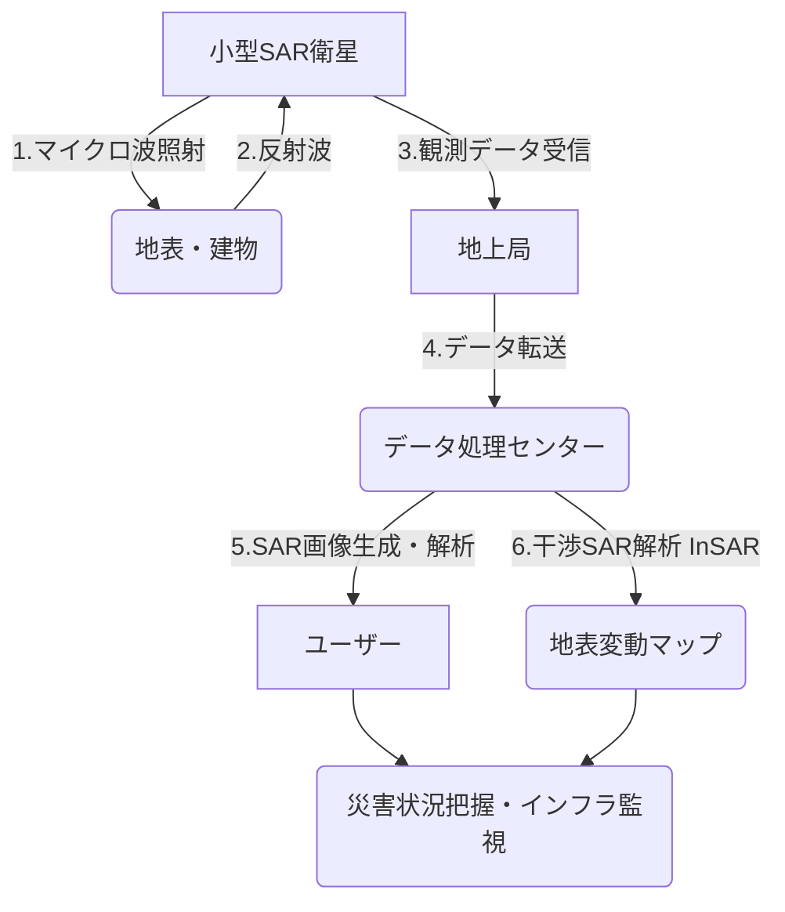

## Summary（5つの要点）

1.  **全天候型観測**: SAR（合成開口レーダー）は自らマイクロ波を照射し、その反射を観測するため、夜間や雲に覆われていても地表を観測可能。
2.  **小型・軽量化の実現**: 従来は数トン級の大型衛星が必要だったSARシステムを、アンテナの軽量化や電子機器の集積化により100kg級の小型衛星で実現。
3.  **コンステレーションによる高頻度観測**: 小型SAR衛星を多数打ち上げ、コンステレーション（衛星群）を構築することで、同一地点を数時間～数十分間隔で観測可能に。
4.  **InSAR（干渉SAR）技術**: 異なる時期に観測した2枚のSAR画像を比較し、地表の数ミリ単位の変動（地盤沈下、インフラ変位）を検出可能。
5.  **市場の急成長**: 災害監視、インフラ管理、防衛、農業、金融など多様な分野でのデータ需要が急増し、スタートアップ企業が激しく競争している。

#### 概念図: 小型SAR衛星の観測プロセス

## 技術評価表（定量的な視点）

| 項目 | 評価（5段階） | 概要 |
| :--- | :--- | :--- |
| **導入コスト** | ⭐⭐☆☆☆ (高) | CubeSatよりは遥かに高コスト。1機あたり数億～数十億円。 |
| **技術成熟度** | ⭐⭐⭐⭐☆ (高) | 技術自体は確立。現在はコンステレーション構築のフェーズ。 |
| **日本の競争力** | ⭐⭐⭐⭐☆ (高) | Synspective、QPS研究所など世界トップレベルのベンチャーが存在。 |
| **市場性** | ⭐⭐⭐⭐⭐ (高) | 2030年に向け市場は急拡大予測。データ解析サービスが鍵。 |
| **品質保証の重要性** | ⭐⭐⭐⭐⭐ (極高) | 高周波電力、大型アンテナ展開機構、熱処理など高難度の品質保証。 |

## 日本の立ち位置・強み弱みのSummary

### 強み

1.  **有力ベンチャーの台頭**: Synspective（シンスペクティブ）やQPS研究所が、海外のICEYEやCapella Spaceと並び、小型SAR市場のトップランナーとして競っている。
2.  **JAXAの技術蓄積**: JAXAのALOSシリーズ（「だいち」）で培われたSAR技術とデータ利用ノウハウが、民間企業の基盤となっている。
3.  **高精度なデータ解析**: InSAR（干渉SAR）を用いたインフラ変位モニタリングなど、高精度なデータ解析ソリューションで優位性を持つ。

### 弱み

1.  **資金調達規模**: 海外の競合（ICEYE, Capella）は、日本企業を上回る巨額の資金調達に成功しており、コンステレーション構築のスピードで差をつけられる懸念がある。
2.  **打上げ手段の依存**: 小型SAR衛星を迅速に多数打ち上げるための低コストなロケットが国内になく、SpaceXなど海外ロケットへの依存度が高い。
3.  **データ利用の裾野**: 防衛・政府需要に比べ、民間企業によるSARデータ利用の普及（特にAI解析）が欧米より遅れている。

## 技術ロードマップ（短期/中期/長期）

### 短期目標（～2027年）

* **第1世代コンステレーション完成**: 各社が目標とする数十機規模のコンステレーション構築を完了し、全球の高頻度観測サービスを開始する。
* **分解能の向上**: サブメーター級（1m以下）の分解能を持つ小型SARが標準化し、より詳細な地表識別が可能になる。

### 中期目標（2028年～2031年）

* **データ解析AIの統合**: SAR画像から自動で物体認識や変化抽出を行うAIプラットフォームが普及し、データが「情報」として提供される。
* **動画SARの実用化**: 同一地点を連続観測し、車両の動きなどを捉える「動画SAR」技術が小型衛星で実用化される。

### 長期目標（2032年～2035年）

* **マルチバンド小型SAR**: Lバンド、Xバンド、Cバンドなど複数の周波数帯を搭載した小型SARが登場し、植生透過や土壌水分測定など観測能力が向上する。
* **即時性（Near Real-time）**: 衛星間光通信と軌道上AI処理により、観測から数分以内に地上へ情報が届く即時災害監視システムが確立される。

### 📚 参照リンク

* [Synspective（シンスペクティブ）](https://synspective.com/jp/)
* [株式会社QPS研究所](https://i-qps.net/)
* [ICEYE (競合: フィンランド)](https://www.iceye.com/)
* [Capella Space (競合: 米国)](https://www.capellaspace.com/)
* [JAXA | 陸域観測技術衛星「だいち」 (ALOS)](https://www.jaxa.jp/projects/sat/alos/)
