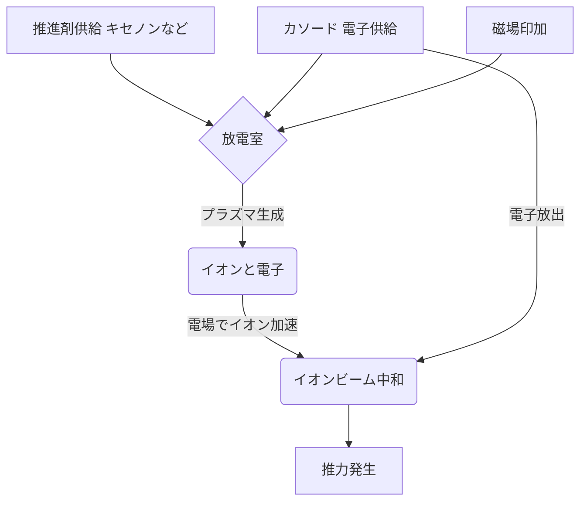

## Summary（5つの要点）

1.  **電気推進（EP）の利点**: 従来の化学推進（ロケット）に比べ、推進剤（燃料）の消費効率（比推力）が10倍以上高く、長期間の運用や大幅な軌道変更が可能。
2.  **小型衛星への必須技術**: コンステレーション構築時の軌道投入、軌道維持（高度維持）、デオービット（運用終了時の軌道離脱）に不可欠な技術となっている。
3.  **イオンスラスター**: キセノン等の推進剤をイオン化し、静電場で加速・噴射する。「はやぶさ」で有名。比推力は高いが推力は小さい。
4.  **ホールスラスター**: 磁場を利用してプラズマを生成・加速する。イオンスラスターより大きな推力を得られ、効率も高い。Starlink衛星にも採用されている。
5.  **推進剤の多様化**: 従来のキセノンに加え、コストや安全性の観点からヨウ素（Iodine）や水（H2O）を利用するスラスターが実用化されている。

#### 概念図: 電気推進（ホールスラスター）の基本原理

## 技術評価表（定量的な視点）

| 項目 | 評価（5段階） | 概要 |
| :--- | :--- | :--- |
| **導入コスト** | ⭐⭐⭐☆☆ (中) | 高度な真空技術と電源システムが必要。キセノンも高価。 |
| **技術成熟度** | ⭐⭐⭐⭐☆ (高) | 深宇宙探査や大型通信衛星で実績多数。小型化が近年のトレンド。 |
| **日本の競争力** | ⭐⭐⭐⭐☆ (高) | 「はやぶさ」のイオンエンジン実績、東大発ベンチャーPale Blueの活躍。 |
| **市場性** | ⭐⭐⭐⭐⭐ (高) | コンステレーション市場の拡大に伴い、需要は爆発的に増加。 |
| **品質保証の重要性** | ⭐⭐⭐⭐⭐ (極高) | 数年間の連続運転が求められるため、カソード消耗などの長期信頼性評価が重要。 |

## 日本の立ち位置・強み弱みのSummary

### 強み

1.  **イオンエンジンの実績**: JAXAの「はやぶさ」「はやぶさ2」ミッションで、世界最高水準のイオンエンジン技術（μ10）を実証し、長期運用ノウハウを蓄積している。
2.  **有力ベンチャーの存在**: 東大発のPale Blue（ペールブルー）が、安全な「水」を推進剤とするスラスターを開発・販売し、グローバル市場で高い評価を得ている。
3.  **基礎研究の層の厚さ**: 大学や研究機関（JAXA宇宙科学研究所など）でのプラズマ物理や電気推進に関する基礎研究が活発。

### 弱み

1.  **ホールスラスターの遅れ**: 世界のコンステレーション市場（特にStarlink）ではホールスラスターが主流だが、日本はこの分野で欧米（Safran, Busek）やロシアに後れを取っていた。
2.  **コンポーネントの量産**: コンステレーション向けの大量生産（年間数百～数千基）に対応するサプライチェーンとコスト競争力が課題。
3.  **推進剤（キセノン）の依存**: 高価な希ガスであるキセノンはほぼ輸入に頼っており、コストと供給安定性にリスクがある。（→水やヨウ素への転換が急務）

## 技術ロードマップ（短期/中期/長期）

### 短期目標（～2027年）

* **CubeSat用スラスターの普及**: 1U～6UのCubeSatに搭載可能な超小型電気推進システム（数W～数10W級）の商用化が進む。
* **代替推進剤（ヨウ素・水）の実用化**: キセノンより安価で調達しやすいヨウ素や、安全な水を推進剤とするスラスターが軌道上で実証され、採用が拡大する。

### 中期目標（2028年～2031年）

* **ホールスラスターの国産化と普及**: Starlinkクラスの大規模コンステレーションに対応可能な、高出力・長寿命のホールスラスターの国産化と量産体制が確立される。
* **大電力化**: 衛星の大型化に伴い、数kW～10kW級の高出力電気推進システムの需要が高まる。

### 長期目標（2032年～2035年）

* **全電気推進衛星の一般化**: 軌道投入（アポジキック）も電気推進で行う「全電気推進衛星」が標準となり、衛星の軽量化（＝打上げコスト削減）が極まる。
* **深宇宙探査への応用**: 数十kW級の高出力スラスターが開発され、火星有人探査や外惑星探査の推進システムとして利用される。

### 📚 参照リンク

* [Pale Blue（ペールブルー）株式会社](https://pale-blue.co.jp/jp/)
* [JAXA | イオンエンジン](https://www.isas.jaxa.jp/j/forefront/2012/yoshikawa/)
* [Safran (ホールスラスターメーカー)](https://www.safran-group.com/products-services/space-plasma-propulsion)
* [Busek (電気推進メーカー)](https://www.busek.com/)
