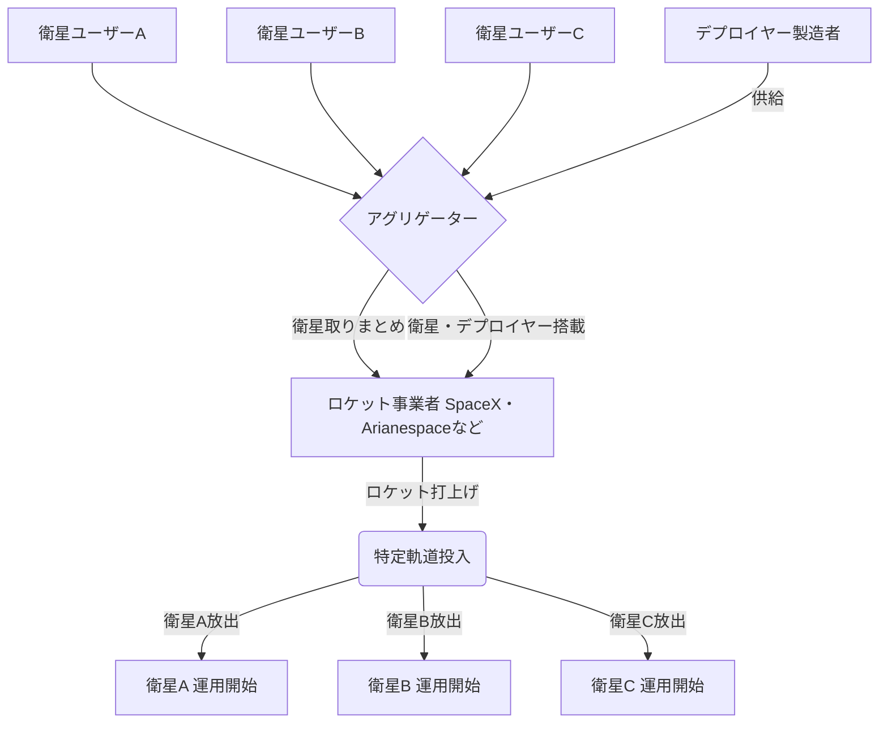

## Summary（5つの要点）

1.  **低コスト化の実現**: 大型衛星打上げロケットの余剰能力（空きスペース）を利用するため、小型衛星専用ロケットより打上げコストを劇的に低減できる。
2.  **SpaceXによる市場破壊**: SpaceXが「Rideshare Program」を開始し、透明性の高い価格（例: 200kgまで100万ドル）と定期的な打上げ（年数回）を提供、市場を独占。
3.  **デプロイヤーの重要性**: CubeSatなどの小型衛星をロケットから安全に分離・放出するための専用機構（Deployer）が必須。衛星とロケットのインターフェースとなる。
4.  **アグリゲーターの役割**: 多数の小型衛星ユーザーを取りまとめ、ロケット事業者と交渉・調整を行う「アグリゲーター」（仲介事業者）がビジネスエコシステムの中核を担う。
5.  **軌道投入の制約**: 基本的に主衛星（プライマリー）の軌道、または相乗り衛星用に設定された特定の軌道にしか投入できず、軌道の自由度は低い。

#### 概念図: 相乗り打上げ（Rideshare）エコシステム

## 技術評価表（定量的な視点）

| 項目 | 評価（5段階） | 概要 |
| :--- | :--- | :--- |
| **導入コスト** | ⭐⭐⭐⭐⭐ (低) | 衛星開発者にとって最も安価な宇宙アクセス手段。 |
| **技術成熟度** | ⭐⭐⭐⭐⭐ (高) | 2010年代から一般化し、SpaceXの参入で完全に成熟した市場。 |
| **日本の競争力** | ⭐⭐☆☆☆ (弱) | SpaceXのような圧倒的低コスト・高頻度の事業者が不在。 |
| **市場性** | ⭐⭐⭐⭐⭐ (高) | 全ての小型衛星開発者が利用対象。打上げ需要の増大が続く。 |
| **品質保証の重要性** | ⭐⭐⭐⭐⭐ (極高) | 放出失敗はミッション失敗に直結。他衛星やロケットへの悪影響（衝突、デブリ化）防止が最重要。 |

## 日本の立ち位置・強み弱みのSummary

### 強み

1.  **デプロイヤー製造技術**: JAXAや日本のベンチャー（例: 三井物産エアロスペース）は、CubeSat用の高信頼性デプロイヤーの製造・販売実績を持つ。
2.  **JAXAの相乗りプログラム**: H-IIAやH3、イプシロンロケットで「革新的衛星技術実証プログラム」など、国内の衛星を相乗りで打ち上げる実績を積んでいる。
3.  **アグリゲーター事業**: スペースBD、三井物産エアロスペースなどが、国内外のロケット（SpaceX含む）の相乗り枠を国内ユーザーに販売する事業を展開。

### 弱み

1.  **打上げ事業者の競争力欠如**: SpaceXのRideshareプログラムと比較して、日本のH3やイプシロンロケットの相乗りメニューは、価格、頻度、柔軟性の全てで圧倒的に劣っている。
2.  **海外への完全依存**: 結局、日本の小型衛星ユーザーの多くが、最も安価で便利なSpaceXのRideshareを利用しており、宇宙アクセスを海外に依存している状態。
3.  **規制の壁**: 日本のロケットで海外の衛星を相乗りで打ち上げる場合、安全保障上の規制（輸出管理）が欧米より厳しく、ビジネスの障壁となる場合がある。

## 技術ロードマップ（短期/中期/長期）

### 短期目標（～2027年）

* **SpaceXの独占継続**: SpaceXのRideshare Program（Transporterミッション）が市場を席巻し続ける。
* **デプロイヤーの多様化**: 12Uや16Uの大型CubeSatや、数100kg級の小型衛星に対応したデプロイヤーが標準化される。

### 中期目標（2028年～2031年）

* **国産ロケットの競争力強化**: H3ロケットやイプシロンSの打上げ頻度向上とコストダウンにより、相乗りメニューの魅力を高める。
* **軌道間輸送機（OTV）の普及**: 相乗りで打ち上げられた後、最終的な目的軌道まで衛星を運ぶ「OTV（Orbital Transfer Vehicle）」が実用化され、軌道の自由度の低さを補完する。

### 長期目標（2032年～2035年）

* **専用軌道投入の低コスト化**: Rocket Labやインターステラテクノロジズなどの小型ロケットが低コスト化し、「相乗り」ではなく「専用」で任意の軌道に打ち上げる選択肢が一般化する。
* **軌道上デポからの放出**: 軌道上に待機する宇宙ステーションやOTVデポから、必要なタイミングで衛星を放出するサービスが始まる。

### 📚 参照リンク

* [SpaceX Rideshare Program](https://www.spacex.com/rideshare/)
* [JAXA | 革新的衛星技術実証プログラム](https://www.jaxa.jp/projects/iss_human/kakushin/)
* [Exolaunch (アグリゲーター/デプロイヤー)](https://exolaunch.com/)
* [三井物産エアロスペース（デプロイヤー）](https://www.mitsuiaerospace.com/jp/project/satellite/)
