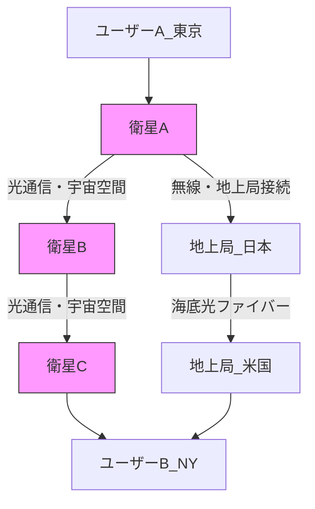

## Summary（5つの要点）

1.  **低軌道コンステレーション**: 高度500～2000kmの**低軌道（LEO）**に数千～数万機の小型衛星を配置し、全地球規模の通信カバレッジを実現する。
2.  **衛星間光通信（ISL）**: 衛星同士を**レーザー光**で接続し、データをバケツリレー式に転送。地上局（ゲートウェイ）を経由せずに通信できる。
3.  **超低遅延の実現**: 真空中（宇宙空間）を光速で進むため、地上の光ファイバーケーブルよりも伝送遅延が理論上**40%以上少ない**。
4.  **Starlinkの先行**: SpaceXのStarlinkが既に5000機以上を打ち上げ、衛星間光通信を実装した第2世代機を量産・展開し、市場を先行している。
5.  **地上インフラの代替**: 海洋、砂漠、山岳地帯、被災地など、光ファイバーの敷設が困難な地域でも**高速ブロードバンド**を提供可能にする。

#### 概念図: 衛星間光通信ネットワーク

## 技術評価表（定量的な視点）

| 項目 | 評価（5段階） | 概要 |
| :--- | :--- | :--- |
| **導入コスト** | ⭐☆☆☆☆ (極高) | 数千機の衛星製造・打上げ、地上局整備に数兆円規模の投資が必要。 |
| **技術成熟度** | ⭐⭐⭐☆☆ (中) | Starlinkが実用化したが、他社は追随中。高度な技術。 |
| **日本の競争力** | ⭐☆☆☆☆ (弱) | プラットフォーム構築競争では米中（Starlink, Kuiper, 国網）に完敗。 |
| **市場性** | ⭐⭐⭐⭐⭐ (極高) | 全地球の通信インフラ市場であり、経済安全保障上の要。 |
| **品質保証の重要性** | ⭐⭐⭐⭐⭐ (極高) | 高速で移動する衛星間でレーザー光の軸を合わせ続ける高度な捕捉・追尾技術（PAT）が必須。 |

## 日本の立ち位置・強み弱みのSummary

### 強み

1.  **光コンポーネント技術**: JAXA（LUCAS）、NICT（情報通信研究機構）が光通信の基礎研究で実績。また、光デバイス、増幅器、レンズなど、日本の部品メーカーが強みを持つ。
2.  **地上局インフラ**: NTT、KDDI、ソフトバンクなどがStarlinkやKuiperの地上局パートナーとして、国内でのサービス展開を担っている。
3.  **データ利用ノウハウ**: 光ファイバー網の運用ノウハウや、通信サービス（BtoB, BtoC）の提供実績が豊富。

### 弱み

1.  **プラットフォーマーの不在**: Starlink（SpaceX）、Kuiper（Amazon）、OneWeb（Eutelsat）のような巨大コンステレーションを自ら構築する日本企業・政府プロジェクトが存在しない。
2.  **資本力と打上げ能力の欠如**: 数兆円規模の投資と、年間数百機を打ち上げる圧倒的なロケット能力（SpaceXのFalcon 9）が決定的に不足している。
3.  **市場の周回遅れ**: Starlinkが既にデファクトスタンダードになりつつあり、日本は「ユーザー」または「部品供給者」の立場に甘んじている。

## 技術ロードマップ（短期/中期/長期）

### 短期目標（～2027年）

* **Starlinkのサービス拡大**: 衛星間光通信を搭載したStarlink第2世代機の展開が完了し、グローバルでの低遅延サービス（特に金融、海運、航空）が本格化する。
* **Amazon Kuiperの追随**: AmazonのProject Kuiperが衛星の大量打上げを開始し、Starlinkに対抗する第2の巨大コンステレーションとしてサービスインする。

### 中期目標（2028年～2031年）

* **第2世代コンステレーション**: 通信容量の増大、遅延のさらなる低減、より小型なユーザー端末に対応した第2世代のコンステレーション競争が始まる。
* **各国政府の独自網**: 米中対立の激化に伴い、欧州（IRIS²）、中国（国網）、インドなどが、安全保障を目的とした独自の衛星間光通信網の構築を急ぐ。

### 長期目標（2032年～2035年）

* **軌道上データセンター**: 衛星間光通信網が「宇宙のインターネット」バックボーンとなり、軌道上でデータ処理を行う「軌道上データセンター」が出現する。
* **6Gとの統合**: 地上の6G通信網と低軌道コンステレーションがシームレスに統合され、空・海・宇宙の全てが通信エリアとなる。

### 📚 参照リンク

* [Starlink by SpaceX](https://www.starlink.com/)
* [Amazon Project Kuiper](https://www.aboutamazon.com/projectkuiper)
* [JAXA | 光衛星間通信システム（LUCAS）](https://www.jaxa.jp/projects/sat/lucas/)
* [NICT | 衛星光通信](https://www.nict.go.jp/wireless/category/research-fields/satellite-optical-communication.html)
* [ESA HydRON (光通信実証)](https://www.esa.int/Applications/Telecommunications_Integrated_Applications/HydRON)
