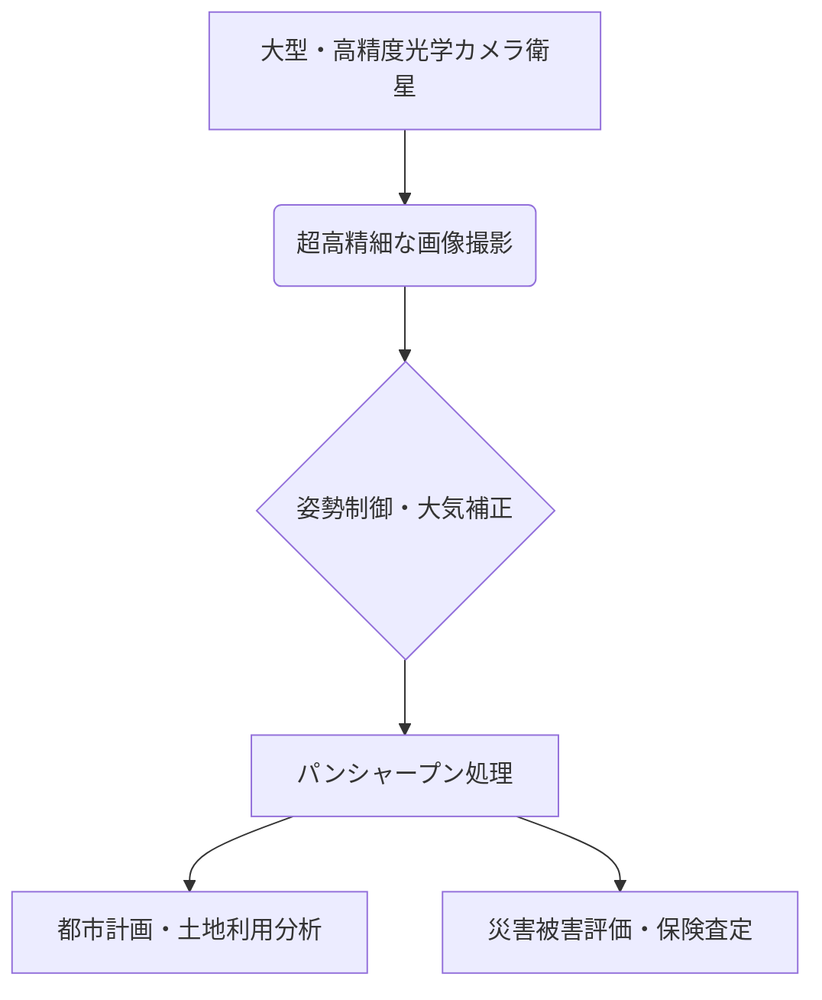

# T19-04-01 高解像度光学カメラ衛星（分解能30cm～1m）

## Summary（5つの要点）

1. **高精細画像取得の実現**: 地上の車両、建物、農作物を識別できる**分解能30cmから1mクラス**の超高精細画像を宇宙から撮影する。
2. **災害被害の迅速評価**: 災害発生直後のインフラ損傷、倒壊建物の状況、交通状況などを面的に把握し、**緊急対応機関の意思決定**を支援する。
3. **光学系の超高精度化**: 衛星の姿勢制御、熱変形補正、大型主鏡の**超精密研磨技術**が分解能向上の鍵となる。
4. **衛星機体の小型・軽量化**: センサー技術と機体バス技術の進化により、高解像度化と同時に**小型化**が進行し、観測頻度とコスト効率が向上する。
5. **パンシャープン処理の高度化**: 白黒画像（パンクロマティック）とカラー画像（マルチスペクトル）を統合し、解像度を維持しつつカラー情報を持たせる**画像融合技術**が解析精度を高める。

#### 概念図: 高解像度光学観測システムフロー

## 技術評価表（定量的な視点）

| 項目 | 評価（5段階） | 備考 |
| :--- | :--- | :--- |
| **導入コスト** | ⭐⭐⭐⭐⭐ | 衛星機体、高精度光学部品、打上げ費用が高額 |
| **技術成熟度** | ⭐⭐⭐⭐︎ | 基礎技術は確立済。商業衛星では分解能30cmが最高水準（WorldView-3） |
| **日本の競争力** | ⭐⭐⭐⭐︎ | 三菱電機ASNARO-2（50cm級）など、**高精度な光学系技術**で実績あり |
| **市場性** | ⭐⭐⭐⭐⭐ | 防衛・情報収集、都市計画、農業、保険査定など商業利用が幅広い |
| **品質保証の重要性**| ⭐⭐⭐⭐︎ | 幾何学的な位置精度、放射計測精度が都市計画・測量に直結するため重要 |

## 日本の立ち位置・強み弱みのSummary

### 強み：

* **光学部品・精密加工技術**: 高解像度光学衛星に不可欠な**大型主鏡の研磨**や、センサー製造における**精密加工技術**で世界的な優位性を持つ。
* **ASNARO-2の運用実績**: 経済産業省（現・JAXA移管）の**ASNARO-2（50cm級）**運用により、高解像度衛星の設計・運用ノウハウを蓄積。
* **衛星バスの信頼性**: **三菱電機、NEC**などが提供する高信頼性の衛星バスは、長期安定運用を支える基盤技術となっている。

### 弱み：

* **商業化の遅れ**: 米国（Maxar、Planet Labs）のような**コンステレーションによる高頻度観測**と、それを支える**商業エコシステム**の構築が遅れている。
* **データ価格の競争力**: 衛星データの単価が海外ベンダーに比べ高止まり傾向にあり、一般市場への浸透が課題。
* **AI解析との連携**: 膨大な画像データに対する**AI自動解析・変化検知（T19-04-03）**のプラットフォーム連携が、海外勢に比べ遅れている。

## 技術ロードマップ（短期/中期/長期）

### 短期目標（～2027年）

* **分解能30cm級**の商用光学衛星の設計・開発を完了し、災害時の即応体制を強化。
* 取得データの**幾何学的位置精度（直交精度）**を数ピクセル以下に改善。

### 中期目標（2028年～2031年）

* 複数衛星による**高頻度（日次）**観測体制を確立し、都市域の定常モニタリングサービスを商用化。
* 高解像度光学データとLiDAR、SARを組み合わせた**マルチモーダル解析**を標準化。

### 長期目標（2032年～2035年）

* **超高解像度（10cm級）**光学衛星の実現に向けた**宇宙光通信技術（T19-02-01）**を導入し、大容量データのリアルタイム伝送を確立。
* **量子イメージング技術**など、次世代センサー技術を導入し、低照度環境での高精細観測を可能にする。

### 📚 参照リンク

[JAXA 宇宙航空研究開発機構：ASNARO-2](https://www.jaxa.jp/sat/asanaro2/)
[Maxar Technologies：WorldView-3](https://www.maxar.com/products/worldview-3)