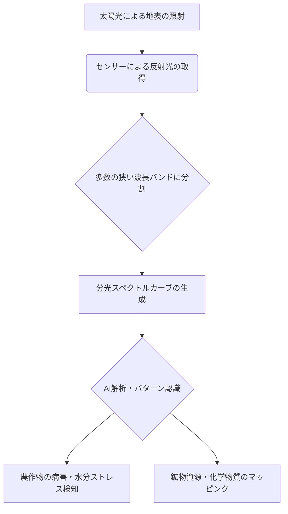

# T19-04-02 ハイパースペクトルセンサー・分光観測

## Summary（5つの要点）

1. **分光特性による物質同定**: 数百バンドの狭い波長帯域のデータ（分光情報）を利用し、通常の光学画像では不可能な物質の**種類・状態（化学組成）**を高精度で識別・定量化できる。
2. **精密農業の究極**: 農作物の病害虫、水分ストレス、栄養状態（窒素・リン酸）などを早期に検知し、**圃場レベルでのピンポイント施肥**や水管理を可能にする。
3. **環境モニタリングへの応用**: 湖沼の有害藻類（アオコ）の発生、油流出、大気汚染物質の**化学成分マッピング**など、環境変化の検出に威力を発揮する。
4. **小型・軽量化による普及**: 超小型衛星やドローンへのハイパースペクトルセンサー搭載が可能になり、観測コストが大幅に低下し、商業利用の敷居が下がる。
5. **AI・機械学習によるノイズ除去と特徴抽出**: 膨大な分光データからノイズを除去し、特定の物質に特有の**スペクトルカーブ（分光曲線）**を自動で抽出・分類するAI技術が不可欠。

#### 概念図: ハイパースペクトル情報の利用

## 技術評価表（定量的な視点）

| 項目 | 評価（5段階） | 備考 |
| :--- | :--- | :--- |
| **導入コスト** | ⭐⭐⭐⭐︎ | センサー（分光計）が高価で、データ処理の計算コストも高い |
| **技術成熟度** | ⭐⭐⭐ | 基礎研究は進展しているが、データ処理・解析手法の標準化は途上 |
| **日本の競争力** | ⭐⭐⭐⭐︎ | **経済産業省**の衛星（ASTER、HISUI）など、センサー開発・データ利用で実績 |
| **市場性** | ⭐⭐⭐⭐︎ | 精密農業、資源探査、環境管理といった専門市場で高付加価値化が期待 |
| **品質保証の重要性**| ⭐⭐⭐⭐⭐ | 特定の化学物質の定量化・異常検知を行うため、分光精度の保証が極めて重要 |

## 日本の立ち位置・強み弱みのSummary

### 強み：

* **センサー技術**: 優れた光学部品、分光計の開発能力。**住友電気工業**などが光ファイバー技術などで強みを持つ。
* **農業分野との親和性**: 日本の**精密農業**における需要が高く、農研機構などと連携した実証実験が進んでいる。
* **資源探査技術**: **経済産業省**の**HISUI（ハイパースペクトル撮像センサ）**プロジェクトなど、鉱物資源探査への応用経験が豊富。

### 弱み：

* **データ処理の標準化遅れ**: 膨大なハイパースペクトルデータの処理・圧縮技術、解析アルゴリズムの統一的なフレームワークが未整備。
* **高頻度観測への対応**: 小型衛星コンステレーションによる高頻度観測体制の構築が、光学・SARに比べると遅れている。
* **AIモデルの汎用性**: 特定の物質・環境に特化したモデルは存在するが、汎用的に利用可能なAI解析プラットフォームの開発が不足している。

## 技術ロードマップ（短期/中期/長期）

### 短期目標（～2027年）

* ドローン搭載型センサーによる圃場レベルのハイパースペクトル解析を実用化し、**病害虫の早期検知率80%以上**を達成。
* 衛星データの圧縮・伝送技術を改善し、データ処理時間を**24時間以内**に短縮。

### 中期目標（2028年～2031年）

* 超小型衛星によるハイパースペクトル観測コンステレーションを構築し、主要農業国・地域の**週次**モニタリングを実現。
* **AIが分光曲線から物質を自動同定**する精度を大幅に向上させ、環境汚染、資源探査の初期調査に本格導入。

### 長期目標（2032年～2035年）

* **テラヘルツ波**など、新たな波長域の分光情報解析技術を統合し、地中・構造物内部の非破壊検査への応用を確立。
* ハイパースペクトルデータを活用した**気候変動による生態系の変化予測モデル**を構築し、政策決定に活用。

### 📚 参照リンク

[経済産業省：ハイパースペクトルデータ活用の推進](https://www.meti.go.jp/policy/mono_info_service/saitani_kogi/space_industry/hyperspectral.html)
[農研機構：リモートセンシングを活用したスマート農業技術](https://www.naro.go.jp/english/index.html)