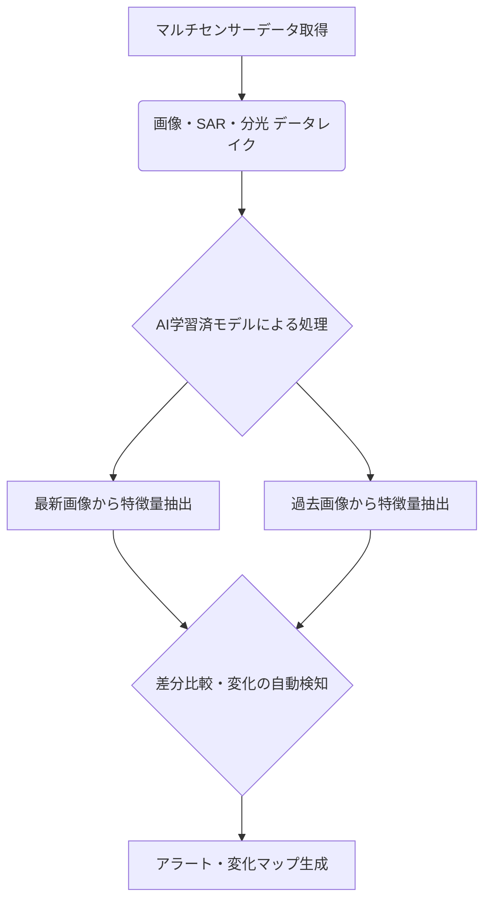

# T19-04-03 AI画像解析・自動変化検知

## Summary（5つの要点）

1. **マルチモーダルデータ統合解析**: 光学、SAR、ハイパースペクトル、LiDARなど**複数のセンサーデータ**をAIが自動で統合し、単一データでは得られない高精度な状況認識を実現。
2. **リアルタイムな変化の自動検出**: 過去の画像と比較し、新規建物の建設、森林破壊、災害によるインフラ損傷など、**地表の変化を即座に通知・マッピング**する。
3. **セマンティックセグメンテーションの精度向上**: 深層学習（特に**Transformerモデル**）により、画像内の道路、建物、水域などの**ピクセル単位での正確な分類**を自動で行う。
4. **学習データセットの拡充**: アノテーション（ラベル付け）された**高品質な教師データセット**の構築が、AIモデルの精度向上と汎用性確保のための最重要課題。
5. **エッジコンピューティングの採用**: 衛星や地上局などの**エッジデバイス**上でAI処理を行うことで、伝送するデータ量を削減し、解析結果の**即応性（Latency）**を劇的に改善する。

#### 概念図: AIによる自動変化検知のフロー

## 技術評価表（定量的な視点）

| 項目 | 評価（5段階） | 備考 |
| :--- | :--- | :--- |
| **導入コスト** | ⭐⭐⭐⭐︎ | AI開発費と高性能GPUサーバー/クラウド費用、教師データ作成コストが高い |
| **技術成熟度** | ⭐⭐⭐⭐︎ | 物体認識・画像セグメンテーションの基礎技術は確立済。マルチモーダル統合が次の課題 |
| **日本の競争力** | ⭐⭐⭐ | AI技術の基礎は高いが、大規模な教師データ整備とプラットフォーム構築で米国勢に遅れ |
| **市場性** | ⭐⭐⭐⭐⭐ | スマートシティ、国家安全保障、災害対応、保険など、最も幅広い応用を持つ |
| **品質保証の重要性**| ⭐⭐⭐⭐⭐ | 誤検知（False Positive/Negative）が災害対応や防衛上の判断を誤らせるため、厳格な検証が必要 |

## 日本の立ち位置・強み弱みのSummary

### 強み：

* **防災分野でのデータ活用ニーズ**: 日本は災害が多く、特に**国交省、消防庁**によるリアルタイムな変化検知へのニーズが非常に高い。
* **画像認識AI技術**: **日立、NEC、富士通**など、既存のセキュリティ・監視システムで培った高度な画像認識AI技術を応用可能。
* **高分解能光学衛星データ**: **JAXA**の光学衛星技術や**民間ベンチャー**による高精細データの提供基盤がある。

### 弱み：

* **教師データのアノテーション不足**: 衛星画像特有の大規模で多様な変化事象に対する高品質なアノテーション付き教師データセットの整備が遅れている。
* **海外プラットフォーマーへの依存**: Google Earth Engine、Amazon SageMakerなど、リモートセンシングAI解析プラットフォームは海外大手への依存度が高い。
* **法規制の壁**: 衛星データや解析結果の利用におけるプライバシー保護や防衛機密に関する法規制が、技術の実装・普及のボトルネックとなり得る。

## 技術ロードマップ（短期/中期/長期）

### 短期目標（～2027年）

* 災害発生後の**1時間以内**に、光学画像とSARデータを統合した**浸水域・道路途絶検知マップ**を自動生成するシステムを実運用。
* AIモデルの**説明可能性（XAI）**を向上させ、検知結果の根拠を提示する機能を実装。

### 中期目標（2028年～2031年）

* **マルチモーダル・マルチタイム**データに対応した**汎用的なAI解析プラットフォーム**を構築し、国内外の企業・自治体へ提供。
* 衛星上でAI処理を完結させる**エッジAI技術**を本格導入し、データ伝送にかかる遅延時間を**数分以内**に短縮。

### 長期目標（2032年～2035年）

* **強化学習**を応用したAIが、地球観測データから気候変動の兆候や異常事態を人間を超える精度で**自律的に学習・予測**し、政策提言まで行う。
* **デジタルツイン**環境へ自動変化検知の結果を統合し、仮想空間上での都市インフラ管理をリアルタイムで実現。

### 📚 参照リンク

[日立 研究開発：地球観測データを活用したAI技術](https://www.hitachi.co.jp/rd/contents/solution/ai/earth_observation.html)
[経済産業省：宇宙産業ビジョン2030](https://www.meti.go.jp/policy/mono_info_service/saitani_kogi/space_industry/vision2030.html)