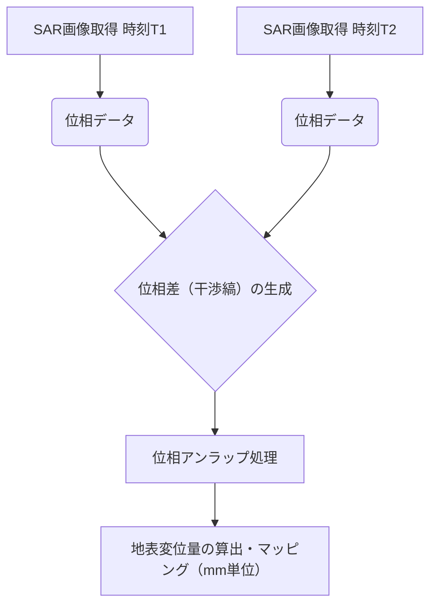

# T19-04-04 SAR干渉法（InSAR）・地表変動計測

## Summary（5つの要点）

1. **mm単位の精密変位検出**: SAR衛星が異なる時期に取得した2枚の画像間の**位相差（干渉縞）**を利用し、地盤沈下、地震・火山による**地殻の微細な変動（数mmオーダー）**を面的に検出する。
2. **全天候・昼夜観測**: SAR（合成開口レーダー）はマイクロ波を利用するため、雲や天候、昼夜に左右されず、災害時・緊急時の地表変動把握に極めて有効。
3. **時系列解析によるリスク評価**: 複数時期のInSARデータを時系列で解析することで、**変動の進行速度**を把握し、インフラや構造物へのリスクを定量的に評価する。
4. **GNSSデータとの統合**: 地上に設置された**GNSS（GPSなど）の連続観測データ**とInSARの面的データを統合することで、絶対的な位置精度と面的変動の詳細度の両方を担保する。
5. **小規模なインフラ変状検知**: 橋梁、ダム、トンネル、送電線などの**土木構造物**の微細な変状や劣化を早期に検知し、維持管理・予防保全に活用する。

#### 概念図: InSARによる地表変位計測の原理

## 技術評価表（定量的な視点）

| 項目 | 評価（5段階） | 備考 |
| :--- | :--- | :--- |
| **導入コスト** | ⭐⭐⭐⭐︎ | 衛星データ購入費用は高価。専用解析ソフトウェアと高い専門知識が必要 |
| **技術成熟度** | ⭐⭐⭐⭐︎ | 地震・火山分野では確立済。インフラ・都市部での応用が急速に拡大中 |
| **日本の競争力** | ⭐⭐⭐⭐⭐ | JAXA「だいち」シリーズ、**国土地理院**による解析ノウハウで世界トップクラス |
| **市場性** | ⭐⭐⭐⭐⭐ | 建設・インフラ老朽化対策、防災・減災対策、保険分野で需要が急増 |
| **品質保証の重要性**| ⭐⭐⭐⭐⭐ | mm単位の精度を要するため、大気の影響補正、ノイズ除去の信頼性保証が必須 |

## 日本の立ち位置・強み弱みのSummary

### 強み：

* **高頻度・高精度SAR衛星**: JAXAの**ALOS-2「だいち2号」**および後継機により、高性能なLバンドSARデータを継続的に提供可能。
* **解析実績とノウハウ**: **国土地理院**や大学・研究機関が、地震・火山活動のモニタリングにInSARを長年利用しており、世界有数の解析ノウハウを持つ。
* **防災ニーズの高さ**: 火山・地震・地盤沈下のリスクが高いため、技術の実装と改善に対する**社会的な要求**が非常に高い。

### 弱み：

* **大気補正の複雑さ**: 水蒸気や電離層の影響による誤差が大きく、都市域での高精度解析には**大気補正技術**の更なる高度化が必要。
* **データ利用の専門性**: InSAR解析は技術的な敷居が高く、一般の企業や自治体職員が容易に利用できる**解析ツールの普及**が遅れている。
* **民間インフラ市場への浸透**: インフラ老朽化対策へのInSAR導入は始まっているが、**維持管理の標準プロセス**への組み込みがまだ限定的である。

## 技術ロードマップ（短期/中期/長期）

### 短期目標（～2027年）

* **超小型SARコンステレーション**（Synspective、ICEYEなど）のデータを利用し、**観測間隔を数日**に短縮。
* AIを活用したInSARの**大気補正アルゴリズム**を開発し、精度を大幅に向上。

### 中期目標（2028年～2031年）

* 全国規模の主要インフラ（高速道路、鉄道）を対象とした**InSARによる週次自動モニタリングシステム**を実用化。
* 変動データと**構造物のデジタルツイン**を連携させ、劣化シミュレーションに活用。

### 長期目標（2032年～2035年）

* InSARを含む多様なリモートセンシングデータを統合し、**地震発生後の即座の被害分布（数時間以内）**を自動で高精度マッピング。
* **量子コンピューティング**を活用した超高速・高精度な**InSAR処理**を実現し、リアルタイムでの地殻変動予測に貢献。

### 📚 参照リンク

[国土地理院：干渉SARによる地殻変動の検出](https://www.gsi.go.jp/common/000204943.pdf)
[JAXA 陸域観測技術衛星2号「だいち2号」](https://www.jaxa.jp/sat/alos-2/)