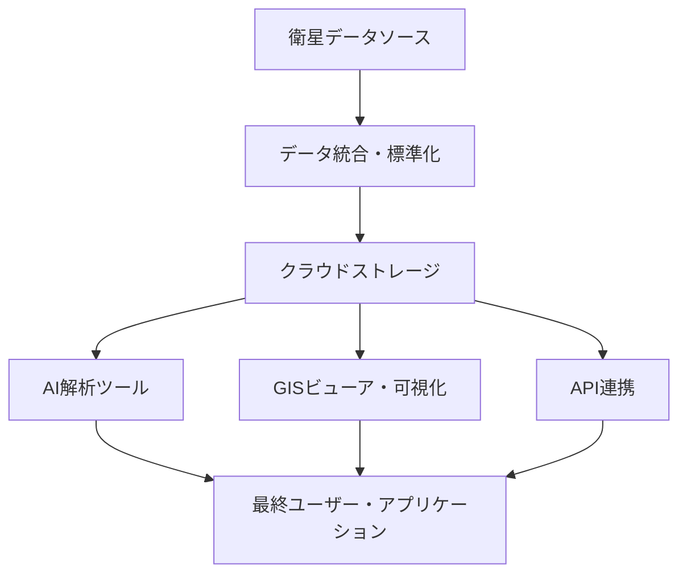

# T19-04-05 リモートセンシングデータプラットフォーム

## Summary（5つの要点）

1. **データのワンストップアクセス**: 複数の衛星（光学、SAR、ハイパースペクトル）から取得したデータを集約し、ユーザーが**一元的に検索・利用**できるクラウドベースのプラットフォームを提供する。
2. **データ解析環境の提供**: ユーザーがデータセットをダウンロードすることなく、プラットフォーム上で提供される**AI/機械学習ツール**やGIS機能を利用して、大規模解析を可能にする。
3. **APIによる機能連携**: 外部アプリケーションや企業の既存システムと連携するための**REST API**を提供し、解析結果をサービスや業務プロセスに容易に組み込めるようにする。
4. **データ利用の民主化**: 専門知識がなくても衛星データを利用できるよう、**ノーコード・ローコード**の解析インターフェースを提供し、利用者の裾野を大幅に広げる。
5. **エコシステムの構築**: 衛星データを提供する企業、解析アルゴリズムを提供するベンダー、そして最終利用者が集まる**オープンなビジネスエコシステム**を形成する。

#### 概念図: データプラットフォームの機能構造

## 技術評価表（定量的な視点）

| 項目 | 評価（5段階） | 備考 |
| :--- | :--- | :--- |
| **導入コスト** | ⭐⭐⭐⭐︎ | サービス利用は安価だが、大規模クラウドインフラ構築・維持は高コスト |
| **技術成熟度** | ⭐⭐⭐⭐︎ | Google Earth Engine、AWSなどで先行。国内でも商用サービスが成長中 |
| **日本の競争力** | ⭐⭐⭐⭐︎ | **NTTデータTellus**など、国産プラットフォームが国内データを中心に健闘 |
| **市場性** | ⭐⭐⭐⭐⭐ | 衛星データ利用のボトルネック解消に必須であり、市場成長のドライブ役となる |
| **品質保証の重要性**| ⭐⭐⭐⭐︎ | データの信頼性、セキュリティ、解析結果の再現性がプラットフォームの生命線 |

## 日本の立ち位置・強み弱みのSummary

### 強み：

* **国産プラットフォームの存在**: **NTTデータTellus**が政府系データ（JAXA、経産省など）を中心に取り扱い、国内のデータ利用促進に貢献。
* **高信頼性インフラ**: **さくらインターネット**などの国内クラウドベンダーが、衛星データ解析に適した高セキュリティ・高性能な計算資源を提供可能。
* **国内データ連携**: 準天頂衛星「みちびき」（T19-05-01）、SAR衛星（T19-03-02）など、**国産衛星データとのスムーズな連携**が可能。

### 弱み：

* **グローバルデータとの統合**: 海外の主要な商用衛星データ（Maxar、Planet Labs）や欧米のプラットフォーム（Google Earth Engine、AWS Ground Station）との**データ量・機能面での差**がある。
* **AI解析アルゴリズムの不足**: プラットフォーム上で提供される**汎用的なAI解析アルゴリズム**の種類や先進性において、海外大手プラットフォームに後れを取っている。
* **開発者コミュニティの規模**: プラットフォーム上で解析ツールを開発する**エコシステム（開発者コミュニティ）**の規模がまだ小さく、多様なアプリケーション開発が進みにくい。

## 技術ロードマップ（短期/中期/長期）

### 短期目標（～2027年）

* 主要な**国内外の衛星データ**（光学、SAR）を統合し、API経由でのアクセスを標準化。
* ユーザーが自身のAIモデルを持ち込める**解析環境（サンドボックス）**を提供。

### 中期目標（2028年～2031年）

* リモートセンシングデータと**地上IoTデータ（T18-05-01）**、**測位データ（T19-05）**を統合し、デジタルツインの基盤データとして提供。
* AIによる**データ品質評価・ノイズ自動除去**をプラットフォーム機能として標準実装。

### 長期目標（2032年～2035年）

* **量子コンピューティング**の技術を活用し、超大規模なデータ同化（T19-04-05の応用）やシミュレーションを可能にするサービスを提供。
* プラットフォームをグローバル展開し、**アジア地域**における衛星データ利用のハブとなる。

### 📚 参照リンク

[NTTデータ Tellus](https://www.tellus.online/)
[Amazon Web Services：AWS Ground Station](https://aws.amazon.com/jp/ground-station/)