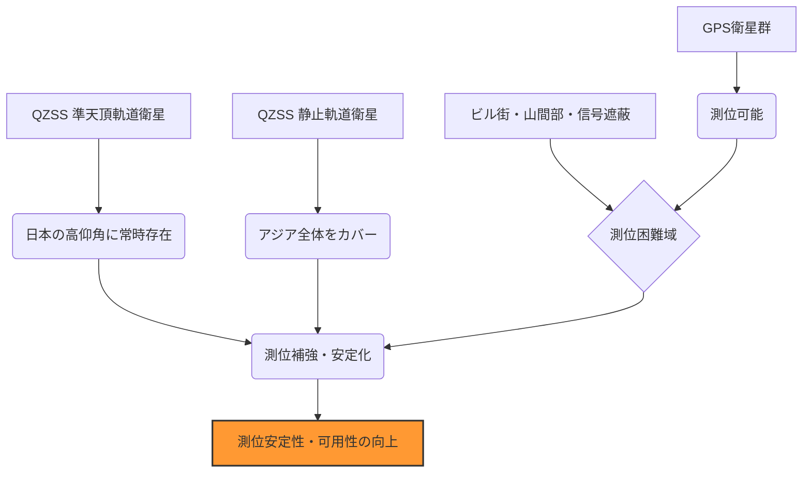

# T19-05-01 準天頂衛星システム（QZSS/みちびき）の高精度・多機能化

## Summary（5つの要点）

1. **センチメートル級測位の実現**: **CLAS（Centimeter Level Augmentation Service）**により、静止状態だけでなく移動中の車両でも数センチメートルの高精度測位をリアルタイムで提供する。
2. **安定的なPNTサービスの提供**: 2025年度を目途に**7機体制**へ移行し、日本上空での衛星可視数が常時4機以上となり、米GPSに依存しない持続的な測位・航法・時刻（PNT）サービス提供能力を確立する。
3. **防災・危機管理機能の強化**: 災害・危機管理通報サービス（**DCレポート**）などの多機能化を進め、災害時における安否情報や避難誘導情報の伝達手段として利用可能範囲を拡大する。
4. **アジア・オセアニア地域への国際展開**: 測位補強情報（**MADOCA-PPP**）の配信範囲をアジア・オセアニアに拡大し、地域のインフラ整備やスマート農業への貢献を通じて、国際的なプレゼンスを向上させる。
5. **時刻同期精度向上への貢献**: 衛星に搭載される高精度原子時計と、地上局による時刻監視・補正により、金融・通信などの社会インフラを支える**超高精度な時刻情報**を継続的に提供する。

## 技術評価表（定量的な視点）

| 項目 | 評価 | 定性的根拠 |
| :--- | :--- | :--- |
| **導入コスト** | 極めて高 | 衛星の製造、打ち上げ、地上システムの維持・更新に大規模な国家予算が継続的に必要。
| **技術成熟度** | 高 | 4機体制でのCLAS運用実績があり、7機体制への移行もロードマップ通り進行中（2025年度完了予定）。
| **日本の競争力** | 極めて高 | CLASは世界最高レベルの精度を持ち、QZSSはアジア地域の高精度測位インフラとして独自の地位を確立。
| **市場性** | 極めて高 | 自動運転、ドローン物流、スマート農業、i-Constructionの必須基盤であり、応用市場は無限大。
| **品質保証の重要性** | 極めて高 | 国のPNT基盤であり、信号の連続性、精度、セキュリティは社会インフラとして最優先で保証される必要がある。

#### 概念図: QZSS 7機体制による測位安定性の向上

## 日本の立ち位置・強み弱みのSummary

### 強み：日本企業や研究機関が持つ独自の技術、優位性などを箇条書きで記述。

1. **CLAS技術の優位性**: リアルタイムでセンチメートル級精度を保証するCLAS技術は、他国に例を見ない高い技術力を有し、自動運転のキー技術として期待される。
2. **準天頂軌道設計**: 日本を中心としたアジア・オセアニア地域のインフラとして、都市部や山間部の測位を補完・補強する独自の地理的優位性を持つ。
3. **官民連携の推進**: 内閣府、JAXA、民間の測量機器メーカーや自動車メーカーが連携し、QZSS利用サービスの開発・普及を強力に推進している。

### 弱み：日本が抱える規制、標準化の遅れ、海外依存などを箇条書きで記述。

1. **受信機の普及と価格**: CLASや多機能信号を受信できるマルチバンド・多機能受信機の普及率が、海外主要GNSSと比較して依然として限定的であり、価格が高い。
2. **海外GNSSへの依存**: QZSSはGPSを補完・補強するシステムであり、基盤となるPNT情報の生成は、依然として米GPSへの依存度が高い構造にある。
3. **国際標準化における主導権**: 測位補強サービス（CLAS、MADOCA）の配信フォーマットや利用プロトコルについて、国際的な標準化作業において主導的な役割を確立する必要がある。

## 技術ロードマップ（短期/中期/長期）

### 短期目標（～2027年）

1. QZSS 7機体制の完全運用開始と、アジア・オセアニア全域での高精度測位サービスの安定提供。
2. CLAS対応受信機のさらなる低コスト化・小型化を進め、ドローンや農業機械への搭載を標準化。

### 中期目標（2028年～2031年）

1. QZSSの測位信号への**信号認証技術**（セキュリティ機能）を導入し、PNTの信頼性を強化。
2. 11機体制に向けた次期衛星の開発・設計に着手し、真に**GPS非依存のPNTサービス**提供能力を目指す。

### 長期目標（2032年～2035年）

1. QZSS 11機体制の運用開始、完全なPNT自立を達成し、アジア地域の基盤測位インフラとしての地位を確立。
2. 衛星搭載原子時計を**量子時計**などの次世代技術に置き換え、測位・時刻同期の精度を究極まで高める。

### 📚 参照リンク

[みちびき – JAXA 第一宇宙技術部門 サテライトナビゲーター](https://www.satnavi.jaxa.jp/ja/project/qzss/)
[準天頂衛星システムみちびき 「衛星測位に関する取組方針」 - 内閣府](https://www8.cao.go.jp/space/comittee/dai113/siryou2-1.pdf)
[センチメータ級測位補強サービス - みちびき（準天頂衛星システム）](https://qzss.go.jp/overview/services/sv06_clas.html)
