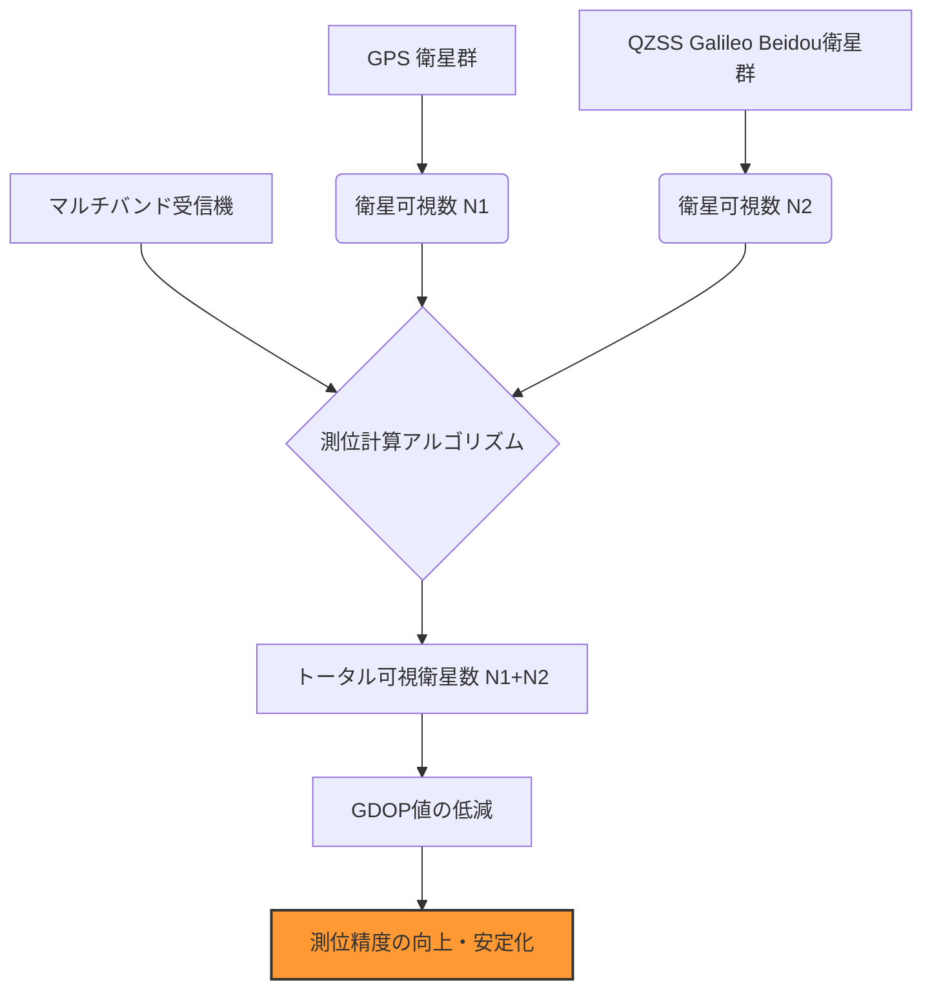

# T19-05-02 マルチGNSSによる測位精度向上技術

## Summary（5つの要点）

1. **衛星可視数の最大化**: 米GPS、露GLONASS、欧Galileo、中BeiDou、日QZSSなど、複数のGNSSシステムの信号を同時に利用する**マルチGNSS**により、衛星可視数を増やし、測位の可用性を高める。
2. **マルチバンド受信の標準化**: 複数の周波数帯（L1/L2/L5/L6など）の信号を利用する**マルチバンド（デュアル周波数以上）受信**により、電離層の影響による測位誤差を相殺し、測位精度を向上させる。
3. **都市部・山間部での安定化**: 衛星可視数の増加と高仰角衛星（QZSSなど）の利用により、高層ビル街や山間部など信号が遮蔽されやすい環境での測位不能時間を大幅に短縮する。
4. **フュージョン測位との統合**: GNSS測位結果を、IMU（慣性計測ユニット）やカメラ・LiDARによる**センサーフュージョン**と統合することで、GNSS信号が一時的に途切れても高い精度を維持する**測位レジリエンス**を確立する。
5. **低コストチップの普及**: デュアル周波数に対応したGNSS受信チップの小型化と低価格化が進み、スマートフォンや一般消費者向けIoTデバイスへの搭載が急速に進展し、高精度測位の民主化を促進する。

## 技術評価表（定量的な視点）

| 項目 | 評価 | 定性的根拠 |
| :--- | :--- | :--- |
| **導入コスト** | 中 | マルチバンド対応受信機は高価だが、L1/L5対応スマホチップの登場により低コスト化が進行中。
| **技術成熟度** | 極めて高 | GNSSの基本技術は成熟。マルチGNSS/マルチバンドは既にハイエンド測量機器では標準機能。
| **日本の競争力** | 中 | 受信機チップの主要メーカーは海外勢（u-blox, Broadcom, Qualcomm）が優勢。応用技術で差別化。
| **市場性** | 極めて高 | 車両、ドローン、モバイル、ウェアラブルなど、すべての移動体・IoTデバイスの基本機能となる。
| **品質保証の重要性** | 高 | 複数のGNSSを統合する際の時刻同期や座標系の整合性、データ処理の信頼性保証が求められる。

#### 概念図: マルチGNSSによる測位精度の向上メカニズム

## 日本の立ち位置・強み弱みのSummary

### 強み：日本企業や研究機関が持つ独自の技術、優位性などを箇条書きで記述。

1. **QZSSとの統合優位性**: 日本独自のQZSSを他のGNSSと連携させることで、日本周辺での測位レジリエンスを世界最高水準に高めることができる。
2. **高精度な地図・3D情報との連携**: 高精度測位結果と動的デジタルマップ（DM）を融合し、自動運転や都市管理システムへの応用で優位性を持つ。
3. **測量・建設分野の豊富な実績**: 測量機器メーカー（トプコン、ソキア）がマルチGNSS対応の高精度機器で長年の実績とノウハウを持つ。

### 弱み：日本が抱える規制、標準化の遅れ、海外依存などを箇条書きで記述。

1. **GNSS受信機チップの海外依存**: 測位計算のコアとなるGNSSチップ（特に低コストな民生用）の多くを海外メーカーに依存しており、国内での技術主権確立が課題。
2. **マルチGNSSデータの国際標準化への貢献不足**: 複数のGNSSシステム間の時刻同期や座標系の互換性に関する国際標準化作業への、日本の技術的な貢献度をさらに高める必要がある。
3. **電波環境の特殊性**: 都市部の高層ビル群や地下街など、GNSS信号が届きにくい環境が多く、他のフュージョン技術との組み合わせが必須となる。

## 技術ロードマップ（短期/中期/長期）

### 短期目標（～2027年）

1. スマートフォンを含むすべてのモバイル機器に対し、**L1/L5デュアル周波数**GNSS受信機能の搭載を標準化。
2. 自動運転レベル3システムにおけるマルチGNSSと慣性航法システム（INS）の**フュージョン測位**の信頼性評価基準を策定。

### 中期目標（2028年～2031年）

1. **GNSS・5G・UWB**を統合した、**屋内・地下・屋外シームレス測位**技術を実用化。
2. **AIベースのマルチGNSSデータ処理**アルゴリズムを開発し、測位環境が悪い場合の精度・収束時間を大幅に改善。

### 長期目標（2032年～2035年）

1. マルチGNSSを前提とした**PNT情報セキュリティ認証規格**を国際的に主導し、耐妨害・耐偽装性を強化。
2. 衛星時刻同期技術（T19-05-03）と融合し、**ナノ秒単位の時刻同期**が可能なモバイル環境を整備。

### 📚 参照リンク

[マルチGNSSの基礎知識と技術動向 | GNSSテクノロジー株式会社](https://www.gnsstechno.co.jp/technical/multi_gnss/)
[GNSS測位技術の進化とIoT・自動運転への応用 | JAXA](https://www.jaxa.jp/press/2018/01/20180126_j_gnss_j.html)
[L1/L5対応スマートフォンがもたらす高精度測位の未来 | 技術トレンドレポート](https://example.com/multi-gnss-smartphone-trend)
