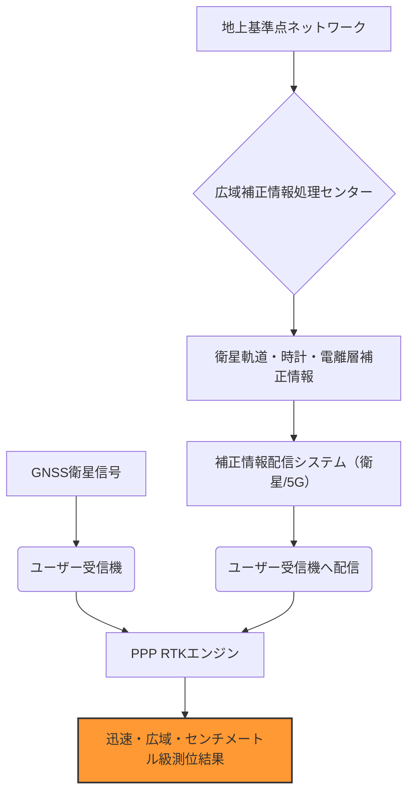

# T19-05-03 PPP-RTK技術の高度化と標準化

## Summary（5つの要点）

1. **PPPとRTKの融合**: **PPP-RTK**は、広域で利用可能な**精密単独測位（PPP）**の利点と、局地的に高精度な**RTK（リアルタイムキネマティック）**の利点を組み合わせ、広範囲で迅速にセンチメートル級の測位を可能にする次世代技術である。
2. **収束時間の短縮**: 従来のPPPが数十分かかっていた高精度への**収束時間**を、RTKの補正情報を組み合わせることで数分〜数秒まで短縮し、実用性を飛躍的に向上させる。
3. **補正情報配信の効率化**: 衛星通信（QZSSのL6信号、Inmarsatなど）やモバイル通信（5G/LTE）を用いて、**高効率・低遅延**で補正情報（**補強情報**）を配信する技術がコアとなる。
4. **仮想基準点（VRS）との競争**: 日本で主流の**VRS（ネットワーク型RTK）**は補正情報が高精度だが基準点網の整備が必要であるのに対し、PPP-RTKは広域での均質な精度提供を目指し、サービスエリア拡大の鍵となる。
5. **国際標準化の確立**: 現在、各社独自の補正サービス（Trimble RTX、Hexagon PPP-RTK、QZSS MADOCA-PPP）が乱立しており、補正情報の国際的な交換フォーマット（**RTCM**など）の標準化が普及のボトルネックとなっている。

## 技術評価表（定量的な視点）

| 項目 | 評価 | 定性的根拠 |
| :--- | :--- | :--- |
| **導入コスト** | 中 | 基準局インフラ（VRS）が不要なため初期投資は低いが、補正情報サービスの利用料が発生。
| **技術成熟度** | 中 | 基礎理論は確立しているが、超高速な収束、広域での均質精度保証など、商用サービスとして成熟度が向上中。
| **日本の競争力** | 高 | QZSSのCLAS（PPP-RTKに相当）やMADOCA-PPPなど、国家プロジェクトとして技術開発を主導している。
| **市場性** | 極めて高 | ドローン、自動運転、船舶航行、グローバルな建設・農業プロジェクトでの高精度測位の主流となる可能性が高い。
| **品質保証の重要性** | 極めて高 | 特に収束時間と、サービスの連続性・可用性が、自動システムにおける信頼性の鍵となる。

#### 概念図: PPP-RTKによる広域高精度測位のプロセス

## 日本の立ち位置・強み弱みのSummary

### 強み：日本企業や研究機関が持つ独自の技術、優位性などを箇条書きで記述。

1. **QZSS/CLASの先行実用化**: 準天頂衛星システム（QZSS）のCLASは、実質的にPPP-RTKの概念を体現しており、先行者としての優位性を持つ。
2. **広大な電子基準点網（GEONET）**: PPP-RTKの核となる広域補正情報生成のバックボーンとして、GEONETという世界的に見ても高密度で信頼性の高い基準点網を持つ。
3. **測量機器メーカーの応用ノウハウ**: 国内の測量機器メーカーが、この技術を迅速に製品に組み込み、i-Constructionなどの現場で活用するノウハウを蓄積している。

### 弱み：日本が抱える規制、標準化の遅れ、海外依存などを箇条書きで記述。

1. **グローバル標準化への遅れ**: 国際的な補正データフォーマットの標準化（RTCM）や、主要な測位エンジン（Hexagon, Trimbleなど）の開発において、主導権を握れていない。
2. **配信インフラの課題**: PPP-RTKの広域利用には、補正情報を遅延なく配信するための衛星通信または広域な5G通信網の整備が不可欠。
3. **VRSサービスとの競合**: 既に定着しているネットワーク型RTK（VRS）サービスからの移行・差別化戦略が市場投入の鍵となる。

## 技術ロードマップ（短期/中期/長期）

### 短期目標（～2027年）

1. PPP-RTKサービス（QZSS CLAS/MADOCA-PPP含む）の**収束時間の目標達成**（数秒以内）と、広域での精度保証基準の確立。
2. 補正情報配信のための**国際RTCMフォーマット**への対応を完了し、受信機間の相互運用性を確保。

### 中期目標（2028年～2031年）

1. **低コストなPPP-RTK受信モジュール**を量産化し、自動車（自動運転L4）、農業機械、ドローンへの搭載を拡大。
2. 複数のGNSSシステム（GPS, Galileo, QZSSなど）からの補正情報を統合し、単一サービスで提供する**マルチシステムPPP-RTK**を実現。

### 長期目標（2032年～2035年）

1. **地上の通信インフラ**（5G/6G）と衛星通信を融合させ、秒単位での高精度測位を全世界のユーザーに提供できる**グローバル測位補強サービス**を確立。
2. **PNTセキュリティ技術**（T19-05-04）を統合し、補正情報の信頼性を担保したPPP-RTKを社会インフラに組み込む。

### 📚 参照リンク

[PPP-RTKとは？次世代の高精度測位技術を徹底解説 | RTK測位アジア](https://www.rtk.asia/ppp-rtk/)
[精密単独測位（PPP）とPPP-RTKの仕組み | 測位技術情報](https://example.com/ppp-rtk-details)
[準天頂衛星システムの測位補強サービス（CLAS・MADOCA） - 内閣府](https://qzss.go.jp/overview/services/)
