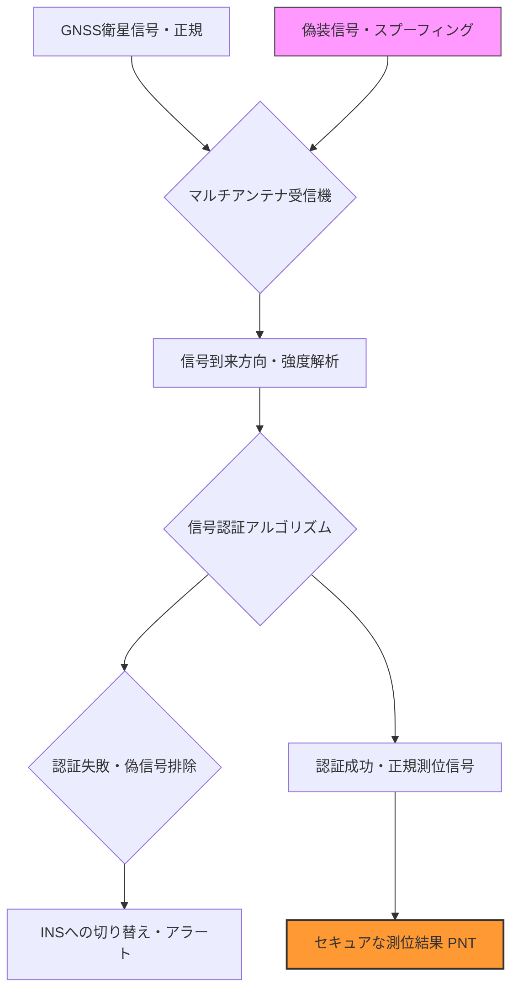

# T19-05-04 PNTセキュリティ・耐妨害（アンチスプーフィング）技術

## Summary（5つの要点）

1. **深刻化する電波妨害リスク**: GNSS信号に対する**ジャミング（妨害）**や、偽の測位情報を送る**スプーフィング（偽装）**が容易になり、自動運転車やドローン、金融システムへの悪影響が深刻化している。
2. **信号認証技術の導入**: 衛星から送信される測位信号自体に電子署名や暗号化を施す**信号認証（Navigation Message Authentication: NMA）**技術により、受信機が偽装信号を検知・排除する能力を付与する。（例：Galileo OS-NMA、QZSS L6信号認証の検討）
3. **アンチスプーフィング受信機**: 受信機側で、複数のアンテナ（アレイアンテナ）を使用し、到来方向や信号強度、信号構造を解析することで、妨害波や偽装信号の到来を検知し、自動的にノイズを抑圧・除去する技術が重要となる。
4. **レジリエンスの確保**: GNSS信号の利用が不可能になった場合でも、**INS（慣性航法システム）**や**画像認識**、**LiDAR**など非GNSSセンサーからの情報を用いて、測位・時刻同期機能を維持する**PNTレジリエンス**の強化が必須である。
5. **時刻同期セキュリティ**: 金融、電力、通信などクリティカルなインフラの時刻同期において、GNSS時刻情報の偽装に対する**高度な時刻認証プロトコル**を確立し、システム全体でのセキュリティを確保する。

## 技術評価表（定量的な視点）

| 項目 | 評価 | 定性的根拠 |
| :--- | :--- | :--- |
| **導入コスト** | 高 | 高度なアルゴリズムやアレイアンテナ、信号認証機能付きチップは、通常のGNSS受信機よりコストが高い。
| **技術成熟度** | 中 | ジャミング対策は成熟。スプーフィング対策は信号認証技術が開発途上であり、受信機での実装・普及が進行中。
| **日本の競争力** | 中 | 信号認証やハードウェア技術は海外が先行。国内はQZSSへの実装や、応用分野でのセキュリティソリューションに注力。
| **市場性** | 極めて高 | 自動運転、防衛、重要インフラ（金融・通信）のセキュリティ必須要件となり、市場は急速に拡大。
| **品質保証の重要性** | 極めて高 | 測位・時刻情報の信頼性が直接、国家の安全保障や経済活動の安定性に直結するため、最高レベルの保証が必要。

#### 概念図: アンチスプーフィング受信機の動作原理

## 日本の立ち位置・強み弱みのSummary

### 強み：日本企業や研究機関が持つ独自の技術、優位性などを箇条書きで記述。

1. **QZSSにおけるセキュリティ機能の検討**: QZSSの次期システムにおいて、L6信号などを活用した信号認証機能の実装が検討されており、国内PNT基盤の信頼性向上の核となる。
2. **高精度な時刻同期技術**: NICT（情報通信研究機構）などが培ってきた超高精度な時刻比較・管理技術が、時刻認証セキュリティの基盤となる。
3. **防衛・セキュリティ分野との連携**: PNTセキュリティを巡る知見が、防衛分野や重要インフラ分野のセキュリティソリューション開発に活かせる。

### 弱み：日本が抱える規制、標準化の遅れ、海外依存などを箇条書きで記述。

1. **受信機チップの技術的遅れ**: 高度なアンチスプーフィング機能をハードウェアとして実装したGNSS受信機チップの開発・量産において、海外大手メーカー（Trimble, u-bloxなど）に後れを取っている。
2. **法的・規制的枠組みの整備遅れ**: PNTセキュリティを重要インフラとして保護するための法的枠組みや、信号認証規格に関する国内・国際的な標準化への対応が急務である。
3. **コストと普及のトレードオフ**: 高いPNTセキュリティレベルを実現する技術は高コストになりがちであり、民生分野への普及を進めるためのコストダウン戦略が課題。

## 技術ロードマップ（短期/中期/長期）

### 短期目標（～2027年）

1. QZSSにおける信号認証技術のプロトタイプ開発と、商用・公共サービスへの導入に向けた技術評価の実施。
2. 自動運転車・ドローン向けに、INSとのフュージョン測位と連動した**スプーフィング・ジャミング検知モジュール**の標準搭載を推進。

### 中期目標（2028年～2031年）

1. GNSS信号認証を基盤とする**PNTセキュリティガイドライン**を策定し、重要インフラ事業者に対して準拠を義務付け。
2. **機械学習（AI）**を活用し、通常の雑音と妨害波を区別する高度な**ノイズ抑圧アルゴリズム**を開発し、受信機性能を向上。

### 長期目標（2032年～2035年）

1. QZSSの全測位信号において、偽装を原理的に排除できる**量子暗号通信**などの技術を取り入れ、PNTセキュリティを究極まで高める。
2. GNSS障害時にも機能する**完全非依存のPNTインフラ**（光ファイバー時刻配信など）を全国に構築し、測位システムのレジリエンスを完成させる。

### 📚 参照リンク

[GNSS測位を脅かすスプーフィングと対策 - JSTニュース](https://www.jst.go.jp/pr/jst-news/pdf/2021/2021_04_p3.pdf)
[衛星測位の信頼性確保に向けた技術動向と課題 - 総務省情報通信政策局](https://www.soumu.go.jp/main_content/000844781.pdf)
[アンチスプーフィング技術の概要と自動運転への応用 | u-blox](https://www.u-blox.com/ja/gnss-anti-spoofing)
