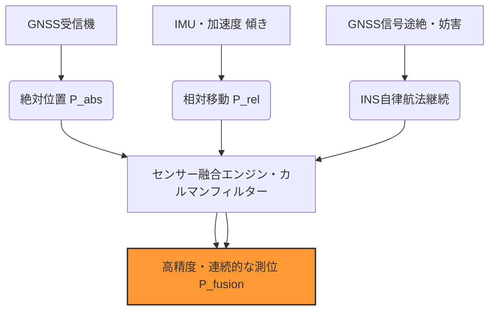

# T19-05-05 慣性航法システム（INS）との融合測位技術

## Summary（5つの要点）

1. **GNSS信号途絶時の補完**: GNSS信号が一時的に遮断されるトンネル、地下、ビル街などの環境において、**INS（慣性航法システム）**が加速度センサーとジャイロセンサーの情報に基づき、自律的に位置・速度・姿勢を推定し、測位を継続する。
2. **フュージョン測位の基盤**: GNSSとINSのデータを統合する**フュージョン測位**は、それぞれの欠点を補い合い、高頻度な更新レートと高精度を両立させ、特に自動運転やドローンなどのリアルタイム制御が必要な用途で不可欠となる。
3. **MEMS-INSの小型・低コスト化**: 高精度で高価だった従来のFOG/Ring Laser Gyroを用いたINSから、低コストで小型の**MEMS（微小電気機械システム）**技術を用いたセンサーが登場し、一般の自動車やスマートフォンへの搭載が加速している。
4. **高度なデータ融合アルゴリズム**: GNSSとINSの誤差を統合的に推定・補正するために、**カルマンフィルター**や、より進化した拡張カルマンフィルター（EKF）などの**推定アルゴリズム**がコア技術となる。
5. **測位のレジリエンス強化**: スプーフィング（偽装信号）やジャミング（妨害）といった外部からの攻撃や、環境要因によるGNSS障害が発生した場合でも、自律航法能力によりPNT情報（位置・航法・時刻）の**レジリエンス（耐障害性）**を飛躍的に向上させる。

## 技術評価表（定量的な視点）

| 項目 | 評価 | 定性的根拠 |
| :--- | :--- | :--- |
| **導入コスト** | 中 | MEMS-INSの低価格化により導入障壁は低下したが、高性能なINSは依然として高コスト。
| **技術成熟度** | 高 | 航空機や船舶で長年使用されてきた技術。MEMS化とフュージョンアルゴリズムは急速に成熟中。
| **日本の競争力** | 高 | 自動車部品（IMU）や高精度センサー分野で日本のメーカーが独自の技術（例：村田製作所、パナソニック）を持つ。
| **市場性** | 極めて高 | 自動運転レベル3以上、自律ドローン、ロボット、高精度マッピングなど、将来のモビリティに必須。
| **品質保証の重要性** | 極めて高 | 自動運転における安全性の確保に直結するため、INSセンサーのバイアス誤差、ドリフト、温度安定性の保証が最重要。

#### 概念図: GNSSとINSのフュージョン測位の仕組み

## 日本の立ち位置・強み弱みのSummary

### 強み：日本企業や研究機関が持つ独自の技術、優位性などを箇条書きで記述。

1. **高性能MEMSセンサー技術**: ジャイロセンサーや加速度センサーといったIMUのコア部品であるMEMS技術において、日本の電子部品メーカーが世界トップクラスの技術と製造品質を保持している。
2. **自動車産業との連携**: 世界的な自動車メーカーとの近接性により、自動運転やADAS（先進運転支援システム）向けにINSフュージョン技術の実装と評価ノウハウが豊富。
3. **カルマンフィルターアルゴリズム開発**: 慣性航法とGNSS、他のセンサーを統合するための高度な推定アルゴリズム（フィルタリング技術）の研究開発が、大学・研究機関で活発に行われている。

### 弱み：日本が抱える規制、標準化の遅れ、海外依存などを箇条書きで記述。

1. **フュージョンソフトウェアの標準化**: 各自動車メーカーやサプライヤーが独自のアルゴリズムを使用しており、業界全体でのデータインターフェースやフュージョンアルゴリズムの標準化が遅れている。
2. **高精度INSのコスト**: 非常に高精度なFOG（ファイバージャイロ）などのINSは依然として高コストであり、普及のためにはさらなる低コスト化と小型化が必要。
3. **誤差蓄積の課題**: INSはGNSS信号がない状態が続くと誤差（ドリフト）が蓄積するため、GNSS以外の外部情報（画像認識、LiDAR）との連携が必須となるが、その統合難易度が高い。

## 技術ロードマップ（短期/中期/長期）

### 短期目標（～2027年）

1. 車載向けMEMS-INSの精度と安定性を向上させ、GNSS途絶時でも**数十秒間**はデシメートル級（数10cm）の精度を維持できるシステムの標準搭載化を推進。
2. INSとLiDAR、カメラ情報を統合する**センサーフュージョンのプラットフォーム**を確立し、自動運転レベル3への技術基盤とする。

### 中期目標（2028年～2031年）

1. **高性能・低コストなFOG相当のMEMS-INS**の開発を完了し、自動運転レベル4以上のシステムへ適用。
2. 複数の異なるINS（例：安価なMEMSと高精度なFOG）とGNSSを統合する**マルチフュージョンアルゴリズム**を最適化し、測位信頼性を向上。

### 長期目標（2032年～2035年）

1. 信号途絶環境下での誤差蓄積を原理的に抑える**量子センサー**を用いた次世代慣性計測技術を実用化。
2. INSフュージョン測位を、**PNTセキュリティ技術**と統合し、測位情報の**自律的検証能力**を持つレジリエントなシステムを社会インフラとして確立。

### 📚 参照リンク

[GNSSとINSを組み合わせた高精度測位を実現するフュージョンシステム | Analog Devices](https://www.analog.com/jp/design-center/reference-designs/circuits-and-boards/cn0522.html)
[自動運転におけるGNSSとINSの役割 - 自動車技術会](https://www.jsae.or.jp/)
[MEMS慣性センサー技術の動向と展望 - 村田製作所](https://www.murata.com/ja-jp/products/sensor/gyro/mems/technology/article/2019/mems-sensor-trend)
