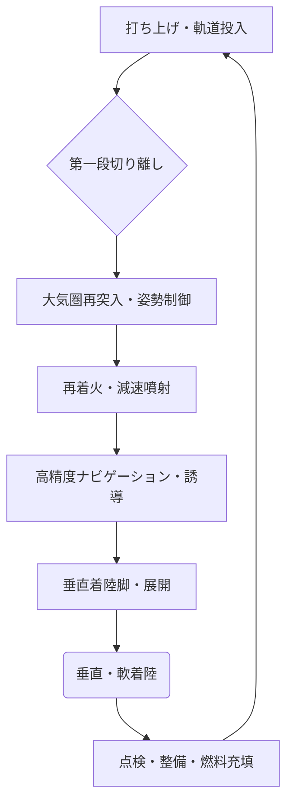

# T19-06-01 再使用型ロケット・垂直着陸技術

## Summary（5つの要点）

1. **輸送コストの劇的削減**: 機体の一部または全体を再使用することで、ロケット打ち上げ費用を大幅に削減し、スペースコマースの拡大を加速する。
2. **垂直離着陸（VTVL）が主流**: スペースX、ブルーオリジン、中国企業などが採用する**垂直着陸型**が再使用ロケットの主要な実現手段となっている。
3. **要素技術の確立**: 再使用可能な大推力・大変推力エンジンの開発、高精度な帰還・着陸誘導制御技術、着陸衝撃緩和システムの技術検証が鍵となる。
4. **日本の取り組み**: JAXAのRV-Xや、日欧共同のCALLISTOプロジェクトを通じて、垂直離着陸技術（VTVL）のデータ取得と実証試験が進められている。
5. **高頻度運用**: 短期間の間隔でロケットの再使用と垂直離着陸シーケンスを**高頻度に実施**するための機体運用方法の確立が、再使用技術の経済効果を最大化する。

#### 概念図: 再使用型ロケットの垂直着陸プロセス

---

### 技術評価表（定量的な視点）

| 項目 | 評価 | 根拠・コメント |
| :--- | :--- | :--- |
| **導入コスト** | ⭐⭐⭐⭐︎ | 初期開発費は巨額だが、再使用により運用コストは大幅に低減可能。|
| **技術成熟度** | ⭐⭐⭐⭐︎ | スペースXのファルコン9で実運用段階。技術検証は完了し、大型機への適用が課題。|
| **日本の競争力** | ⭐⭐⭐☆☆ | RVT、RV-X、CALLISTO等で要素技術を保持するが、実機運用で先行する海外勢に後れ。|
| **市場性** | ⭐⭐⭐⭐⭐ | ロケット打ち上げ市場の低コスト化競争の核心であり、必須技術。|
| **品質保証の重要性** | ⭐⭐⭐⭐⭐ | 再使用に伴う機体健全性評価、劣化データ解析、短期間での検査・整備が極めて重要。|

---

## 日本の立ち位置・強み弱みのSummary

### 強み：日本企業や研究機関が持つ独自の技術、優位性などを箇条書きで記述。

* **RV-X/CALLISTOプロジェクトの知見**: JAXA主導で長年にわたり垂直離着陸実験（RVT-9等）を実施。RV-Xを通じて垂直離着陸技術の実証データを取得している。
* **高精度制御技術**: 帰還・着陸に必要な高精度ナビゲーション誘導制御技術は、日本の精密機械・制御分野の強みを活かせる。
* **Hondaの参入**: 自動車分野で培った技術力を応用し、再使用型ロケット実験機による垂直離着陸実験に成功。新たなプレーヤーの参入は技術革新を加速させる。

### 弱み：日本が抱える規制、標準化の遅れ、海外依存などを箇条書きで記述。

* **実機運用の後れ**: スペースX、ブルーオリジン、中国（LandSpace）が軌道投入級の再使用ロケットの実運用・実証で先行しており、技術的キャッチアップが課題。
* **エンジン開発の遅延**: 再使用に必要な高頻度・大推力・大変推力エンジンの開発が、海外勢に比べ遅れている傾向がある。
* **莫大な開発費**: 水平着陸型（有翼型）を含む完全再使用ロケットの開発には莫大な開発費が必要であり、国家レベルでの継続的な投資が必要。

---

## 技術ロードマップ（短期/中期/長期）

### 短期目標（～2027年）

* RV-X/CALLISTO実験機による垂直離着陸の反復飛行試験とデータ取得の完了。
* 再使用対応型エンジンの地上燃焼試験の成功と、再使用サイクルの劣化傾向データの蓄積。
* 帰還・着陸の高精度ナビゲーション誘導制御ソフトウェアの信頼性向上とシミュレーション検証。

### 中期目標（2028年～2031年）

* 直径4メートル級等の大型再使用型ロケット第一段機体による、高高度（10km以上）垂直離着陸飛行テストの成功。
* 実機への搭載を見据えた、軽量・高効率な着陸衝撃緩和システムの開発・統合。
* 再使用に伴う機体健全性モニタリング技術（Health Monitoring）の実用化。

### 長期目標（2032年～2035年）

* 軌道投入可能な**完全再使用型ロケットの商業運用開始**と打ち上げコストの大幅な低減。
* 水平着陸型（スペースプレーン型）を含む、多様な再使用システムの要素技術確立。
* 国際標準に準拠したロケット再使用に関する安全基準、品質保証システムの確立。

---

### 📚 参照リンク

[再使用型ロケット、初の10キロ級垂直離着陸飛行テストに成功 - Science Portal China](https://spc.jst.go.jp/news/240604/topic_3_05.html)
[日本の再使用ロケット開発の現在 ～低コスト・高頻度の打ち上げへ - SPACE CONNECT](https://space-connect.jp/rvx-callisto/)
[垂直離着陸ロケット - Wikipedia](https://ja.wikipedia.org/wiki/%E5%9E%82%E7%9B%B4%E9%9B%A2%E7%9D%80%E9%99%B8%E3%83%AD%E3%82%B1%E3%83%83%E3%83%88)
[ロケットの再使用化技術の世界動向と JAXAの取組 - 文部科学省](https://www.mext.go.jp/content/20250703-mxt_uchukai01-000043486_00005.pdf)
[再使用型ロケット実験機の離着陸実験 - YouTube](https://www.youtube.com/watch?v=p0jjxqpC0aY)