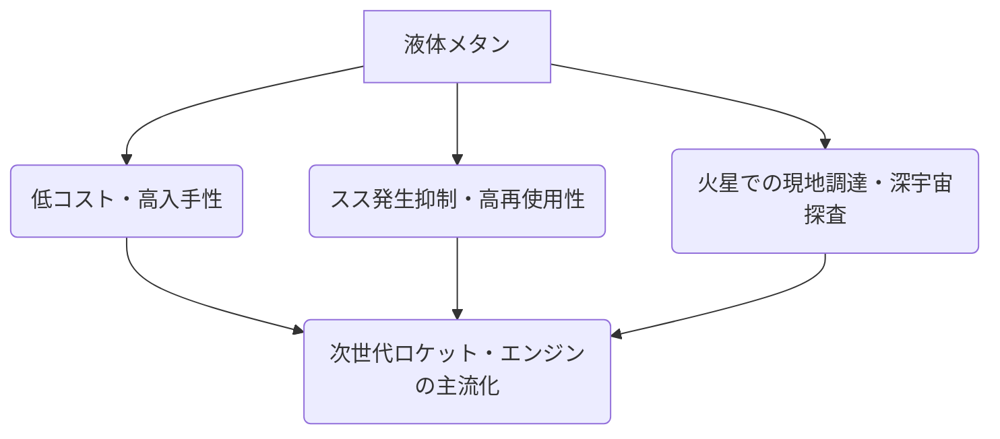

# T19-06-02 液体メタンエンジン技術

## Summary（5つの要点）

1. **次世代ロケット燃料の本命**: 液体酸素/液体メタン（LOX/LCH4）は、ケロシンや液体水素に比べ、再使用性、コスト、深宇宙探査への適応力に優れる次世代のロケット推進薬として注目されている。
2. **再使用性への貢献**: メタンは**煤（スス）が発生しにくく**、エンジンの再使用における検査・整備のコストと期間を大幅に削減できる。
3. **深宇宙探査への優位性**: メタンは火星など太陽系天体での**現地調達（ISRUが可能**であり、長期的な深宇宙探査や宇宙空間での長期運用に不可欠な技術である。
4. **高い安全性と経済性**: 水素に比べ分子量が大きく漏れにくい、常温での取り扱いが容易、天然ガス由来で安価かつ大量供給が可能といった利点を持つ。
5. **国際開発競争**: スペースX、中国のLandSpace社などが開発を加速させ、既に軌道投入成功（LandSpace）や再使用型ロケットでの活用（中国）実績があり、国際的な競争が激化している。

#### 概念図: 液体メタンエンジンの主要な優位点

---

### 技術評価表（定量的な視点）

| 項目 | 評価 | 根拠・コメント |
| :--- | :--- | :--- |
| **導入コスト** | ⭐⭐⭐⭐︎ | 燃料自体は安価で入手容易。エンジンの複雑な設計（フルエキスパンダーサイクル等）はコスト要因。|
| **技術成熟度** | ⭐⭐⭐⭐︎ | 中国LandSpace社が軌道投入に成功。IHI等の日本企業も燃焼試験に成功し、実用化へ近づいている。|
| **日本の競争力** | ⭐⭐⭐☆☆ | IHIがLE-8やIME-3Uなど先駆的な開発実績を持つが、大規模ロケットでの実運用実績は海外に後れ。|
| **市場性** | ⭐⭐⭐⭐⭐ | 再使用ロケットや軌道上サービス、月・火星探査の共通基盤技術として市場必須。|
| **品質保証の重要性** | ⭐⭐⭐⭐︎ | 再使用時のコンポーネント耐久性、長期軌道運用における推進薬管理が重要。|

---

## 日本の立ち位置・強み弱みのSummary

### 強み：日本企業や研究機関が持つ独自の技術、優位性などを箇条書きで記述。

* **先駆的な研究開発**: IHIがLE-8エンジン開発（JAXA主導）や、IME-3U（Bluetail）などのメタンエンジンに世界に先駆けて取り組んできた実績。
* **エンジンサイクル技術**: IHIが開発中のIME-3Uは**フルエキスパンダーサイクル**を採用しており、高い真空中比推力（350s超）の性能見通しを得ている。
* **民間企業の参入**: 将来宇宙輸送システム（ISC）が燃焼試験に成功するなど、国内民間企業が開発に参入しており、技術の裾野が広がりつつある。

### 弱み：日本が抱える規制、標準化の遅れ、海外依存などを箇条書きで記述。

* **実機運用実績の不足**: 中国、米国が既に軌道投入や再使用ロケットでの適用実績を持つ中、日本は実機での大規模運用・実証段階に至っていない。
* **部品の高コスト体質**: 従来、確実な作動を最優先とした特注部品の多用により、空圧弁や電動弁などの製造コストが高額になる傾向がある。
* **既存ロケットへの適用**: 現行のH3ロケットなど、既存の基幹ロケットはメタンエンジンを採用しておらず、次世代ロケットへの移行のタイミングと戦略が課題。

---

## 技術ロードマップ（短期/中期/長期）

### 短期目標（～2027年）

* 30 kN級メタンエンジン（IME-3U等）の地上燃焼試験の完了と、再生冷却・コンポーネント耐久性の実証。
* 推力100 kN級以上の再使用対応型メタンエンジンのプロトタイプ開発と、主要サブシステム（ターボポンプ、バルブ）の再使用サイクルの評価。

### 中期目標（2028年～2031年）

* 再使用型ロケットへの搭載に向けた、大推力・大変推力メタンエンジンの実機大試験（フルスケールテスト）の成功。
* ロケットの軌道上燃料補給（OOS）を見据えた、極低温メタン推進薬の軌道上での長期保管・移送技術の確立。
* 深宇宙探査機用メタンエンジンの開発着手と、軌道上実証実験。

### 長期目標（2032年～2035年）

* メタンエンジンを搭載した再使用型ロケットの商業打ち上げサービスの開始。
* 月・火星でのISRU（現地資源利用）によるメタン生成技術とエンジンの統合システムの実証。
* 軌道上輸送システムにおけるメタンエンジンの標準化と長期運用化。

---

### 📚 参照リンク

[メタンエンジン 宇宙へ向けた挑戦 - IHI](https://www.ihi.co.jp/technology/techinfo/contents_no/__icsFiles/afieldfile/2025/06/23/07.pdf)
[日本版スペースシャトル実現への第一歩。日本企業が液体メタンエンジン燃焼試験に成功 - Smart Mobility](https://smart-mobility.jp/_ct/17761417)
[宇宙輸送は メタンエンジンにおまかせ！ - IHI](https://www.ihi.co.jp/technology/techinfo/contents_no/__icsFiles/afieldfile/2023/06/16/be8f2e98a375d988db8239436895066f.pdf)
[次世代のロケット燃料としてメタンが注目される理由 - TELESCOPE magazine](https://www.tel.co.jp/museum/magazine/report/202403_01/)
[メタンエンジン 宇宙へ向けた挑戦 メタンを燃料とするIHI製ロケットエンジンIME-3U(Bluetail)の開発 - IHI](https://www.ihi.co.jp/technology/techinfo/contents_no/1201483_13491.html)
[LE-8 - Wikipedia](https://ja.wikipedia.org/wiki/LE-8)