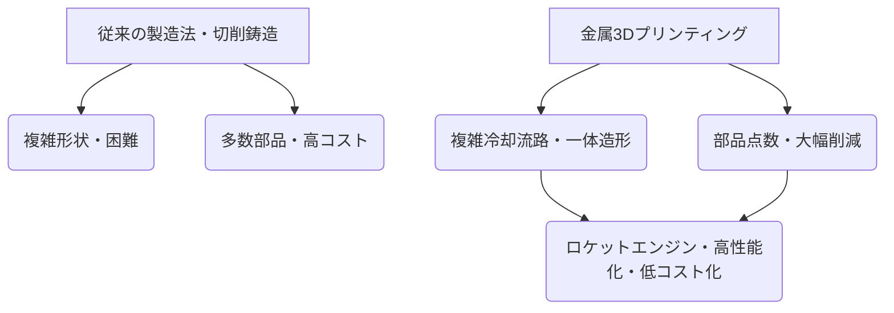

# T19-06-03 ロケットエンジン向け金属3Dプリンティング製造技術

## Summary（5つの要点）

1. **形状自由度の飛躍的向上**: 従来の切削や鋳造では不可能だった複雑な冷却流路や内部構造を一体で造形でき、エンジンの高性能化・軽量化に貢献する。
2. **部品点数の削減**: 複数の部品を一体造形することで部品点数を大幅に削減し、製造コストの低減、リードタイムの短縮、および信頼性の向上を実現する。
3. **ロケットエンジンへの適用**: 燃焼器やターボポンプなどの主要コンポーネント製造に適用され、特に熱負荷の大きい**再生冷却構造**を持つ部品で威力を発揮する。
4. **材料開発との連携**: 耐熱性、耐圧性に優れた特殊合金の粉末材料開発と、積層造形プロセスにおける品質（微細組織、欠陥）の均一化が実用化の鍵となる。
5. **国際競争力の源泉**: SpaceX、Relativity Spaceなどの海外企業がロケットのほぼ全てを3Dプリンティングで製造する構想を進めており、**製造技術**が宇宙開発の国際競争力を左右する。

#### 概念図: 金属3Dプリンティングによるロケットエンジン製造プロセスの利点

---

### 技術評価表（定量的な視点）

| 項目 | 評価 | 根拠・コメント |
| :--- | :--- | :--- |
| **導入コスト** | ⭐⭐⭐☆☆ | 装置自体は高価だが、リードタイム短縮と部品統合によるトータルコストで優位性。|
| **技術成熟度** | ⭐⭐⭐⭐︎ | ジェットエンジンの一部パーツやロケットエンジンの燃焼器などで実用化が進んでいる。|
| **日本の競争力** | ⭐⭐⭐⭐︎ | IHIやHonda等、主要企業が積極的に導入し、ロケットエンジンパーツの製造技術を保有。|
| **市場性** | ⭐⭐⭐⭐⭐ | 航空宇宙産業における軽量化・高機能化・再使用対応に不可欠であり、市場の拡大は確実。|
| **品質保証の重要性** | ⭐⭐⭐⭐⭐ | 積層造形特有の内部欠陥（ポロシティ）の非破壊検査技術、材料特性の信頼性確保が極めて重要。|

---

## 日本の立ち位置・強み弱みのSummary

### 強み：日本企業や研究機関が持つ独自の技術、優位性などを箇条書きで記述。

* **大手重工メーカーの導入**: IHIや三菱重工といった日本の航空宇宙産業のリーディングカンパニーが、ロケットエンジン（LE-7Aターボポンプなど）の部品製造に3Dプリンターを積極的に活用している。
* **金属積層造形技術の研究**: 独自のレーザー照射技術、材料粉末の開発・最適化技術の蓄積。
* **Hondaの応用**: 自動車分野での知見を活かし、金属3Dプリンターを用いた複雑なエンジンパーツ製造技術をロケット開発にも応用。

### 弱み：日本が抱える規制、標準化の遅れ、海外依存などを箇条書きで記述。

* **造形サイズとスピード**: 現状、大規模なエンジン全体を一体で造形する技術（Relativity Space等）に比べ、日本の導入事例は部品レベルに留まる傾向がある。
* **材料特性のデータ不足**: 3Dプリンティングで製造された部品の長期的な耐久性や信頼性に関する、標準化されたデータ蓄積が不足している。
* **軽量合金の課題**: 高性能ロケットに必要な軽量かつ熱伝導率の高いジュラルミン等の軽量合金での金属3Dプリンティングの実現が、まだ不可であるという情報もある。

---

## 技術ロードマップ（短期/中期/長期）

### 短期目標（～2027年）

* ロケットエンジン主要コンポーネント（燃焼器、インジェクタ等）の3Dプリンティングによる製造コスト・リードタイムの定量的評価と実機試験。
* 積層造形部品の非破壊検査（X線CT等）技術の高度化と、品質保証基準の策定。
* 積層造形に適した高性能な特殊金属粉末材料の国内サプライチェーンの確立。

### 中期目標（2028年～2031年）

* エンジン全体の部品点数削減を目的とした、複数の主要部品の大型一体造形技術の確立。
* 3Dプリンティング技術を前提とした、エンジンの熱設計・流体設計手法（DfAM: Design for Additive Manufacturing）の標準化。
* 再使用型ロケットの整備・改修部品への3Dプリンティング技術の本格適用。

### 長期目標（2032年～2035年）

* 主要なロケットシステム（エンジン、構造体）の大部分を3Dプリンティングで製造する**完全なAM製造ラインの確立**。
* 軽量合金を含めた全ての材料における、積層造形品の信頼性データと国際標準の策定。
* 宇宙空間での3Dプリンティング（オン・オービット・マニュファクチャリング）への技術応用。

---

### 📚 参照リンク

[3Dプリンターで ロケットエンジンを作る - IHI](https://www.ihi.co.jp/technology/techinfo/contents_no/__icsFiles/afieldfile/2023/06/16/1d20a032eefedbc40d3508783ea37775.pdf)
[世界初となる3Dプリントジェットエンジンが登場 - 3Dプリンター i-maker](https://i-maker.jp/blog/3d-print-jet-engine-2-7155.html)
[【Honda Technology】金属3Dプリンター紹介 - YouTube](https://www.youtube.com/watch?v=karP2ZyHbM4)
[3Dプリンターでエンジン作れないのか？ - クチコミ掲示板 - 価格.com](https://bbs.kakaku.com/bbs/-/SortID=25701362/)