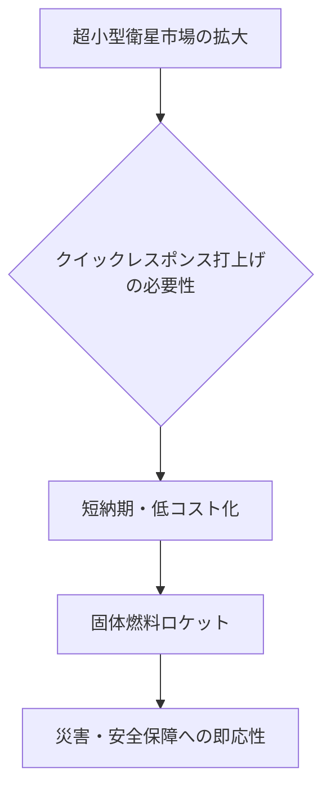

# T19-06-04 小型固体燃料ロケット（クイックレスポンス打上げ）

## Summary（5つの要点）

1. **打上げ準備期間の劇的短縮**: 固体燃料の特性とロケットのシンプル化により、打上げ準備期間を従来の数ヶ月から数日〜数週間に短縮し、**即応性（クイックレスポンス）**を確保する。
2. **超小型衛星市場への対応**: 2030年に予測される超小型衛星の打上げ需要増に対応し、低コストかつ柔軟な打上げ機会を提供することで市場競争力を高める。
3. **日本の基幹技術**: JAXAが開発した**イプシロンロケット**とその強化型**イプシロンSロケット**がこの技術の中心であり、日本の宇宙安全保障の要となる。
4. **衛星搭載環境の改善**: 振動、音響、衝撃といった衛星への負荷を世界最高水準に緩和し、**衛星に優しい**搭載環境を実現することで顧客の信頼を得る。
5. **H3ロケットとのシナジー**: イプシロンSロケットは、H3ロケットと共通の部品（電子機器など）を採用することで、**量産効果**と**コストダウン**を実現し、国際競争力の強化を図る。

#### 概念図: クイックレスポンス打上げの優位性

---

### 技術評価表（定量的な視点）

| 項目 | 評価 | 根拠・コメント |
| :--- | :--- | :--- |
| **導入コスト** | ⭐⭐⭐⭐︎ | 液体燃料ロケットに比べ、構造がシンプルで製造コストを抑えやすい。H3との部品共通化でさらに低減。|
| **技術成熟度** | ⭐⭐⭐⭐︎ | イプシロンロケットは実運用段階。強化型イプシロンSは燃焼試験で爆発が発生し、実証機打上げに遅延が生じている。|
| **日本の競争力** | ⭐⭐⭐⭐︎ | 固体燃料ロケット技術では世界でもトップクラスの技術力を保持。IA（IHIエアロスペース）が事業主体となり自立的なサービス展開を目指す。|
| **市場性** | ⭐⭐⭐⭐⭐ | 超小型衛星コンステレーションの構築に不可欠であり、市場の拡大は確実。災害対応や安全保障分野で高い需要。|
| **品質保証の重要性** | ⭐⭐⭐⭐⭐ | 爆発事故の再発防止に向けた**推進薬の信頼性評価**、軽量化された電子機器の**耐環境性評価**が最重要課題。|

---

## 日本の立ち位置・強み弱みのSummary

### 強み：日本企業や研究機関が持つ独自の技術、優位性などを箇条書きで記述。

* **高信頼性の固体推進薬技術**: 固体ロケットの推進薬製造・成形技術は、長年の実績があり高い信頼性を誇る。
* **AIを活用した自律点検**: イプシロンは、打ち上げ前の機体点検にAIを活用し、準備期間の短縮と信頼性の向上を実現した。
* **軽量・小型化技術**: 電力シーケンス分配器（PSDB）を機械式リレーから**半導体リレー**に置き換え、重量を約半減させることに成功。電子部品の軽量化技術に優位性。

### 弱み：日本が抱える規制、標準化の遅れ、海外依存などを箇条書きで記述。

* **実証試験での課題**: イプシロンSの2段機体燃焼試験で2度の爆発が発生しており、実証機打ち上げ計画に遅延が生じている。
* **コスト競争力の課題**: 従来のイプシロンロケットは、海外の小型液体ロケット（Rocket Lab Electronなど）に比べ、打上げコストで劣る傾向があった。
* **運用回数の不足**: 年間の打上げ機会が限定されており、高頻度運用によるノウハウ蓄積とコスト削減効果が低い。

---

## 技術ロードマップ（短期/中期/長期）

### 短期目標（～2027年）

* イプシロンSロケット第2段モータの爆発原因の究明と対策完了、再燃焼試験の成功。
* イプシロンS実証機の打上げ成功と、超小型衛星複数機同時打上げ技術の実証。
* H3との共通部品（アビオニクス等）の製造プロセスと品質保証体制の確立。

### 中期目標（2028年～2031年）

* 年間複数回のイプシロンSロケットによる商業打上げ輸送サービスの本格展開。
* 打上げ準備期間のさらなる短縮（数日レベル）と、緊急即応体制の確立。
* 民間企業によるロケット開発（Canon Electronics、インターステラテクノロジズ等）との連携による市場拡大。

### 長期目標（2032年～2035年）

* 災害時や安全保障上の危機における、**24時間以内の即応打上げ体制**の実現。
* 固体燃料ロケットをベースとした、簡易・低コストな月・惑星探査機打上げ能力の獲得。
* 固体ロケット技術を応用した、将来的な極超音速飛翔体技術（Hypersonic Technology）への貢献。

---

### 📚 参照リンク

[イプシロンロケット - JAXA](https://www.jaxa.jp/projects/rockets/epsilon/index_j.html)
[小型ロケット「イプシロンS」2段燃焼試験で爆発 秋田のJAXA実験場 | Science Portal](https://scienceportal.jst.go.jp/explore/review/20230718_e01/)
[イプシロンSロケット開発状況 第2段モータ再地上燃焼試験概要説明 - JAXA](https://www.jaxa.jp/projects/files/youtube/epsilon-s_SFT/jaxa_doc_20241125-01.pdf)
[イプシロン｜ロケット - JAXA 宇宙輸送技術部門](https://www.rocket.jaxa.jp/rocket/epsilon/)
[JAXA「イプシロンS」第2段モータ試験爆発原因調査で状況報告 小型版モータの燃焼試験を準備中](https://sorae.info/space/20250910-epsilon-s.html)