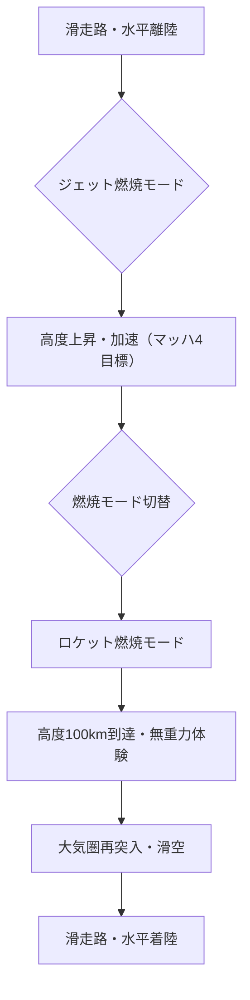

# T19-06-05 スペースプレーン・水平離着陸型宇宙機

## Summary（5つの要点）

1. **航空機と同じ運用形態**: 既存の空港・滑走路から離陸・着陸が可能であり、ロケット発射場が不要で、整備も比較的容易なため、**運用コストと簡便性**に優れる。
2. **完全再使用と安全性**: 機体全体を再使用し、またジェット飛行が可能であるため、異常時にはいつでも**飛行中断（アボート）や着陸のやり直し**が可能であり、安全性が高い。
3. **燃焼モード切替エンジン**: ジェット燃焼（大気圏内）とロケット燃焼（宇宙空間）を切り替える**独自エンジン**が主要な技術的特徴であり、この切替技術の実証が鍵となる。
4. **サブオービタル宇宙旅行**: まずは高度100kmに到達し帰還する**サブオービタル（弾道）宇宙旅行**を主な市場として目指しており、将来的には高速旅客輸送や人工衛星軌道投入への応用も視野に入れる。
5. **日本のベンチャーが主導**: 日本では**PDエアロスペース**が、ANAホールディングスやH.I.S.など大手企業からの出資を受け、この技術開発を民間主導で進めている。

#### 概念図: スペースプレーンの水平離着陸飛行プロファイル

---

### 技術評価表（定量的な視点）

| 項目 | 評価 | 根拠・コメント |
| :--- | :--- | :--- |
| **導入コスト** | ⭐⭐⭐☆☆ | 機体開発コストは高いが、ロケットのような使い捨て部品や専用インフラが不要なため、運航コストは低い。|
| **技術成熟度** | ⭐⭐⭐☆☆ | Virgin Galacticは商用飛行を開始。PDエアロスペースは無人実験機での高度100km到達を目指す段階であり、軌道投入レベルでの実用化には長期的な開発が必要。|
| **日本の競争力** | ⭐⭐⭐☆☆ | PDエアロスペースが「燃焼モード切替エンジン」という独自の特許技術を保有。国際競争力を持つ独自技術だが、実証段階に留まる。|
| **市場性** | ⭐⭐⭐⭐︎ | 宇宙旅行市場の拡大、地球上の高速移動、軌道上サービスへの応用等、市場は大きい。|
| **品質保証の重要性** | ⭐⭐⭐⭐⭐ | 多数回再使用される機体の健全性評価、特に**燃焼モード切替機構**の信頼性と耐久性確保が極めて重要。|

---

## 日本の立ち位置・強み弱みのSummary

### 強み：日本企業や研究機関が持つ独自の技術、優位性などを箇条書きで記述。

* **燃焼モード切替エンジン**: PDエアロスペースが特許を持つ、ジェット燃焼とロケット燃焼を瞬時に切り替えるエンジン技術。構造が簡素で熱効率が高い。
* **民間主導の資金調達**: ANA HD、H.I.S.、みずほグループなど大手民間企業がリスクマネーを提供し、開発を支援している。
* **安全性への優位性**: 常に滑空・ジェット飛行で帰還できるオプションを持つため、従来のロケットに比べ安全性が高いという設計上の利点。

### 弱み：日本が抱える規制、標準化の遅れ、海外依存などを箇条書きで記述。

* **実証段階の遅れ**: 無人実験機による高度100km到達を目標とする段階であり、海外の商業運行開始事例（Virgin Galactic）に比べると、実用化までの道のりが長い。
* **極超音速技術の不足**: マッハ4以上の超高速飛行が必要な単段式宇宙輸送機を実現するための、極超音速空気力学や耐熱材料技術（スクラムジェット等）の蓄積が限定的。
* **技術難易度の高さ**: 大気圏内の水平離陸から宇宙空間への到達を単段で行うSSTO（単段式宇宙輸送機）構想は、技術的な難易度が極めて高い。

---

## 技術ロードマップ（短期/中期/長期）

### 短期目標（～2027年）

* PDエアロスペースが無人実験機による**高度100km到達と水平帰還**に成功。
* 燃焼モード切替エンジンの地上での連続サイクル試験と耐久性評価の完了。
* 宇宙港としての利用を想定した既存空港の設備改修・運用検証の着手。

### 中期目標（2028年～2031年）

* 有人スペースプレーンのプロトタイプ開発と、サブオービタルでの低高度飛行試験開始。
* 多数回再使用を前提とした機体構造の検査・整備マニュアルの確立と品質保証システムの構築。
* 宇宙旅行の安全基準（機体の認定、パイロットのライセンス等）に関する国際連携。

### 長期目標（2032年～2035年）

* スペースプレーンによる**サブオービタル宇宙旅行の商業運航開始**。
* マッハ5以上の極超音速飛行技術を統合し、長距離高速旅客輸送システムへの応用。
* 衛星打ち上げ能力を持つ、軌道投入可能な完全再使用型スペースプレーンの開発着手。

---

### 📚 参照リンク

[“誰もが行ける宇宙”を実現するために！ 国内初・高度１００km到達～帰還。宇宙飛行機（スペースプレーン）開発プロジェクト - ふるさとチョイス](https://www.furusato-tax.jp/gcf/284)
[PDエアロスペース社報告資料](https://www.mext.go.jp/kaigisiryo/content/000036414.pdf)
[世界の将来宇宙輸送システムに関する動向（欧州）](https://www8.cao.go.jp/space/comittee/kettei/vision-sankou2.pdf)
[PDAS 会社/事業概要 - ＰＤエアロスペース](https://pdas.co.jp/wp-content/themes/pdas/pdf/PDAS%20Company_Outline.pdf)
[宇宙旅行の実現を目指す日本発の企業「PDエアロスペース」 - Telescope Magazine](https://www.tel.co.jp/museum/magazine/016/interview01/)
[翼で宇宙に行く時代がやってくる | 経済産業省 METI Journal ONLINE](https://journal.meti.go.jp/p/7719/)
[PDAS-X06｜ＰＤエアロスペース株式会社](https://pdas.co.jp/en/x06/)