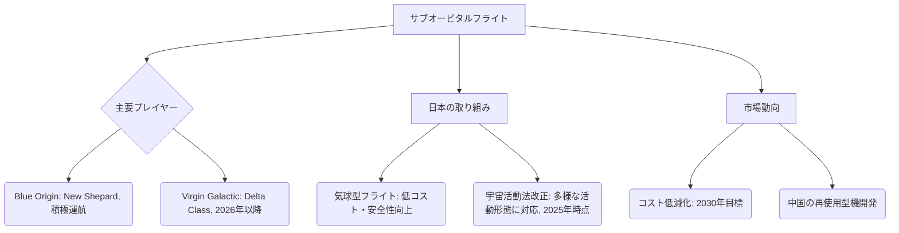

# 宇宙旅行・サブオービタルフライト

## Summary（5つの要点）
1. Blue Originは「**New Shepard**」により著名人を含む民間人ミッションを活発化しており、サブオービタルでの無重力体験を積極的に展開している。
2. Virgin Galacticは既存機「VSS Unity」の商業飛行を停止し、2026年以降の本格的な商業拡大を見据え、**次世代機「Delta」**の開発にリソースを集中投資している。
3. 中国は2025年頃までに**再使用型サブオービタル打上げ機**の開発成功とサブオービタル宇宙旅行の実現を目標に掲げており、アジア地域での競争が激化する見込み。
4. 日本企業も気球型宇宙船による成層圏フライト（岩谷技研）や、超音速飛行を見据えた有翼機による宇宙往還（往復）を目指す事業が進行中である。
5. サブオービタル旅行のコスト（数千万円～数億円）は、技術進歩と競争激化により**2030年頃には下落**し、市場の一般化が進むと予測されている。

#### 概念図

---
### 技術評価表（定量的な視点）
| 評価項目 | 評価 | 根拠・リスク |
| :--- | :--- | :--- |
| 導入コスト | ⭐⭐⭐⭐☆ | 機体開発・打ち上げインフラが高額、Starshipによる低コスト化に期待 |
| 技術成熟度 | ⭐⭐⭐⭐☆ | 実証段階は完了、商用化・規模拡大フェーズへ移行済み |
| 日本の競争力 | ⭐⭐☆☆☆ | 有人ロケット技術で米国・中国に後れ、気球方式でニッチ市場開拓 |
| 市場性 | ⭐⭐⭐⭐☆ | 富裕層向けニッチ市場確立済み、将来的な一般化に期待 |
| 品質保証の重要性 | ⭐⭐⭐⭐⭐ | 人命直結のため、機体安全性・再使用時の信頼性確保が最重要課題 |

---
## 日本の立ち位置・強み弱みのSummary
### 強み
1. 気球型成層圏遊覧飛行（岩谷技研）など、独自の技術アプローチで高高度観光市場への参入を試みている。
2. 航空機開発で培った複合材・システムインテグレーション技術は、有翼の宇宙往還機開発に応用可能。
3. JAXAや日本航空（JAL）との連携による、有人飛行に関する高度な安全管理・オペレーションノウハウの蓄積。

### 弱み
1. Blue OriginやVirgin Galacticのような、商業的なサブオービタル飛行を実現した**再使用型ロケット**や**宇宙往還機**の運用実績がない。
2. 宇宙活動法の規制が多様な形態の宇宙活動（再使用型、サブオービタル）への対応が遅れていたが、現在改正作業中（2025年時点）。
3. サブオービタル市場をリードする民間企業への大規模なリスクマネー投資が米国に比べて限定的。

---
## 技術ロードマップ（短期/中期/長期）
### 短期目標（～2027年）
1. 次世代機（Virgin Galactic Deltaなど）の開発完了と商業フライト開始。
2. 日本の宇宙活動法改正の完了と、新制度下でのサブオービタル/再使用型機体の許認可プロセス確立。
3. 気球型成層圏遊覧飛行の商業運航開始と安全性・収益性の実証（岩谷技研など）。
### 中期目標（2028年～2031年）
1. サブオービタルフライトの年間運航回数を倍増させ、コストを現在の半分以下に低減。
2. 低軌道（LEO）商業宇宙ステーションへの輸送サービスとの連携開始。
3. 宇宙旅行客向け訓練システムの標準化とライセンス制度の確立。
### 長期目標（2032年～2035年）
1. サブオービタル機体を活用した超高速ポイント・トゥ・ポイント輸送（地球上2地点間移動）の試験運航開始。
2. 一般消費者層への市場拡大に向け、価格帯を数百万単位まで引き下げる競争原理の確立。
3. 宇宙医学・生命維持技術の高度化による、より多様な旅行客層の受け入れ。

### 📚 参照リンク
1. [2025年、宇宙は旅先になる 民間宇宙旅行の最新動向と未来予測 - note](https://note.com/space_business/n/n33072a856363)
2. [サブオービタル旅行の夜明け：Virgin Galacticの挑戦と展望｜宇宙ビジネスキュレーター - note](https://note.com/space_business/n/n1fc34f6719a0)
3. [【2025最新】宇宙活動法の改正動向をわかりやすく解説｜民間宇宙ビジネスにも影響](https://asahigodo.jp/legal-issue/%E3%80%902025%E6%9C%80%E6%96%B0%E3%80%91%E5%AE%87%E5%AE%99%E6%B4%BB%E5%8B%95%E6%B3%95%E3%81%AE%E6%94%B9%E6%AD%A3%E5%8B%95%E5%90%91%E3%82%92%E3%82%8F%E3%81%8B%E3%82%8A%E3%82%84%E3%81%99%E3%81%8F/)
4. [誰でも宇宙・成層圏旅行に行ける時代！？主要企業4社の最新動向に注目 | SPACE CONNECT](https://space-connect.jp/space-travel/)