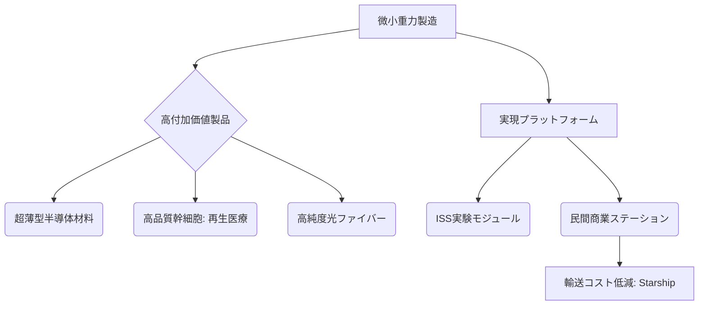

# 宇宙工場・微小重力製造

## Summary（5つの要点）
1. 微小重力環境は、地上では重力の制約により困難な、原子レベルで均一な**超薄型半導体材料**や高純度結晶の製造を可能にする「製造拠点」として注目されている。
2. 再生医療分野では、高品質な**間葉系幹細胞（MSC）**や臓器チップの安定的な大量製造プロセス確立を目指した研究が、日本企業（積水化学、SBLなど）により進められている（2025年）。
3. ISSの退役（2030年頃）を見据え、Axiom SpaceやSierra Spaceが開発する**商業宇宙ステーション**が、将来の微小重力製造の主要なプラットフォームとなる。
4. 製造コストの大部分を占める**地球からの輸送コスト**が、Starshipなどの超大型再使用型ロケットの登場により劇的に下がり、商業的な採算性が向上している。
5. ターゲット製品は、**極めて高単価**な特定タンパク質、超高性能半導体、高純度光ファイバーなど、地上技術では実現不可能な高付加価値品に絞られる。

#### 概念図

---
### 技術評価表（定量的な視点）
| 評価項目 | 評価 | 根拠・リスク |
| :--- | :--- | :--- |
| 導入コスト | ⭐⭐⭐⭐⭐ | 打ち上げコストが高額、軌道上インフラ構築が必要 |
| 技術成熟度 | ⭐⭐⭐☆☆ | 研究・実証段階から商業化への移行期、製品回収技術が課題 |
| 日本の競争力 | ⭐⭐⭐☆☆ | 再生医療分野で独自技術を持つが、半導体製造は国際協力に依存 |
| 市場性 | ⭐⭐⭐⭐☆ | ニッチだが極めて高単価な市場（半導体、医薬品） |
| 品質保証の重要性 | ⭐⭐⭐⭐⭐ | 医薬品・半導体は結晶構造の均一性や無菌性が厳しく要求される |

---
## 日本の立ち位置・強み弱みのSummary
### 強み
1. 再生医療分野における独自の知見と技術（積水化学の**Ceglu™**など）を保有し、幹細胞培養の高品質化に貢献。
2. JAXAの「きぼう」日本実験棟を通じた微小重力環境での長期的な実験実績と運用ノウハウの蓄積。
3. 高純度結晶、先端材料分野で高い地上技術力を有し、これを宇宙環境に応用できる潜在力。

### 弱み
1. 微小重力製造に特化した専用の商業モジュールや宇宙ステーションインフラの整備が、米国主導（Axiom Spaceなど）に後れを取っている。
2. 製造した高付加価値製品（半導体、医薬品）を安全かつ安価に地球へ帰還させるための**再突入技術や輸送チェーン**が未成熟。
3. 地上での模擬実験装置と実際の宇宙環境での製造プロセスとの間には、依然として技術的なギャップが存在。

---
## 技術ロードマップ（短期/中期/長期）
### 短期目標（～2027年）
1. ISSや民間プラットフォームを活用した、特定材料（半導体、幹細胞）の**試作品製造**と品質評価の実施。
2. 微小重力製造品の地球への輸送・回収コストとプロセスの最適化。
3. 高品質幹細胞の大量培養技術の実証と、再生医療臨床研究への応用開始。
### 中期目標（2028年～2031年）
1. 商業宇宙ステーション内での、**パイロットプラント**規模での製造ライン確立。
2. 高付加価値材料（例：超高純度光ファイバー）の最初の商用顧客獲得と商業生産開始。
3. 製造プロセスと製品品質に関する国際的な標準化の議論開始。
### 長期目標（2032年～2035年）
1. 製造コストを考慮しても地上製造品に対して経済的優位性を持つ製品群の確立と市場投入。
2. 製造・輸送・回収を自律的に行う完全自動化された**軌道上工場**の運用開始。
3. 月面やラグランジュ点での資源活用を見据えた製造技術の研究開発。

### 📚 参照リンク
1. [宇宙が製造拠点に：ISSでの最先端半導体実験の動向 | スペース経済ニュースメディア](https://www.innovations-i.com/release/69304/)
2. [積水化学工業、高品質間葉系幹細胞培養に関する共同研究開始](https://www.sekisui.co.jp/news/2025/1429076_41954.html)
3. [商業宇宙ステーションの動向と宇宙製造の未来 | JAXAビジネス開発](https://business.jaxa.jp/column/commercial_space_station/)