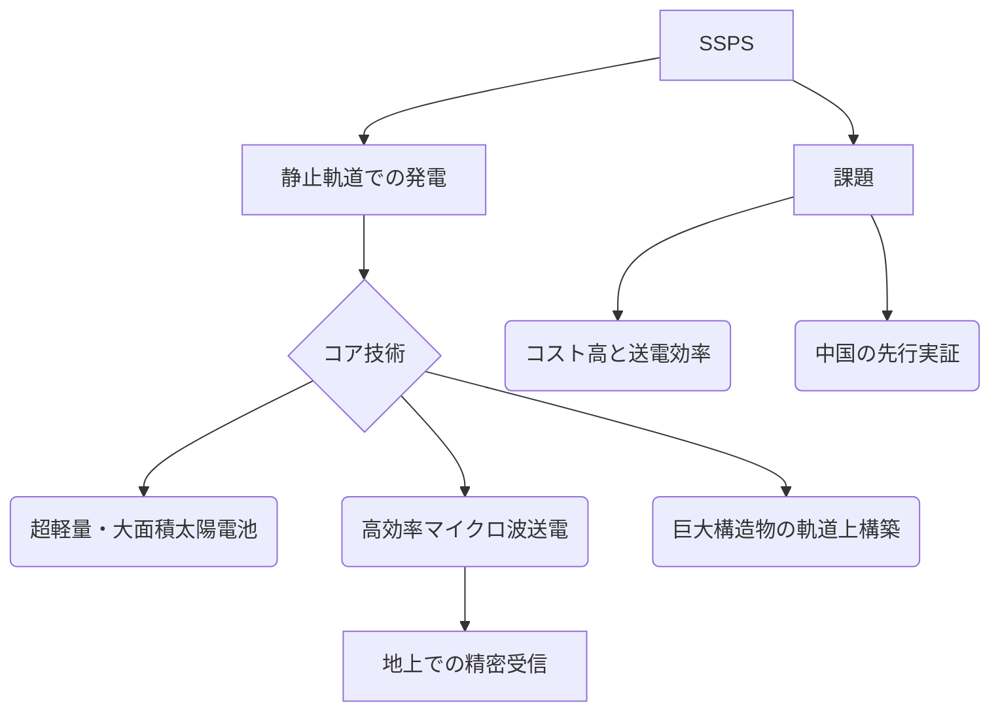

# 宇宙太陽光発電（SSPS: Space Solar Power System）

## Summary（5つの要点）
1. SSPSは静止軌道（GEO）で24時間発電し、**マイクロ波またはレーザー**で地上に送電するシステムであり、地上の太陽光発電の約10倍の発電効率を持つ。
2. 日本はSSPSを将来的なエネルギー戦略と位置付け、文部科学省と経済産業省の主導で少なくとも2033年まで研究開発を継続するロードマップを持つ。
3. SSPSの鍵となる技術は、長距離での**マイクロ波電力伝送（WPT）**であり、日本は2025年度を目標に多素子パネルでの実証、中国は2025年までにLEOでの**100kW級実証**を計画している。
4. 実用化には、巨大な発電構造物（数km²級）を**軌道上で安価に構築する技術**（超軽量構造、自律組立）と、マイクロ波の**ビーム形成・精密制御技術**が不可欠である。
5. SSPSの実現は、カーボンニュートラル社会に向けた**ベースロード電源**として、既存の再生可能エネルギー源の不安定性を補完する戦略的価値を持つ。

#### 概念図

---
### 技術評価表（定量的な視点）
| 評価項目 | 評価 | 根拠・リスク |
| :--- | :--- | :--- |
| 導入コスト | ⭐⭐⭐⭐⭐ | 巨大な衛星と地上レクテナ建設で極めて高額、実証機のコストも高い |
| 技術成熟度 | ⭐⭐☆☆☆ | 基礎研究・地上実証段階、軌道上実証は緒に就いたばかり |
| 日本の競争力 | ⭐⭐⭐☆☆ | 無線送電技術に強みを持つが、中国が先行実証計画で優位 |
| 市場性 | ⭐⭐⭐⭐⭐ | 実用化すれば基幹エネルギー源となり得るが、経済性は未確立 |
| 品質保証の重要性 | ⭐⭐⭐⭐☆ | 送電ビームの制御ミスや、宇宙デブリによる構造物損傷のリスクが高く、安全確保が最重要 |

---
## 日本の立ち位置・強み弱みのSummary
### 強み
1. マイクロ波電力伝送（WPT）技術、特に**多素子の位相同期によるビーム形成・制御技術**において長年の研究蓄積があり、2025年度の地上実証を目指している。
2. 三菱電機など国内企業が、GaN増幅器やレクテナなどの高周波デバイス開発で、WPTの産業化に向けた取り組みを進めている。
3. 政府（MEXT/METI）が2033年までのロードマップを策定し、継続的な研究投資を行う姿勢が明確。

### 弱み
1. 中国が2025年100kW級という具体的な軌道上実証計画を公表しており、**実証フェーズで後れ**を取っている。
2. 静止軌道に巨大構造物を安価に輸送・組み立てるための**超大型ロケット**や**軌道上サービス（OOS）**技術の開発が米国（Starship）や中国に比べ遅れている。
3. SSPSの経済性を確保するための、発電コストと送電効率のブレークスルーが依然として最大の技術的障壁。

---
## 技術ロードマップ（短期/中期/長期）
### 短期目標（～2027年）
1. 長距離マイクロ波電力伝送技術の**長距離・高効率**での地上実証完了（日本）。
2. 中国によるLEOでの100kW級電力伝送の実証結果を分析し、日本の計画にフィードバック。
3. 超軽量・高効率な宇宙用太陽電池、送電アンテナの基礎技術開発。
### 中期目標（2028年～2031年）
1. 軌道上での小型実証機（数kW～数十kW級）を打ち上げ、無線送電、ビーム制御、構造展開の統合試験を実施。
2. 宇宙構造物のモジュール化・自律組立技術（OOS）の基礎研究を推進。
3. 地上でのレクテナ（受信局）の建設コスト低減化技術の開発。
### 長期目標（2032年～2035年）
1. GEOまたはLEOでの**中規模（数十MW級）実証衛星**の設計・開発開始。
2. 国際協力によるSSPSの周波数利用や安全基準の標準化への貢献。
3. 商用化に向けた経済合理性の検証と、メガワット級の送電を可能にする次世代高効率デバイスの開発。

### 📚 参照リンク
1. [SSPSとは?宇宙太陽光発電システムの仕組みと実用化への展望を徹底解説](https://open-insight.net/blog/research-development/what-is-ssps-space-solar-power-systems/)
2. [宇宙太陽光発電における無線送受電技術の概要 - 経済産業省](https://www.meti.go.jp/policy/tech_evaluation/c00/C0000000R03/220114_space_1st/space_1st_08-6.pdf)
3. [日本でも1980年代から研究が続く太陽光発電衛星、その実現の可能性は？](https://sorae.info/space/20210408-ssps.html)