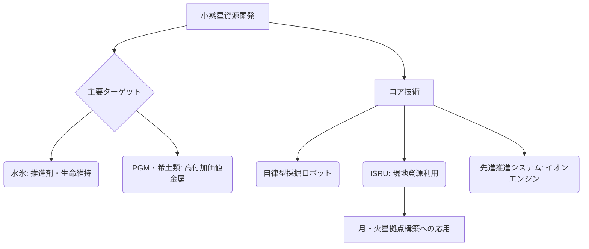

# 小惑星資源開発（宇宙採掘）

## Summary（5つの要点）
1. 小惑星採掘市場は、2025年の推定15億米ドルから2033年には95億米ドルに成長するCAGR 25.5%の急成長が見込まれている。
2. ターゲット資源は、高付加価値な**白金族金属（PGM）**や、宇宙インフラに不可欠な**推進剤や生命維持用の水氷**（月面・近地球小惑星）である。
3. 採掘資源を宇宙空間で利用する**ISRU（In-Situ Resource Utilization：現地資源利用）技術**、特に水氷からのロケット燃料製造技術の確立が、宇宙経済拡大のボトルネックを解消する鍵となる。
4. 実現には、地球からの遠隔操作ではなく、**AIを搭載した自律型ロボット**による採掘、選鉱、精製プロセスが不可欠となる。
5. 日本はJAXAの「**はやぶさ**」シリーズにより、小惑星への往復航行、精密な着陸、サンプルリターンという**宇宙採掘の基礎技術実証**に世界で唯一成功し、国際的な優位性を有する。

#### 概念図

---
### 技術評価表（定量的な視点）
| 評価項目 | 評価 | 根拠・リスク |
| :--- | :--- | :--- |
| 導入コスト | ⭐⭐⭐⭐⭐ | 深宇宙探査機・採掘ロボット開発、長期間の運用コストが極めて高額 |
| 技術成熟度 | ⭐⭐☆☆☆ | 探査段階、資源利用技術（ISRU）は基礎研究・実証段階 |
| 日本の競争力 | ⭐⭐⭐⭐☆ | はやぶさ・はやぶさ2による小惑星サンプルリターン技術で世界をリード |
| 市場性 | ⭐⭐⭐☆☆ | 潜在的価値は高いが、経済性の確立は2030年代以降の課題 |
| 品質保証の重要性 | ⭐⭐⭐☆☆ | 採掘システムの耐久性、長期間の自律運用信頼性が求められる |

---
## 日本の立ち位置・強み弱みのSummary
### 強み
1. JAXAの「**はやぶさ**」「**はやぶさ2**」ミッションにより、小惑星への往復航行、精密な着陸、サンプルリターンという、**宇宙採掘の核となる技術実証**に世界で唯一成功している。
2. 小惑星サンプル分析によって、地球外資源の化学組成や物理特性に関する貴重なデータと知見を保有している。
3. 電気推進（イオンエンジン）技術において高い信頼性を有し、深宇宙探査機の航行に貢献できる。

### 弱み
1. 採掘した資源を**商業的に利用可能な形に変換・精製するISRU技術**（特に水氷からの推進剤製造）の軌道上での大規模実証経験が不足している。
2. 米国やルクセンブルク政府のような、**宇宙資源法の整備**や民間企業への大規模な投資支援体制が未発達。
3. 採掘から地球への輸送、または軌道上での利用に至るまでの、経済的なビジネスモデルが未確立。

---
## 技術ロードマップ（短期/中期/長期）
### 短期目標（～2027年）
1. 月面でのISRU技術（水資源利用）の初期実証（NASA/Artemis計画への参画、JAXAの活動）。
2. 採掘ターゲットとなる小惑星（特に近地球型小惑星）の資源量・組成を特定する精密観測計画の策定。
3. 採掘ロボットの基礎技術（掘削、選鉱、自律制御）の地上・模擬環境での開発。
### 中期目標（2028年～2031年）
1. 深宇宙探査機による**特定の小惑星への採掘実証機**の打ち上げ、初期的な採掘作業と資源回収の試験。
2. 採掘した水氷からロケット推進剤を製造する**軌道上デモンストレーター**の運用開始。
3. 宇宙資源の所有権、利用権、環境保全に関する国際的な法制度の議論に参加し、日本の立場を明確化。
### 長期目標（2032年～2035年）
1. PGM、希土類などの高付加価値資源の採掘・回収を目的とした商業ミッションの開始。
2. 月軌道上（Cis-Lunar）の宇宙インフラ（軌道上燃料ステーション、宇宙デポ）への水資源供給チェーンの確立。
3. 小惑星の資源データを活用した、採掘投資判断のための金融モデルの構築。

### 📚 参照リンク
1. [小惑星採掘市場Forecast 2025–2033：規模、需要、競争戦略](https://www.innovations-i.com/release/1784549.html)
2. [月面・宇宙資源の現地資源利用（ISRU）技術の最新動向](https://www.jst.go.jp/ristex/stip/reports/pdf/20230303_isru.pdf)
3. [JAXA はやぶさ２ミッションと日本の深宇宙探査技術](https://www.jaxa.jp/press/2020/12/20201206b_j.html)