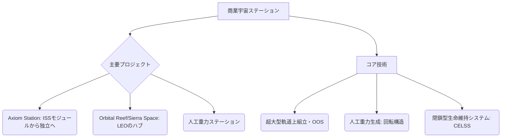

# 宇宙ホテル・商業宇宙ステーション

## Summary（5つの要点）
1. ISS退役（2030年頃）後の後継として、Axiom Space（**Axiom Station**）やSierra Space（**Orbital Reef**）など、複数の民間企業が商業宇宙ステーションの建設を計画・推進している。
2. Orbital Assembly Corporationは、ステーションを回転させることによる**人工重力（月や火星と同等）**の実現を目指しており、長期滞在や観光客の身体的負担軽減を図る。
3. SpaceXの**Starship**のような超大型・再使用型ロケットの登場により、軌道上建設に必要な資材の輸送コストが大幅に低減し、商業ステーションの実現可能性が高まった。
4. 商業ステーションは、宇宙旅行客の宿泊だけでなく、**微小重力製造**、**軌道上研究開発拠点**、宇宙飛行士訓練施設といった多角的な収益源を持つビジネスモデルを構築する。
5. 日本企業も商業ステーションのモジュール開発や、**閉鎖型生命維持システム（CELSS）**技術の提供を通じて、商業宇宙インフラへの参入機会を伺っている。

#### 概念図

---
### 技術評価表（定量的な視点）
| 評価項目 | 評価 | 根拠・リスク |
| :--- | :--- | :--- |
| 導入コスト | ⭐⭐⭐⭐⭐ | 軌道上での大規模建設が必要、極めて高額だが輸送コスト低減で改善傾向 |
| 技術成熟度 | ⭐⭐⭐☆☆ | モジュール技術はISSで実証済み、人工重力構造と商業運営は未経験 |
| 日本の競争力 | ⭐⭐☆☆☆ | プラットフォーム事業は米国先行、部品・モジュール供給が主 |
| 市場性 | ⭐⭐⭐⭐☆ | 宇宙旅行の最終目的地、研究・製造需要も取り込む多角的な市場 |
| 品質保証の重要性 | ⭐⭐⭐⭐⭐ | 長期滞在施設であり、閉鎖環境での生命維持、安全管理が最重要 |

---
## 日本の立ち位置・強み弱みのSummary
### 強み
1. ISS「きぼう」モジュールの開発・運用で培った、**長期の閉鎖型生命維持システム（CELSS）**、熱制御、構造技術に関する高い技術力。
2. 商業ステーションの構築に必要なロボットアーム技術や、高品質な電子部品・材料の供給能力。
3. JAXAによる商業ステーション利用促進のための枠組み構築への貢献と、国内企業への技術支援。

### 弱み
1. Axiom SpaceやOrbital Reefのような、**商業ステーション全体のインテグレーション**を主導する民間プラットフォーマーが存在しない。
2. 超大型構造物を軌道上で自律的に組み立てるための**軌道上サービス（OOS）**技術（ロボティクス、自動ドッキング）が米国に比べて遅れている。
3. 宇宙ホテル事業の鍵となる、国際的な宇宙旅行規制や保険・責任のフレームワーク構築への関与が限定的。

---
## 技術ロードマップ（短期/中期/長期）
### 短期目標（～2027年）
1. 民間企業による最初の商業ステーションモジュール（Axiom Stationモジュールなど）の軌道上構築開始。
2. 日本企業による商業ステーション向け研究・製造モジュールの供給および利用契約の締結。
3. 宇宙ホテル宿泊客の訓練プログラムの標準化と、重力レベルの検証。
### 中期目標（2028年～2031年）
1. Axiom Station、Orbital Reefなどの独立運用開始と、商業利用客（旅行客、研究者）の受け入れ本格化。
2. ステーションと地上を結ぶ、定期的かつ低コストな輸送サービス（Starship等）の安定稼働。
3. 閉鎖環境での長期滞在に向けた、水リサイクルや食料生産（宇宙農業）技術の組み込み。
### 長期目標（2032年～2035年）
1. 人工重力を持つ大型商業ステーションが本格稼働し、観光、製造、研究の複合施設として定着。
2. ステーションの軌道上拡張やモジュール交換を行うOOS技術の確立と、サービス産業化。
3. 月軌道上（Cis-Lunar）ステーションや、地球-月間の輸送中継拠点としての利用検討。

### 📚 参照リンク
1. [人工重力を備えた「宇宙ホテル」が2025年に建設開始予定](https://nazology.kusuguru.co.jp/archives/83870)
2. [商業宇宙ステーション - 宇宙メディア「SpaceMate」](https://spacemate.jp/commercial-space-station)
3. [Sierra Space、Blue Originの宇宙ステーション計画「Orbital Reef」](https://www.sierraspace.com/destinations/orbital-reef/)
4. [軌道上ホテル「ボイジャー・ステーション」は2027年完成予定か | sorae](https://sorae.info/space/20210408-voyager-station.html)