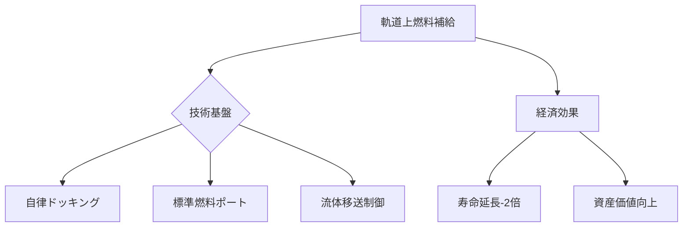

# T19-08-01 軌道上燃料補給技術

## Summary（5つの要点）
1. 静止軌道（GEO）衛星向けの**寿命延長サービス**が、Northrop GrummanのMEV（Mission Extension Vehicle）により商用化され、衛星資産価値の維持に貢献している。
2. 燃料補給の実現には、**標準化された燃料ポート（インターフェース）**が必須であり、Orbit Fab社などが**軌道上タンカーステーション**の設置を進めている。
3. 高度な**ランデブー・近接運用技術（RPO）**と、推進剤をこぼさず移送するための**流体制御技術**が中核をなす。
4. この技術が通信衛星や観測衛星の運用寿命を**2倍以上**に延長することで、打ち上げコストを実質的に低減する経済効果がある。
5. 月・火星探査や深宇宙ミッションにおいて、地球周回軌道を**中継基地（Space Depot）**として活用するための重要な基盤技術となる。

#### 概念図

---
### 日本の立ち位置・強み弱みのSummary
### 強み
1. JAXAの**ISS補給技術**で培われたランデブー・ドッキング技術。
2. 高い**センサー技術**と精密な**姿勢制御技術**。
### 弱み
1. GEO領域での**商業サービス**の具体的な提供計画が、米国企業に比べて遅れている。
2. 国際的な**燃料ポートの標準化**議論への影響力が限定的である。
