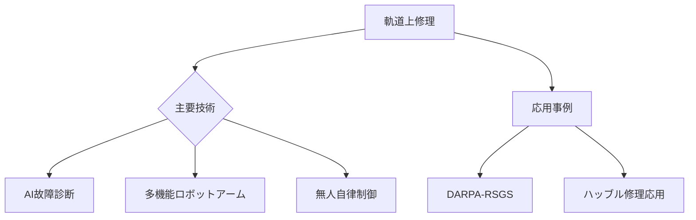

# T19-08-02 軌道上修理・部品交換技術

## Summary（5つの要点）
1. **故障診断と修理計画の自律化**: AIを活用し、衛星の故障部位を特定し、最適な修理手順を自律的に立案するソフトウェア技術。
2. **高精度ロボットマニピュレータ**: 繊細な部品の取り外し・取り付け、配線の接続など、人間の手に近い作業が可能な**多機能ロボットアーム**が中核。
3. **スペースシャトル時代からの進化**: ハッブル宇宙望遠鏡の修理など、有人ミッションで行われていた作業を、**無人ロボット**による遠隔または自律で実施する技術が開発の主流。
4. **実証プロジェクトの推進**: DARPAの**RSGS（Robotic Servicing of Geosynchronous Satellites）**などのプログラムにより、静止軌道でのロボット修理実証が進行中。
5. **モジュラー設計の普及**: 将来の衛星設計において、修理・交換を容易にするための**モジュール化**（プラグアンドプレイ）が標準となる。

#### 概念図

---
### 日本の立ち位置・強み弱みのSummary
### 強み
1. **ISS「きぼう」でのロボット運用経験**に基づく、長期間の宇宙環境下でのロボット制御ノウハウ。
2. 国内製造業の**精密なマニピュレータ技術**と、**非破壊検査技術**の応用。
### 弱み
1. 専用の**商業軌道上修理プラットフォーム**の開発と市場投入が遅れている。
2. ロボット修理に必要な**専用ツールやインターフェース**の国際標準化における主導権が弱い。
