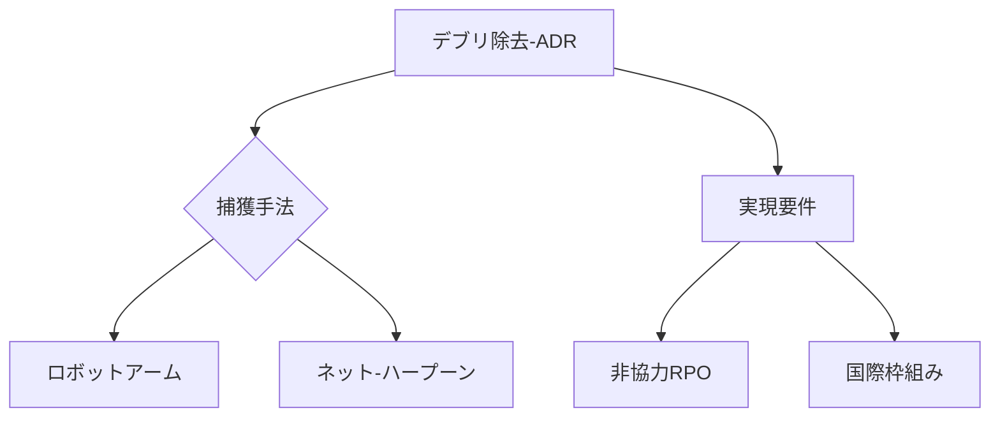

# T19-08-03 スペースデブリ除去技術

## Summary（5つの要点）
1. ADRは、増え続ける**スペースデブリ**問題、特に低軌道（LEO）コンステレーションの安全性を担保するための**宇宙交通管理（STM）**に不可欠な技術である。
2. **捕獲技術の多様化**: デブリの特性（非協力性、回転、サイズ）に応じて、**ロボットアーム、ネット、ハープーン**、粘着パッドなど、複数の捕獲手法が研究されている。
3. **非協力的物体へのRPO**: 姿勢が不安定でインターフェースを持たないデブリに対し、安全かつ正確に接近・捕獲するための**高精度センサーフュージョンとAI制御技術**が鍵となる。
4. **日本の優位性**: **アストロスケール**（日本）が、デブリの接近・捕獲・除去の技術実証ミッション（ADRAS-Jなど）で世界的優位性を持ち、商業サービスをリードしている。
5. **除去後の処理**: 捕獲したデブリを、大気圏に再突入させて燃焼させる**デオービット**（軌道離脱）手法が主であり、安全な再突入経路の計算技術も重要である。

#### 概念図

---
### 日本の立ち位置・強み弱みのSummary
### 強み
1. **アストロスケール**による世界最先端の商業ADR技術開発と実績。
2. 高精度な**画像認識センサー**と、非協力的物体への接近制御技術。
### 弱み
1. ADRサービスの**コスト負担者**や**法的責任**に関する国際的な枠組み、国内法整備の遅れ。
2. 大規模なデブリを効率的に除去するための**国家的なインフラ**（監視網など）の整備。
