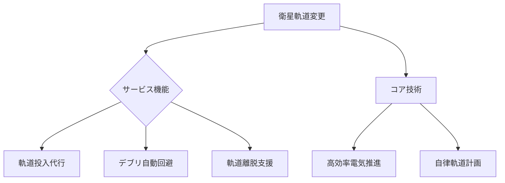

# T19-08-04 衛星軌道変更サービス

## Summary（5つの要点）
1. **宇宙空間のMaaS化**: 衛星を牽引・プッシュする**小型推進モジュール**を提供し、衛星の軌道投入、軌道変更、デブリ回避、デオービットなどを代行するサービス。
2. **軌道投入支援**: ロケットからの分離後、目標軌道までの最終調整を担うことで、ロケットの要求精度を緩和し、**打ち上げコストを低減**する効果がある。
3. **デブリ回避の自律化**: LEOコンステレーションの衛星が、接近デブリを自律的に検知し、衝突リスクを避けるための**軌道変更アルゴリズム**が高度化している。
4. **主要プレイヤー**: D-Orbit（イタリア）、Momentus Space（米国）などが、軌道変更・輸送サービス（Space Tug/Last Mile Delivery）を商業展開している。
5. **多様な推進技術の活用**: ホールスラスタ、イオンエンジンなどの**電気推進**技術が、高効率で長期間の軌道変更に利用され、サービスの提供期間を延長する。

#### 概念図

---
### 日本の立ち位置・強み弱みのSummary
### 強み
1. JAXAや国内企業が培った**電気推進技術**（イオンエンジンなど）の高効率化技術。
2. **衛星の軌道決定・制御**に関する高い技術力。
### 弱み
1. 商業的な**宇宙牽引車（Space Tug）**の機体開発と、サービスの市場展開で、欧米のスタートアップに後れを取っている。
2. 軌道変更サービスを運用するための**地上局ネットワークと管制システム**の規模が限定的である。
