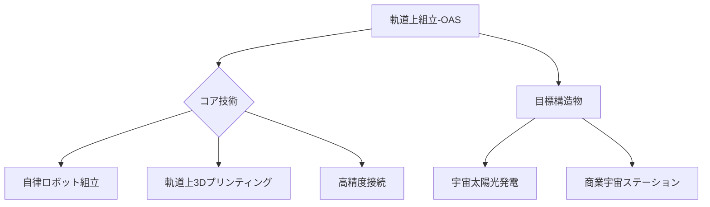

# T19-08-05 軌道上アセンブリ・大型構造物建設

## Summary（5つの要点）
1. **打ち上げサイズからの解放**: 地球上でのロケットフェアリングサイズに制約されない、**超大型の宇宙構造物**（数km級の太陽光発電アレイなど）の軌道上建設を可能にする。
2. **軌道上3Dプリンティング（OAM）**: 地球から資材を運ぶのではなく、軌道上で部品や部材を**自律的に製造**する技術（例: NASA Archinaut）が、コストと時間の削減に貢献。
3. **自律ロボットによる高精度組立**: **AIとロボットアーム**を統合し、微小重力下で部材を把持・接続・溶接する高精度な自律制御技術が中核となる。
4. **主要応用先**: 将来の**宇宙太陽光発電（SSPS）**、大型宇宙望遠鏡、商業宇宙ステーションや**深宇宙探査基地の構築**など、宇宙インフラの基盤となる。
5. **ISSの知見の応用**: ISSのロボットアーム（Canadarm2）によるモジュール結合の経験が、OASの基礎技術として活用されている。

#### 概念図

---
### 日本の立ち位置・強み弱みのSummary
### 強み
1. JAXAの**「きぼう」でのロボットアームの長期運用実績**と、国内の精密ロボティクス技術。
2. **大型構造物のモジュール化設計**に関する産業技術。
### 弱み
1. **軌道上での資材製造（3Dプリンティング）**に関する大規模実証や、コア技術開発が米国主導のプロジェクトに依存している。
2. OAS/OAMによって建設される**超大型構造物**（例: SSPS）の国家的なロードマップが未だ明確でない。
