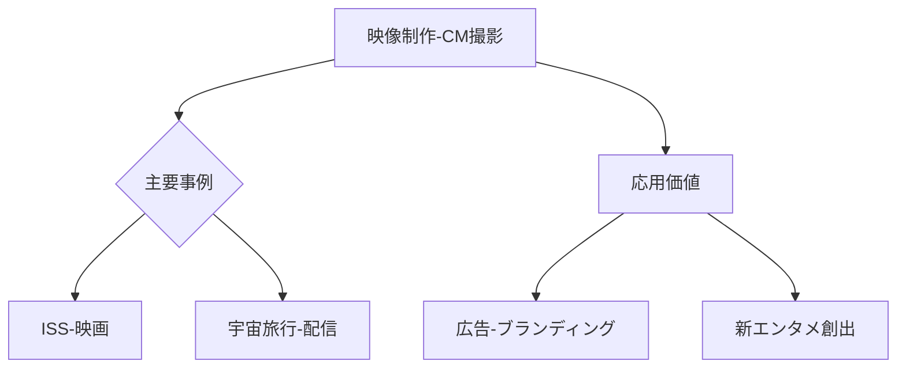

# T19-09-01 宇宙空間での映像制作・CM撮影

## Summary（5つの要点）
1. **実写映画制作の商業化**: ロシアが世界初のISSでの映画撮影（「The Challenge」）を実施し、宇宙空間での映像制作が商業ベースに移行した。
2. **宇宙旅行との融合**: 宇宙旅行者（例: 前澤友作氏）が、滞在中に撮影した映像をYouTubeなどのプラットフォームで配信し、**高価値なコンテンツ**として活用している。
3. **無重力・軌道からの景観の活用**: 無重力状態や地球の壮大な景観など、**地上では再現不可能な特殊な映像**を、広告や映画の差別化要素として利用する。
4. **技術的課題**: 宇宙環境に耐える**小型・軽量・高精細なカメラ**と、長期間のバッテリー持続性、および高帯域でのデータ伝送技術が求められる。
5. **ブランド価値の最大化**: 企業のCM撮影に利用することで、**革新性やグローバルな視野**を訴求するブランディング戦略に活用され、広告媒体としての新市場を創出する。

#### 概念図

---
### 日本の立ち位置・強み弱みのSummary
### 強み
1. 日本企業の**カメラ・映像機器技術**は世界的に高く評価されており、宇宙用カメラの小型軽量化・高精細化技術で貢献可能。
2. アニメ・ゲームなど**コンテンツ制作ノウハウ**が高く、映像制作後の二次利用コンテンツ展開に強みを持つ。
### 弱み
1. 宇宙空間での**ロケ機会**が、米国やロシアの宇宙船・ステーションに依存しており、主導権を握りにくい。
2. **ハリウッド**主導の大型宇宙映画企画と比較し、日本の**映画産業の投資規模**が小さい。
