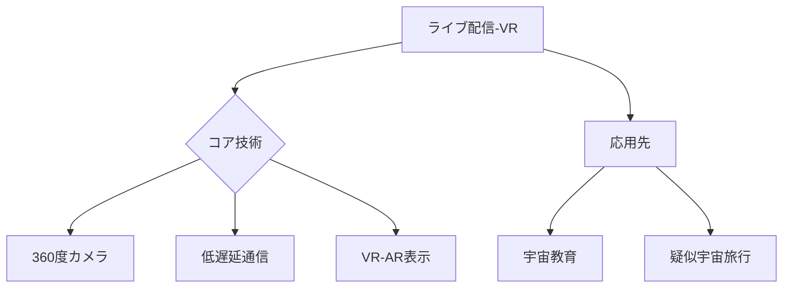

# T19-09-02 宇宙からのライブ配信・VR体験

## Summary（5つの要点）
1. **リアルタイム没入体験**: ISS搭載の**360度カメラ**などから撮影された映像をVR/ARデバイスを通じて地上に配信し、ユーザーに**宇宙飛行士の視点**を疑似体験させる。
2. **低遅延通信の実現**: 大容量のVRデータをリアルタイムで途切れなく伝送するための、**低遅延・高スループットな衛星通信技術**（例: LEO/GEO衛星コンステレーションの活用）が必須となる。
3. **教育分野での革新**: 宇宙飛行士によるライブ中継授業と組み合わせることで、**教育プログラムの臨場感**を飛躍的に高め、STEM教育への関心を喚起する。
4. **デジタルツインの構築**: ISSや将来の月面基地の**デジタルツイン**を構築し、VR空間内で遠隔操作や共同作業を行うための基盤となる。
5. **主要事例**: JAXA、NASA、NHKなどが共同で、ISSからの高精細なVRコンテンツ制作やライブ配信の実証を継続的に行っている。

#### 概念図

---
### 日本の立ち位置・強み弱みのSummary
### 強み
1. **VR/ARデバイス**（PSVR2など）や**ゲームエンジン技術**において、高品質なユーザーインターフェースと体験を提供するノウハウを持つ。
2. **JAXA**が「きぼう」からのライブ中継授業など、教育コンテンツの配信実績が豊富。
### 弱み
1. 宇宙からの**大容量データ伝送**に必要な衛星コンステレーションや通信インフラが、米国企業（Starlinkなど）に依存している。
2. VR/AR酔いを防ぐための**生体情報フィードバック技術**や、超低遅延化技術の開発が国際的に競合している。
