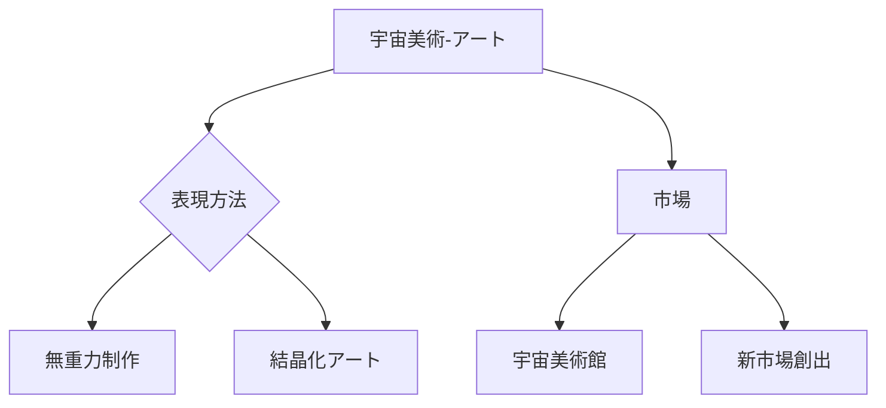

# T19-09-03 宇宙美術・宇宙アート展示

## Summary（5つの要点）
1. **無重力環境の活用**: 無重力下での液体の動きや、地上では再現不可能な**結晶成長プロセス**など、宇宙特有の現象を芸術表現の手段として用いる。
2. **宇宙美術館プロジェクト**: 2021年にISSで実施されたように、宇宙空間で制作・展示された作品を**地球に帰還**させ、美術市場に新たな価値を創出する。
3. **精神・文化への貢献**: 宇宙開発を単なる技術や探査に留めず、**文化・芸術分野との融合**を深めることで、宇宙の意義を広く社会に浸透させる。
4. **デジタルアートとの連携**: 宇宙空間で得られたデータや画像を基にした**デジタルアート、NFTアート**が制作され、ブロックチェーン技術と結びついた新しい経済圏を形成する。
5. **アート展示の多様化**: 宇宙飛行士や研究者だけでなく、**アーティストやデザイナー**が宇宙へアクセスし、創造活動を行うための商業サービスが展開される。

#### 概念図

---
### 日本の立ち位置・強み弱みのSummary
### 強み
1. **伝統芸術**と**現代美術**の両方で高い評価を受けており、宇宙というモチーフを独自の感性で表現する潜在能力が高い。
2. **日本の伝統工芸技術**（例: 漆、和紙）を、宇宙環境でどのように変化させるかという研究テーマに独自性がある。
### 弱み
1. 宇宙空間でのアート制作に必要な**費用と機会**が限定的であり、欧米の富裕層や機関に依存せざるを得ない。
2. 宇宙アートの**価値評価基準**や**著作権**に関する法整備が未熟である。
