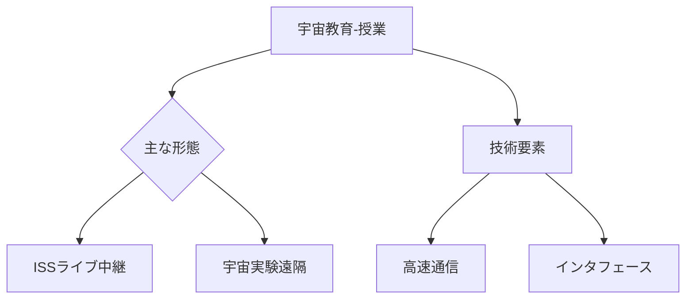

# T19-09-04 宇宙教育プログラム・オンライン授業

## Summary（5つの要点）
1. **ISSからのライブ中継**: ISSの**「きぼう」モジュール**やその他の宇宙施設から、宇宙飛行士が直接、地球上の教室に向けて実験や講義をリアルタイムで配信する。
2. **遠隔参加型実験**: 地上の生徒が、宇宙ステーションの実験装置を遠隔操作したり、観測データの解析に貢献する**市民科学（Citizen Science）**プログラムが推進される。
3. **双方向コミュニケーション**: SkypeやZoomなどのツールを活用し、世界中の学校やコミュニティと宇宙飛行士との**双方向対話イベント**が定期的に開催され、学習効果を高める。
4. **STEM教育への貢献**: 宇宙という題材が持つ高い関心度を利用し、**科学（Science）、技術（Technology）、工学（Engineering）、数学（Mathematics）**への興味を喚起する。
5. **教育インフラの普及**: 高品質なオンライン授業を可能にするための、**高速インターネット接続**と、教育機関向けの低コストな受信・視聴環境の整備が求められる。

#### 概念図

---
### 日本の立ち位置・強み弱みのSummary
### 強み
1. **JAXA**がISS「きぼう」を利用した**教育プログラムで世界的に高い実績**とノウハウを保有。
2. **教育用コンテンツ（アニメ、ゲーム）**の制作技術が高く、宇宙科学を分かりやすく伝えるコンテンツ開発に優位性がある。
### 弱み
1. 地方や発展途上国における**高速インターネットインフラ**の整備が遅れており、教育機会の地域格差を生む可能性がある。
2. 宇宙飛行士という**限られたリソース**に依存しているため、提供できる授業回数や時間に制約がある。
