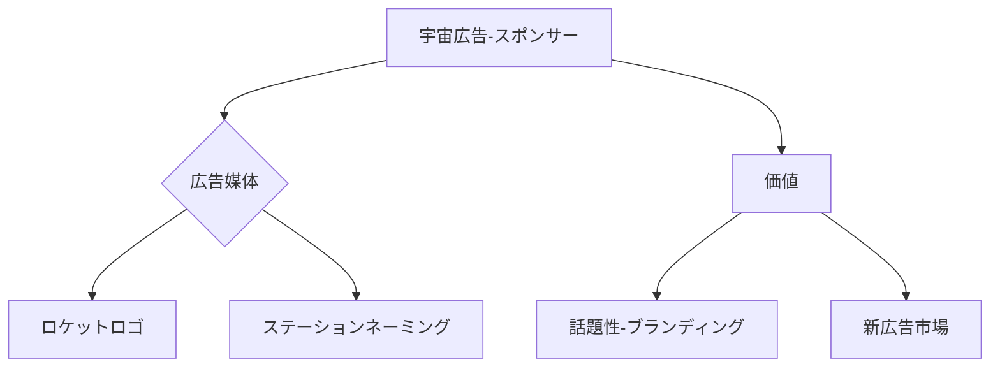

# T19-09-05 宇宙広告・スポンサーシップ

## Summary（5つの要点）
1. **ロケット・機体へのロゴ掲示**: SpaceXがロケットのフェアリングや機体に企業ロゴを掲示するなど、**打ち上げ時の高い視認性**と話題性を活用した広告形態が主流になりつつある。
2. **宇宙インフラのネーミングライツ**: Axiom Spaceなどの商業宇宙ステーションや、将来の月面基地において、施設やモジュールの**ネーミングライツ**が新たな広告媒体として売買される。
3. **宇宙広告の法規制**: 宇宙空間での広告活動（例: 軌道上に巨大ロゴを投影するなど）は、**光害やデブリ化のリスク**から、国際的な法規制や倫理ガイドラインの整備が急務となっている。
4. **ブランドイメージの向上**: 宇宙ビジネスへの参加は、企業に**革新性、未来志向、持続可能性**といったポジティブなブランディング効果をもたらす。
5. **スポンサーシップの多様化**: 宇宙飛行士や宇宙旅行者に対する個人スポンサーシップ、特定の宇宙科学実験や教育プログラムへの**資金提供**など、広告の形態が多様化している。

#### 概念図

---
### 日本の立ち位置・強み弱みのSummary
### 強み
1. **自動車、エレクトロニクス、食品**など、国際的に認知度の高いブランドを多数保有しており、宇宙を媒体としたブランディング効果を最大限に活用できる。
2. 宇宙開発への**民間企業投資**が増加傾向にあり、スポンサーシップ市場の拡大が見込まれる。
### 弱み
1. 広告媒体となる**商業ロケットや宇宙ステーション**のプラットフォームが海外企業（SpaceX、Axiom）に集中しており、広告枠の確保で不利な状況にある。
2. **宇宙活動の倫理規定**や広告表示に関する国内および国際的な法整備の進展が、市場拡大の速度に影響を与える可能性がある。
