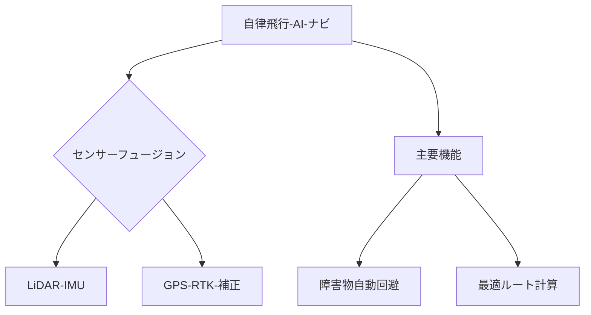

# T19-10-01 自律飛行・AIナビゲーション

## Summary（5つの要点）
1. **レベル4飛行（有人地帯上空の目視外飛行）**を実現するための根幹技術であり、人間の操縦に頼らない完全自律運用を可能にする。
2. **センサーフュージョン**: カメラ（視覚）、LiDAR（距離）、GPS/IMU（位置・姿勢）などの複数のセンサー情報を統合し、自己位置推定と環境認識の精度を極限まで高める。
3. **障害物自動回避**: AIが飛行中の環境をリアルタイムで解析し、鳥、電線、建物などの障害物を瞬時に特定・予測し、安全なルートを計算して回避する機能（例: Skydio）。
4. **最適ルート計算**: 目的地、天候、充電ポイント、空域制限などを考慮し、エネルギー効率と飛行時間の両面で最適な3次元ルートを瞬時に生成する。
5. **エッジコンピューティング**: 飛行中に発生する大量のセンサーデータをドローン本体（エッジ）で即座に処理し、**低遅延**で自律的な判断を下すための高性能なオンボードプロセッサが不可欠である。

#### 概念図

---
### 日本の立ち位置・強み弱みのSummary
### 強み
1. **自律制御システム**と**ロボティクス**に関する高い基礎研究力（ソニー、楽天などによる実装）。
2. **RTK-GPS**など、高精度測位技術のインフラ整備が進んでいる。
### 弱み
1. AI学習のための**多様な環境飛行データ**の蓄積が、DJIなどのグローバル企業に比べて遅れている。
2. センサーフュージョンのための**専用ドローンチップ**の開発競争で、海外勢に後れを取っている。
