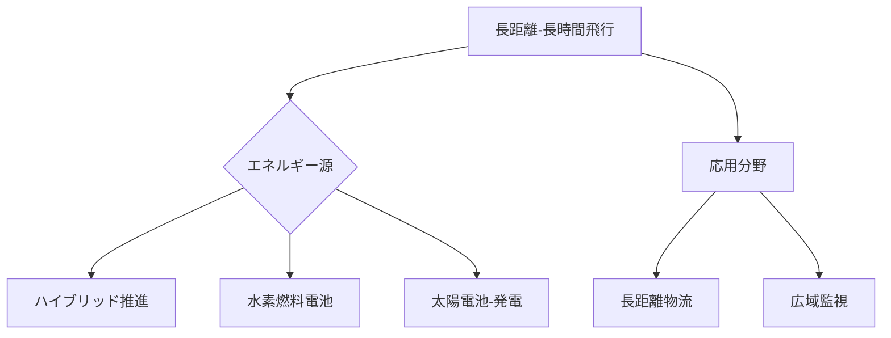

# T19-10-02 長距離・長時間飛行技術

## Summary（5つの要点）
1. **産業利用の拡大**: 航続距離**100km超**、飛行時間**数時間**を達成することで、長距離物流、広域インフラ点検、災害時の長時間監視など、ドローンの産業用途を大幅に拡大する。
2. **ハイブリッド推進**: ガソリンエンジン（ジェネレーター）と電動モーターを組み合わせ、燃費効率とパワーを両立させ、飛行時間を延長する技術。自動車分野の技術を応用。
3. **水素燃料電池**: 水素と酸素の化学反応で電力を生成し、**高エネルギー密度**と**排気ゼロ**を実現する。リチウムイオンバッテリーの限界を超える長時間飛行の鍵となる。
4. **太陽電池ドローン**: 翼や機体表面に薄膜太陽電池を搭載し、飛行中に発電・充電することで、特に日中の飛行時間を極限まで延長する（例: 高高度擬似衛星）。
5. **高効率なプロペラ・機体設計**: 空気抵抗の低減、軽量化、プロペラの空力効率最適化により、推進力を高め、エネルギー消費を最小限に抑える。

#### 概念図

---
### 日本の立ち位置・強み弱みのSummary
### 強み
1. 自動車産業で培われた**ハイブリッド技術**と、**燃料電池**に関する研究開発（トヨタ、ホンダなど）。
2. 高品質な**軽量炭素繊維**（CFRP）などの素材技術。
### 弱み
1. ドローンに特化した**高エネルギー密度バッテリー**の開発競争で、中国・韓国勢に後れを取っている。
2. 水素燃料電池ドローンの普及に必要な**水素供給インフラ**の整備が、初期段階にある。
