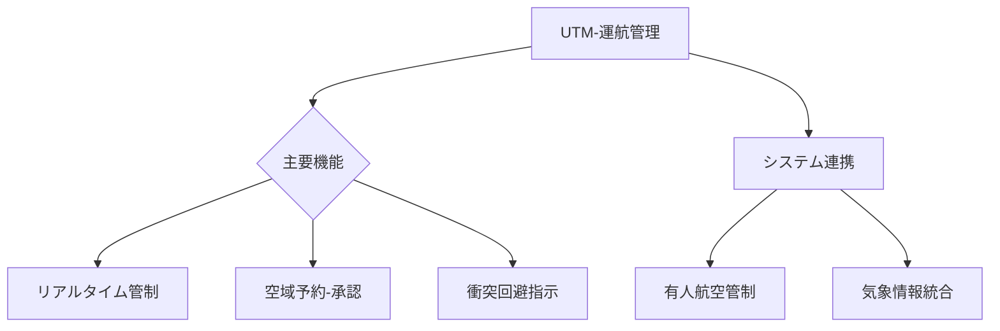

# T19-10-03 ドローン運航管理システム（UTM: UAV Traffic Management）

## Summary（5つの要点）
1. **空域の安全確保**: 多数のドローンが同一空域で安全に飛行するための、**飛行計画の承認、リアルタイム位置監視、衝突回避指示**を自動で行う管制システム。
2. **レベル4飛行の基盤**: 無人機が有人機と同じ空域を飛行する際、安全性と公平性を担保するための**ルールベースの交通管理**に不可欠。
3. **デジタル空域管理**: 飛行禁止空域、一時制限空域、気象情報などをデジタルマップ上に統合し、ドローンオペレーターと管制機関が**情報を共有**するプラットフォームを提供する。
4. **緊急時対応の自動化**: ドローンの異常発生時や天候急変時に、自動で最も近いドローンポートへの**誘導、緊急着陸地点の指示**などの対応を行う。
5. **開発と実証**: JAXAが中心となり、NEC、日立、Terra Droneなどの企業が連携し、2025年のレベル4飛行解禁に向けた**全国規模の実証実験**を推進中。

#### 概念図

---
### 日本の立ち位置・強み弱みのSummary
### 強み
1. **官民連携による法整備とシステム開発**が先行しており、レベル4に向けたUTMの実証・導入で世界をリードしている。
2. NEC、日立など**ITインフラ企業**による、高度なデータ処理・管制システムの開発力。
### 弱み
1. **既存の航空管制システム**とのシームレスな統合において、技術的・制度的な課題が残る。
2. **国際的なUTMの標準化**議論において、米国（FAA）や欧州（EASA）が主導権を握る中、日本独自のシステムとの連携が課題となる。
