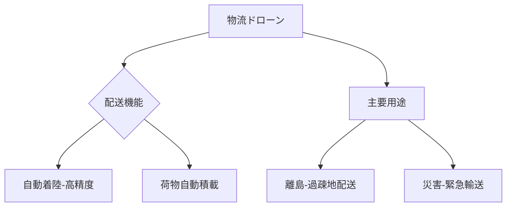

# T19-10-04 物流ドローン・自動着陸技術

## Summary（5つの要点）
1. **ラストワンマイルの革新**: 交通インフラが未整備な**過疎地、離島、山間部**、および**災害発生時**において、医薬品や緊急物資を迅速かつ安価に配送する。
2. **高精度着陸技術**: 風や天候の影響下でも、数cm単位の誤差で指定された**ドローンポートや家庭の受領ボックス**に安全に着陸する画像認識・誘導技術。
3. **荷物自動積載・降ろし**: 荷物の自動梱包、ドローンへの**自動積載（Load）**、目的地でのワイヤーやロボットアームを用いた**自動降ろし（Unload）**を可能にするシステム。
4. **主要プレイヤー**: Amazon Prime Air、AlphabetのWing、楽天ドローン、日本郵便などが、商業化に向けた**大規模な実証実験**を世界中で展開中。
5. **機体の特化**: 荷物を安定的に運搬するための**ペイロード容量**の最適化、悪天候に強い機体設計、荷物保護のための**衝撃吸収機構**を備えた専用ドローンが開発されている。

#### 概念図

---
### 日本の立ち位置・強み弱みのSummary
### 強み
1. **ヤマト、日本郵便、楽天**など、既存の強力な物流ネットワークと、ドローン配送との**システム連携ノウハウ**。
2. **高齢化・過疎化**が進む地域が多く、ドローン物流の**社会実装ニーズ**が極めて高い。
### 弱み
1. ドローンの**積載可能重量**や**航続距離**が、ハイブリッド技術を持つ海外勢に比べてまだ限定的である。
2. **都市部での騒音やプライバシー**に関する住民の懸念が強く、社会受容性の獲得が課題。
