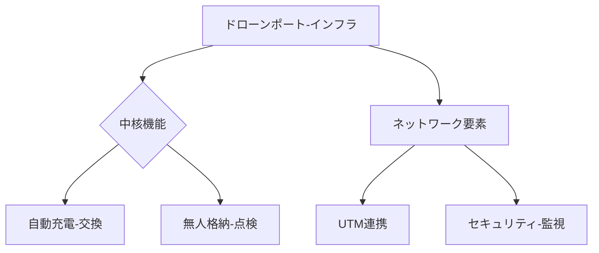

# T19-10-05 ドローンポート・充電インフラ

## Summary（5つの要点）
1. **無人運用の自動化**: ドローンがミッションを継続的に実行するための、**自動離着陸、充電/バッテリー交換、格納、機体点検**を行う無人・自律化された拠点。
2. **充電システムの効率化**: **ワイヤレス給電（非接触充電）**や、故障や劣化を検知し自動で交換する**ロボットによるバッテリー交換システム**が導入される。
3. **ネットワークの構築**: ドローンポートを都市、山間部、離島などに**網の目状に設置**することで、ドローンが広範囲で長距離飛行できるインフラを確立する。
4. **機体管理とセキュリティ**: 格納中に機体の状態を遠隔で監視し、セキュリティカメラや認証システムにより、**機体の盗難や悪用**を防ぐ機能が統合される。
5. **主要企業**: 日本では**ブルーイノベーション**や**ACSL**（自律制御システム研究所）などが、物流・インフラ点検用のドローンポートとシステムの開発を推進している。

#### 概念図

---
### 日本の立ち位置・強み弱みのSummary
### 強み
1. **省人化・自動化**に関する高い技術力と、**精密なロボティクス**をドローンポートに組み込むノウハウ。
2. **太陽光発電**などのクリーンエネルギーを活用した、自立型ドローンポートの開発。
### 弱み
1. ドローンポートの**設置場所（用地）の確保**と、法規制・景観規制への対応が、都市部を中心に難しい。
2. 多数のドローンが利用する**共有型の充電・交換プラットフォーム**の標準化が遅れている。
