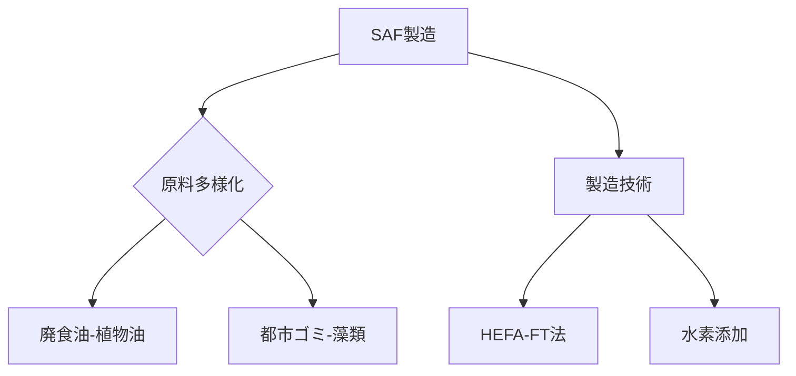

# T19-11-01 持続可能な航空燃料（SAF: Sustainable Aviation Fuel）

## Summary（5つの要点）
1. **定義と効果**: 植物油、廃食油、都市ゴミ、藻類など、バイオマス由来の原料から製造されるジェット燃料。ライフサイクル全体で**CO2排出を最大80%削減**できる。
2. **既存インフラ活用**: 従来のジェット燃料（ケロシン）と混合して使用でき、航空機の**エンジンや燃料供給システムを改造する必要がない**（ドロップイン特性）。
3. **国際目標**: 国際民間航空機関（ICAO）や各国政府が、2030年までに航空燃料の**10%以上をSAFに置換**する目標を掲げており、需要が急拡大する。
4. **製造技術の多様化**: HEFA（動植物油脂からの水素化精製）、FT（フィッシャー・トロプシュ法）、ATJ（アルコールからのジェット燃料製造）など、**多様な原料に対応する製造経路**が認証され、商業化が進む。
5. **国内プレイヤー**: 日本では**IHI、ENEOS**などが製造技術の開発や実証を推進し、安定的な国産SAFの供給体制確立を目指している。

#### 概念図

---
### 日本の立ち位置・強み弱みのSummary
### 強み
1. IHI、ENEOSなど、**既存の石油精製・化学プラント技術**をSAF製造に転用できる基盤技術力。
2. **廃食油などの回収システム**が都市部で確立されており、初期原料の一部確保に優位性がある。
### 弱み
1. 大規模なSAF製造に必要な**原料（バイオマス）の安定供給と低コスト化**が、米国やブラジルなど農業大国に比べて課題。
2. 製造コストが既存燃料よりも高いため、**公的な支援制度や義務化**が市場拡大の鍵となる。
