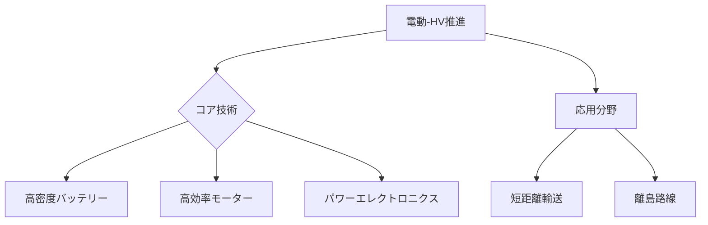

# T19-11-02 電動・ハイブリッド推進システム

## Summary（5つの要点）
1. **システム構成**: 従来のジェット燃料に加え、バッテリーと電動モーターを動力源として利用し、燃費効率を向上させるか、完全に電力で推進する（EVTOLを含む）。
2. **適用範囲**: 現在のバッテリー性能の制約から、主に**短距離路線（500km以下）**、地域航空、離島路線、遊覧飛行など、小型航空機での実用化が先行する。
3. **主要開発機**: eviationの**Alice**（9人乗り）、Heart Aerospaceの**ES-30**（30人乗り）など、バッテリー駆動のリージョナル機が開発・認証取得に向けて進んでいる。
4. **技術的課題**: 航空機の重量を増やすことなく必要な出力を供給できる**高エネルギー密度バッテリー**と、信頼性の高い**高効率モーター・インバータ（SiC/GaN）**の統合が不可欠である。
5. **日本の立ち位置**: IHI、川崎重工が機体・推進システムに関する研究を進めており、特に**パワーエレクトロニクス**やモーターの小型化・高出力化技術で貢献が期待される。

#### 概念図

---
### 日本の立ち位置・強み弱みのSummary
### 強み
1. 自動車分野で培われた**ハイブリッド技術**と、EV/FCV用の**モーター・インバータ**の高性能化技術。
2. **リチウムイオンバッテリー**の材料技術と製造プロセス技術。
### 弱み
1. 電動旅客機の**機体全体の設計・システムインテグレーション**における主導権が、欧米のスタートアップに集中している。
2. 航空機特有の**厳しい安全性・耐熱性基準**を満たすためのバッテリー管理システム（BMS）の認証プロセスが複雑。
